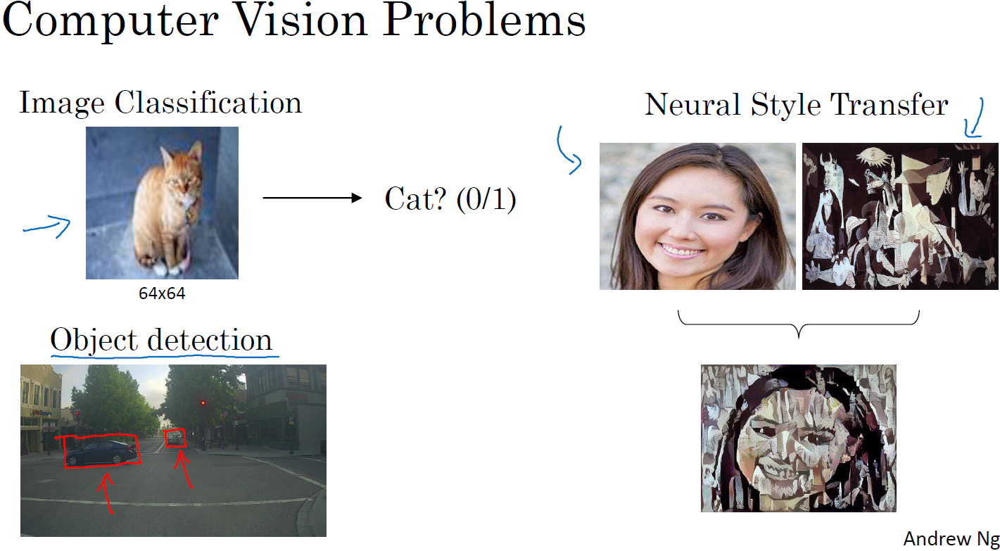
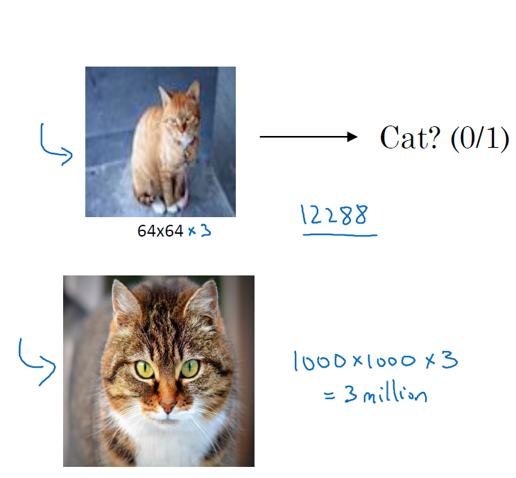
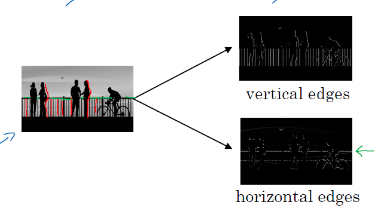
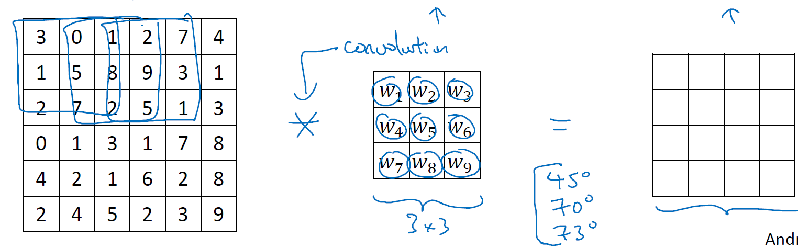
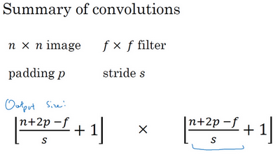
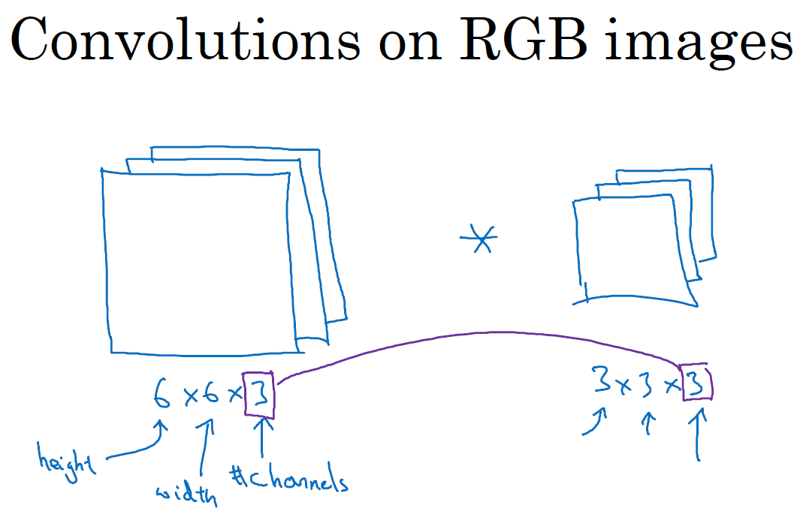
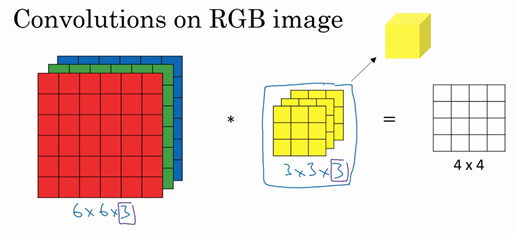
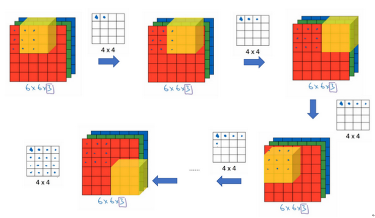
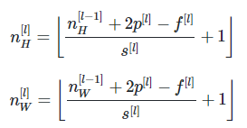

### 第一周：卷积神经网络

#### 计算机视觉（Computer Vison）
计算机视觉问题包括以下几类：
图片分类（Image Classification）；
目标检测（Object detection）；
神经风格转换（Neural Style Transfer），就是图片风格迁移。

**引出卷积神经网络：**
计算机视觉处理大尺寸图片的问题？
如果你要操作更大的图片，比如一张1000×1000的图片，它足有1兆那么大，但是特征向量的维度达到了1000×1000×3，因为有3个RGB通道，神经网络输入层的维度将高达300万，这样会造成两个后果：
- 神经网络结构复杂，数据量相对较少，容易出现过拟合；
- 所需内存和计算量巨大。

因此，一般的神经网络很难处理蕴含着大量数据的图像。解决这一问题的方法就是使用卷积神经网络（Convolutional Neural Network, CNN）。

#### 边缘检测示例（Edge detection example）
从一个边缘检测例子来看一下，如何通过卷积来实现对图像边缘的检测。如何在图像中检测行人的轮廓线？

图片的边缘检测可以通过与相应的过滤器进行卷积实现，以垂直边缘检测为例，原始图像是一个 6×6 的灰度图像，因为是灰度图像，所以它是 6×6×1 的矩阵，而不是 6×6×3 的，因为没有 RGB 三通道。为了检测图像中的垂直边缘，现在构造一个 3×3 矩阵。在通用习惯中，在卷积神经网络的术语中，它被称为过滤器（filter），当然有些论文把它叫做“核”。

卷积运算的求解过程是从左到右，由上到下，每次在原始图片矩阵中取与滤波器同等大小的一部分，每一部分中的值与滤波器中的值对应相乘后求和，将结果组成一个矩阵。就如上图所示：原始图片尺寸为 6x6，过滤器尺寸为 3x3，卷积后得到的图片尺寸为 4x4，得到结果如最右边矩阵（数值表示灰度，以左上角和右下角的值为例）。 下图同样对应一个垂直边缘的例子：

为什么这个过滤器可以用做边缘检测呢？ 这是一个简单的 6×6 图像，左边的一半是 10，右边一般是 0。它当成一个图片，左边那部分看起来是白色的，像素值 10 是比较亮的像素值，右边像素值比较暗，使用灰色来表示 0。图片里，有一个特别明显的垂直边缘在图像中间，这条垂直线是从黑到白的过渡线，或者从白色到深色。而3x3 的过滤器就像中间的那副图显示的那样，然后进行卷积运算，得到右边的矩阵。在中间有段亮一点的区域，对应检查到这个 6×6 图像中间的垂直边缘。

垂直边缘检测和水平边缘检测的滤波器如下所示：

其实在真正的应用中这些过滤器的数字正是需要网络学习的参数W。相比这种单纯的垂直边缘和水平边缘，它可以检测出 45°或 70°或 73°，甚至是任何角度的边缘。

#### Padding
假设输入图片的大小为 $n×n$，而滤波器的大小为 $f×f$，则卷积后的输出图片大小为 $(n−f+1)×(n−f+1)$。
这样的话会有两个缺点:
- 每次卷积运算后，输出图片的尺寸缩小，图像在每次识别边缘或其他特征时都缩小是不好的现象
- 如下图：像素点（绿色阴影标记）只被一个输出所触碰或者使用，因为它位于这个 3×3 的区域的一角。但如果是在中间的像素点，比如这个（红色方框标记），就会有许多 3×3 的区域与之重叠。所以那些在角落或者边缘区域的像素点在输出中采用较少，意味着你丢掉了图像边缘位置的许多信息。

为了解决这些问题，可以在进行卷积操作前，对原始图片在边界上进行填充（Padding），以增加矩阵的大小。通常将0作为填充值。

设每个方向扩展像素点数量为$p$，则填充后原始图片的大小为 $(n+2p)×(n+2p)$，过滤器大小保持$ f×f$不变，则输出图片大小为$ (n+2p−f+1)×(n+2p−f+1)$。

至于选择填充多少像素，通常有两个选择，分别叫做**Valid卷积**和**Same卷积**。
- Valid 卷积：不填充，直接卷积。结果大小为 $(n−f+1)×(n−f+1)$；
- Same 卷积：进行填充，使得输出大小和输入大小是一样的，这样 $p=\frac{f-1}{2}$。

在计算机视觉领域，f通常为奇数。原因包括Same卷积中$p=\frac{f-1}{2}$能得到自然数结果，并且过滤器有一个便于表示其所在位置的中心点。

#### 卷积步长（Strided convolutions）
步长表示过滤器在原始图片的水平方向和垂直方向上每次移动的距离。之前，步长被默认为 1。而如果我们设置步长为 2，则卷积过程如下图所示：

总结一下维度情况，如果你有$n×n$的图像，与一个$f×f$的过滤器。Padding是p，步幅为s,则输出维度为：

注意公式中有一个向下取整的符号，用于处理商不为整数的情况。

做一点说明：在深度学习中的卷积概念和数学上的卷积概念并不相同。从技术上讲，我们实际上做的，前面视频中使用的操作，有时被称为互相关（cross-correlation）而不是卷积（convolution）。但在深度学习文献中，按照惯例，将这（不进行翻转操作）的做法称为卷积操作。

#### 三维卷积（Convolutions over volumes）
上面都是在二维图像上对卷积进行的讲解，这节讲在三维RGB图像上如何应用卷积计算。

彩色图像如果是6×6×3，这里的3指的是三个颜色通道，你可以把它想象成三个6×6图像的堆叠。为了检测图像的边缘或者其他的特征，不是把它跟原来的3×3的过滤器做卷积，而是跟一个三维的过滤器，它的维度是3×3×3，这样这个过滤器也有三层，对应红绿、蓝三个通道。

给这些命个名字（原图像），这里的第一个 6 代表图像高度，第二个 6 代表宽度，这个 3 代表通道的数目。同样你的过滤器也有一个高，宽和通道数，并且图像的通道数必须和过滤器的通道数匹配，所以这两个数（紫色方框标记的两个数）必须相等。

为了计算这个卷积操作的输出，要做的就是把这个 3×3×3 的过滤器先放到最左上角的位置，这个 3×3×3 的过滤器有 27 个数，27 个参数就是 3 的立方。依次取这 27 个数，然后乘以相应的红绿蓝通道中的数字。先取红色通道的前 9 个数字，然后是绿色通道，然后再是蓝色通道，乘以左边黄色立方体覆盖的对应的 27 个数，然后把这些数都加起来，就得到了输出的第一个数字。

如果要计算下一个输出，把这个立方体滑动一个单位，再与这 27 个数相乘，把它们都加起来，就得到了下一个输出，以此类推。

如果想同时检测多个特征，或者实现更多的边缘检测，可以增加更多的过滤器组，例如设置第一个过滤器组实现垂直边缘检测，第二个过滤器组实现水平边缘检测。 设输入图片的尺寸为$ n×n×n_c$（$n_c$为通道数），过滤器尺寸为 $f×f×n_c$，则卷积后的输出图片尺寸为 $(n−f+1)×(n−f+1)×n′c$，$n′c$ 为过滤器组的个数。

#### 单层卷积网络（One layer of a convolutional network）

$$Z^{[l]}=W^{[l]}A^{[l-1]}+b^{[l]}$$$$A^{[l]}=g^{[l]}(Z^{[l]})$$

与之前的卷积过程相比较，卷积神经网络的单层结构多了激活函数和偏移量；而与标准神经网络相比，过滤器的数值对应着权重$ W^{[l]}$，卷积运算对应着 $W^{[l]}$与 $A^{[l−1]}$的乘积运算，每一个过滤器都有对应的一个偏差参数bi，所选的激活函数变为 ReLU。

假设有 10 个过滤器， 神经网络的一层是 3x3x3 ，那么，这一层有几个参数？

每一层都是一个 3x3x3 矩阵，因此每个过滤器都有27个权重参数，也就是27个数，再加上一个偏差，总共有28个，然后一共有10个过滤器，则全部参数的总和为 28x10=280 个，也就是280个参数。

请注意一点，不论输入图片有多大，1000×1000 也好，5000×5000 也好，参数始终都是 280 个。用这 10 个过滤器来提取特征，如垂直边缘，水平边缘和其它特征。即使这些图片很大，参数却很少，这就是卷积神经网络的一个特征，叫作“避免过拟合”。即选定过滤器组后，参数的数目与输入图片的尺寸无关。因此，卷积神经网络的参数相较于标准神经网络来说要少得多。这是 CNN 的优点之一。

**符号总结**

设$l$层为卷积层：
- $f^{[l]}$：过滤器的高（或宽）
- $p^{[l]}$：填充长度
- $s^{[l]}$：步长
- 输入维度：$l−1$ 表示为上一层，$n^{[l−1]}_H×n^{[l−1]}_W×n^{[l−1]}_c$表示为上一层的激活值，也就是这一层的输入值 。其中$n^{[l−1]}_H$表示输入图片的高，$n^{[l−1]}_W$表示输入图片的宽。之前的示例中输入图片的高和宽都相同，但是实际中也可能不同，因此加上下标予以区分。
- 输出维度：$n^{[l]}_H×n^{[l]}_W×n^{[l]}_c$ 。其中

- $n^{[l]}_c$：过滤器的数量（该层总共有几个特征检测器）
- 每个过滤器的维度：$f^{[l]}×f^{[l]}×n^{[l−1]}_c$，其中$n^{[l−1]}_c$为输入图片通道数
- 权重维度：$f^{[l]}×f^{[l]}×n^{[l−1]}_c×n^{[l]}_c$
- 偏置维度：$1×1×1×n^{[l]}_c$

#### 简单卷积网络示例（A simple convolution network example）
假设你有一张图片，你想做图片分类或图片识别，把这张图片输入定义为 x，然后辨别图片中有没有猫，用 0 或 1 表示，这是一个分类问题，我们来构建适用于这项任务的卷积神经网络。下面是完整表示。

针对这个示例，使用一张 39x39x3 大小的图片，则第0层的维度为39x39x3 ，也就是$n^{[0]}_H=n^{[0]}_W=39 , n^{[0]}_c=3$。

第0层使用 3x3 的过滤器来提取特征，那么 $f^{[1]}=3$ 。步幅为1，$s^{[1]}=1$。padding为0，$p^{[1]}=0$。如果有10个过滤器，神经网络下一层的激活值为 37×37×10，写 10 是因为用了 10 个过滤器。37是公式$(n+2p−f)/s+1 $的计算结果。所以输出是 37x37 ，这是一个vaild卷积。
则第1层被标记为$n^{[1]}_H=n^{[1]}_W=37, n^{[1]}_c=10$。

再经历一个卷积层，这层使用 5x5 的过滤器来提取特征，那么 $f^{[2]}=5$  。步幅为2，$s^{[2]}=2$。padding为0，$p^{[2]}=0$。有 20 个过滤器，该层的输出为 17×17×20（下一层的激活值）。第2层的输入被标记为为 17×17×20 ，也就是 $n^{[2]}_H=n^{[2]}_W=17, n^{[1]}_c=20$。

这是最后一个卷积层，这层使用 5x5 的过滤器来提取特征，那么 $f^{[3]}=5$。步幅为2，$s^{[3]}=2$。padding为0，$p^{[3]}=0$。有 40 个过滤器，该层的输出为 7×7×40（下一层的激活值）

到此，这张 39×39×3 的输入图像就处理完毕了，为图片提取了 7×7×40 个特征，即a[3]的维度为 7x7x40，将 1960 个特征平滑展开成 1960 个单元的一列，然后连接最后一级的输出层。输出层可以是一个神经元，即二元分类（logistic）；也可以是多个神经元，即多元分类（softmax）。最后得到预测输出 $ \hat y$。

**在设计神经网络结构时，有一个规律：**
随着神经网络计算深度不断加深，图片的高度和宽度一般逐渐减小，而通道数量在增加。

一个典型的卷积神经网络通常包含有三种层：卷积层（Convolution layer）、池化层（Pooling layer）、全连接层（Fully Connected layer）。仅用卷积层也有可能构建出很好的神经网络，但大部分神经网络还是会添加池化层和全连接层，它们更容易设计。

#### 池化层（Pooling layers）
卷积网络也经常使用池化层来缩减模型的大小，提高计算速度，同时提高所提取特征的鲁棒性。

采用较多的一种池化过程叫做最大池化（Max Pooling）。将输入拆分成不同的区域，输出的每个元素都是对应区域中元素的最大值，如下图所示：

池化过程类似于卷积过程，上图所示的池化过程中相当于使用了一个大小 f=2的滤波器，且池化步长 s=2。卷积过程中的几个计算大小的公式也都适用于池化过程。如果有多个通道，那么就对每个通道分别执行计算过程。

对最大池化的一种直观解释是，元素值较大可能意味着池化过程之前的卷积过程提取到了某些特定的特征，池化过程中的最大化操作使得只要在一个区域内提取到某个特征，它都会保留在最大池化的输出中。但是，没有足够的证据证明这种直观解释的正确性，而最大池化被使用的主要原因是它在很多实验中的效果都很好。

重点是池化层不参与权重更新，也就是说它是一组超参数，由人为设定好的一组数值，一旦确定了 f 和 s，它就是一个固定运算，梯度下降无需改变任何值,而且一般情况不对池化层使用padding操作。 

#### 卷积神经网络示例（Convolutional neural network example）
下图为一个完整的卷积神经网络示例。可见随着神经网络深度的加深，高度$n_{H}$和宽度$n_{W}$通常都会减少，前面我就提到过，从32×32到28×28，到14×14，到10×10，再到5×5。所以随着层数增加，高度和宽度都会减小，而通道数量会增加，从3到6到16不断增加，然后得到一个全连接层。

在神经网络中的一种常见模式就是一个或多个卷积后面跟随一个池化层，然后一个或多个卷积层后面再跟一个池化层，然后是几个全连接层，最后是一个softmax。

接下来看一下上图中的神经网络的激活值维度，激活值大小和参数数量。

有几点需要注意：第一，池化层和最大池化层没有参数；第二，卷积层的参数相对较少，前面也提到过，其实许多参数都存在于神经网络的全连接层。观察可发现，随着神经网络的加深，激活值尺寸会逐渐变小，如果激活值尺寸下降太快，也会影响神经网络性能。

构建深度卷积的模式：
- 随着网络的深入，提取的特征图片大小将会逐渐减小，但同时通道数量应随之增加；
- 常见模式就是一个或多个卷积后面跟随一个池化层，然后一个或多个卷积层后面再跟一个池化层，然后是几个全连接层，最后是一个 softmax。
Conv——Pool——Conv——Pool—— ……多个（Conv-Pool）… ——Fc——Fc——Fc——softmax。

#### 为什么使用卷积？（Why convolutions?）
卷积层的两个主要优势在于参数共享和稀疏连接，举例说明一下。

- 参数共享（Parameter sharing）：观察发现，特征检测如垂直边缘检测如果适用于图片的某个区域，那么它也可能适用于图片的其他区域。也就是说，如果你用一个 3×3 的过滤器检测垂直边缘，那么图片的左上角区域，以及旁边的各个区域（左边矩阵中蓝色方框标记的部分）都可以使用这个 3×3 的过滤器。每个特征检测器以及输出都可以在输入图片的不同区域中使用同样的参数，以便提取垂直边缘或其它特征。直观感觉是，一个特征检测器，如垂直边缘检测器用于检测图片左上角区域的特征，这个特征很可能也适用于图片的右下角区域。因此在计算图片左上角和右下角区域时，你不需要添加其它特征检测器。

- 稀疏连接（Sparsity of connections）：在每一层中，由于滤波器的尺寸限制，输入和输出之间的连接是稀疏的，每个输出值只取决于输入在局部的一小部分值。如下图所示：这个 0 是通过 3×3 的卷积计算得到的，它只依赖于这个 3×3 的输入的单元格，右边这个输出单元（元素0）仅与 36 个输入特征中 9 个相连接。而且其它像素值都不会对输出产生任影响，这就是稀疏连接。

神经网络可以通过这两种机制减少参数，以便我们用更小的训练集来训练它，从而预防过度拟合。卷积神经网络善于捕捉平移不变。通过观察可以发现，向右移动两个像素，图片中的猫依然清晰可见，因为神经网络的卷积结构使得即使移动几个像素，这张图片依然具有非常相似的特征，应该属于同样的输出标记。实际上，我们用同一个过滤器生成各层中，图片的所有像素值，希望网络通过自动学习变得更加健壮，以便更好地取得所期望的平移不变属性。

池化过程则在卷积后很好地聚合了特征，通过降维来减少运算量。

综上，就是卷积或卷积网络在计算机视觉任务中表现良好的原因