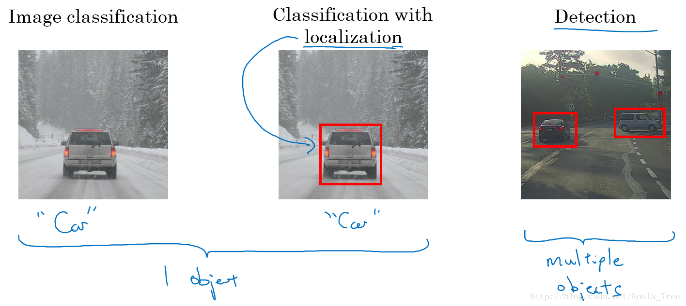
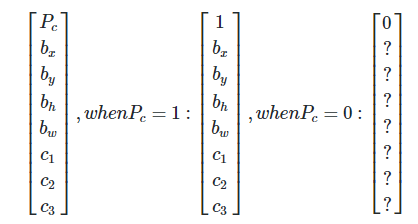
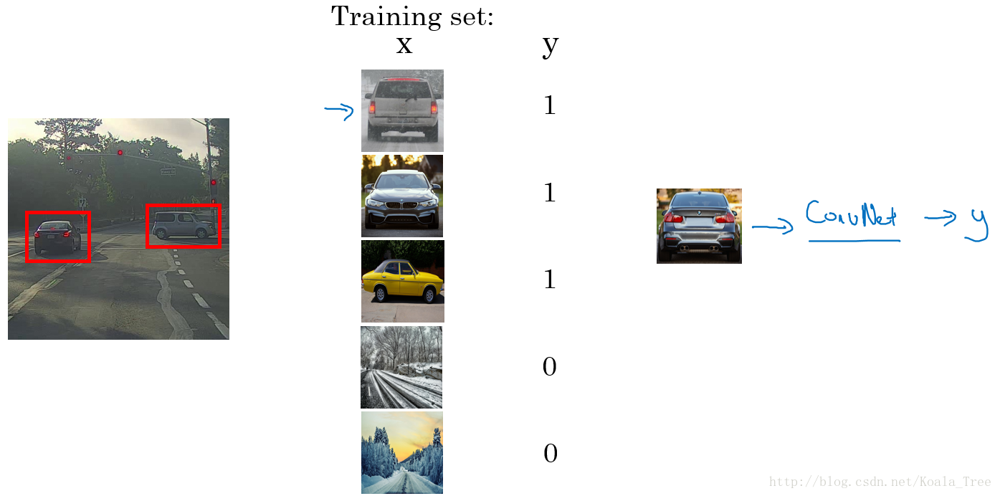
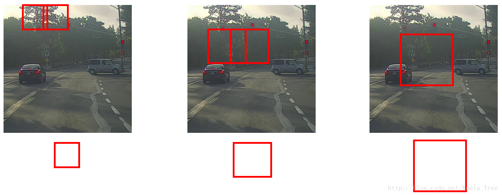
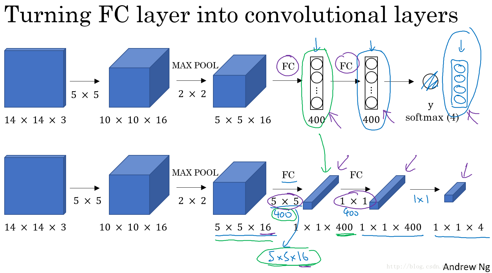
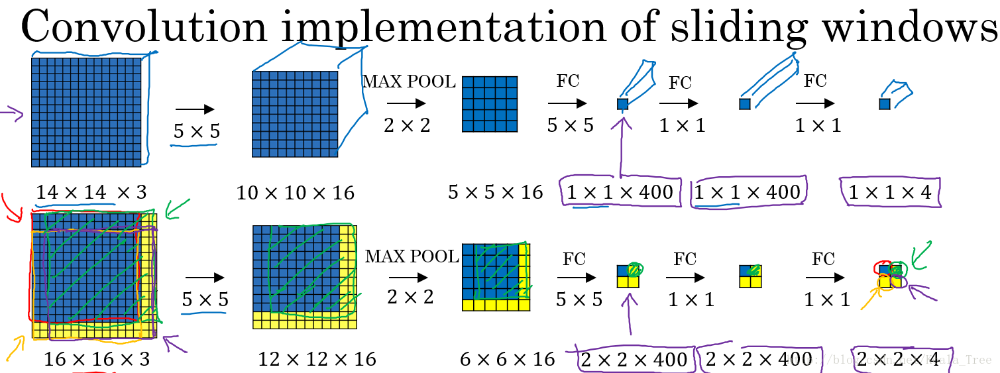
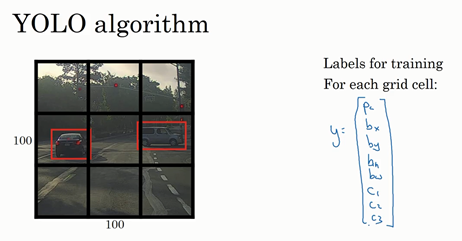
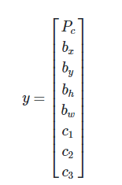

### 第三周：目标检测（Object detection）

#### 目标定位（Object localization）
计算机视觉中对于图片处理的几类应用如下：
- 分类问题：判断图中是否为汽车；
- 目标定位：判断是否为汽车，并确定具体位置；
- 目标检测：图片中有多个对象时，检测不同物体并定位。

课程中给出了对于多目标检测的数学表示。如下图：

分别对各参数进行说明：
- $p_c$表示是否含有对象，如果对象属于前三类（行人、汽车、摩托车），则$p_c=1$，如果图片中没有要检测的对象，则$p_c=0$;
- $b_x、b_y、b_h和b_w$为被检测对象的边框参数;将图片左上角标记为 (0, 0)，右下角标记为 (1, 1)，则红色方框的中心点为：$(b_x、b_y)$;边界框的高度为$b_h$,边界框的宽度为$b_w$
- 输出$c_1、c_2和c_3$，表示该对象属于1-3类中的哪一类，是行人，汽车还是摩托车;

目标的标签Y如下几种形式：
- 若$p_c=0$，表示没有检测到目标，则输出label后面的7个参数都可以忽略(用 ? 来表示)。
- 当$p_c=0$时，表示图片中存在物体，会给出相应的边框参数坐标。

#### 特征点检测（Landmark detection）

神经网络可以通过输出图片上特征点的(x,y)坐标来实现对目标特征的识别。上图示例中：假设需要定位一张人脸图像，同时检测其中的64个特征点，这些点可以帮助我们定位眼睛、嘴巴等人脸特征。

具体做法是，准备一个卷积网络和一些特征集，将人脸图片输入卷积网络，输出1或0，1表示有人脸，0表示没有人脸，然后输出$（l_1x，l_1y）$……直到$（l_64x，l_64y）$。这里我用$l$代表一个特征，这里有129个输出单元，其中1表示图片中有人脸，因为有64个特征，64×2=128，所以最终输出128+1=129个单元，由此实现对图片的人脸检测和定位。

#### 目标检测（Object detection）
这一节学习如何通过卷积网络进行目标检测，采用的是基于滑动窗口（Sliding Windows Detection）的目标检测算法。

**如何构建训练集？**

假如你想构建一个汽车检测算法，如上图所示，具体步骤是：

训练集X：将有汽车的图片进行适当的剪切，剪切成整张几乎都被汽车占据的小图或者没有汽车的小图；

训练集Y：对X中的图片进行标注，有汽车的标注1，没有汽车的标注0。

**滑动窗口目标检测**

- 首先选定一个特定大小的窗口，将窗口内的图片输入到模型中进行预测；
- 以固定步幅滑动该窗口，遍历图像的每个区域，对窗内的各个小图不断输入模型进行预测；
- 继续选取一个更大的窗口，再次遍历图像的每个区域，对区域内是否有车进行预测；
- 遍历整个图像，可以保证在每个位置都能检测到是否有车。

滑动窗算法的优点是原理简单，且不需要人为选定目标区域（检测出目标的滑动窗即为目标区域）。但是其缺点也很明显，首先滑动窗的大小和步进长度都需要人为直观设定。滑动窗过小或过大，步进长度过大均会降低目标检测正确率。而且，每次滑动窗区域都要进行一次CNN网络计算，如果滑动窗和步进长度较小，整个目标检测的算法运行时间会很长。所以，滑动窗算法虽然简单，但是性能不佳，不够快，不够灵活

#### 卷积的滑动窗口实现（Convolutional implementation of sliding windows）
上节课，学习了如何通过卷积网络实现滑动窗口目标检测算法，但效率很低。这节课讲了如何在卷积层上应用这个算法。

**卷积层替代全连接层：**

全连接层可以由1×1大小卷积核的卷积层来替代。全连接层转变成卷积层的操作很简单，只需要使用与上层尺寸一致的滤波算子进行卷积运算即可。如上图示例，第一个全连接层，可以将上一层的输出5x5x16再卷积上同等高度和宽度的过滤器,假如有400个这样的过滤器，则可得到输出为1x1x400。

**滑动窗口的卷积实现：**

滑动窗口在整幅图片上进行滑动卷积的操作过程，就等同于在该图片上直接进行卷积运算的过程。所以卷积层实现滑动窗口的这个过程，我们不需要把输入图片分割成四个子集分别执行前向传播，而是把他们作为一张图片输入到卷积神经网络中进行计算，其中的重叠部分（公共区域）可以共享大量的计算。

如下图中间一行卷积的初始图，我们假设输入的图像是16 x 16 x 3的，而窗口大小是14 x 14 x 3，我们要做的是把蓝色区域输入卷积网络，生成0或1分类，接着向右滑动2个元素，形成的区域输入卷积网络，生成0或1分类，然后接着滑动，重复操作。我们在16 x 16 x 3的图像上卷积了4次，输出了4个标签，我们会发现这4次卷积里很多计算是重复的。

我们不用依靠连续的卷积操作来识别图片中的汽车，我们可以对整张图片进行卷积，一次得到所有的预测值，如果足够幸运，神经网络便可以识别出汽车的位置。

#### Bounding Box预测（Bounding box predictions）
在上一个视频中，学到了滑动窗口法的卷积实现，这个算法效率更高，但仍然存在问题，不能输出最精准的边界框。在这个视频中，我们看看如何得到更精准的边界框。

**YOLO：**

YOLO算法，YOLO(You only look once)意思是你只看一次，YOLO算法可以使得滑动窗口算法寻找到更加精准的边界框。

YOLO算法首先将原始图片分割成n x n网格，每个网格代表一块区域。为简化说明，下图中将图片分成3 x 3网格。

利用上一节卷积形式实现滑动窗口算法的思想，对该原始图片构建CNN网络，得到的的输出层维度为3 x 3 x 8。其中，3 x 3对应9个网格，每个网格的输出包含8个元素：

如果目标中心坐标 (bx,by) 不在当前网格内，则当前网格Pc=0；相反，则当前网格Pc=1（即只看中心坐标是否在当前网格内）。判断有目标的网格中， bx,by,bh,bw 限定了边界框。

- 值得注意的是，**当前网格**左上角坐标设定为(0,0)，右下角坐标设定为(1,1)， (bx,by) 表示坐标值，范围限定在[0,1]之间；
- bh,bw 表示比例值，相对于当前网格尺寸的比例，它们取值可以大于 1。因为目标可能超出该网格，横跨多个区域；

目标占几个网格没有关系，目标中心坐标必然在一个网格之内。划分的网格可以更密一些。网格越小，则多个目标的中心坐标被划分到一个网格内的概率就越小，这恰恰是我们希望看到的。

#### 交并比（Intersection over union）
本节介绍了一个用于评价目标检测算法的指标：交并比函数（IoU），即交集与并集之比。

如上图所示，红色方框为真实目标区域，蓝色方框为检测目标区域。两块区域的交集为绿色部分，并集为紫色部分。蓝色方框与红色方框的接近程度可以用IoU比值来定义：
$$IoU = \frac{I}{U}$$

IoU可以表示任意两块区域的接近程度。IoU值介于0～1之间，且越接近1表示两块区域越接近。

一般在目标检测任务中，约定如果 $IoU>=0.5$ ，那么就说明检测正确。当然标准越大，则对目标检测算法越严格。得到的IoU值越大越好。

#### 非极大值抑制（Non-max suppression）
**非极大值抑制提出的背景：**

对于汽车目标检测的例子中，我们将图片分成很多精细的格子。最终预测输出的结果中，可能会有相邻的多个格子里均检测出都具有同一个对象。

对于每个格子都运行一次，所以格子（编号1）可能会认为这辆车中点应该在格子内部，这几个格子（编号2、3）也会这么认为。对于左边的车子也一样，格子（编号4）会认为它里面有车，格子（编号5）和这个格子（编号6）也会这么认为。

那如何判断哪个网格最为准确呢？方法是使用非极大值抑制算法。

**非极大值抑制方法：**

- 算法首先审视每一个概率高（Pc>=0.6）的格子，在上图中，分别由5个格子表示检测出车子的概率很高，分别是0.8、0.7、0.9、0.6、0.7。
- 首先看概率最大的，这里是0.9，，然后将剩下的4个格子分别和0.9的这个格子做交并比计算，发现右边为0.6和0.7的两个格子和0.9的交并比很大，则将这两个格子抑制（舍弃）。
- 接下来，再次审视剩下的格子（0.8，0.7），找出概率最大的那一个，这里是0.8，然后再次将该格子和剩下的格子（0.7）进行交并比计算，舍弃掉交并比很大的格子，这里剩下的0.7被舍弃。
- 最后剩下左边的0.8和右边的0.9两个格子。

这就是非极大值抑制，非极大值意味着你只输出概率最大的分类结果，同时抑制那些不是极大值，却比较接近极大值的边界框。

上述是单对象检测，对于多对象检测，输出标签中就会有多个分量。正确的做法是：对每个输出类别分别独立进行一次非极大值抑制。

#### Anchor Boxes
到目前为止，我们介绍的都是一个网格至多只能检测一个目标。那对于多个目标重叠的情况，例如一个人站在一辆车前面，该如何使用YOLO算法进行检测呢？方法是使用不同形状的Anchor Boxes。

如下图所示，同一网格出现了两个目标：人和车。为了同时检测两个目标，我们可以设置两个Anchor Boxes，Anchor box 1检测人，Anchor box 2检测车。也就是说，每个网格多加了一层输出。原来的输出维度是 3 x 3 x 8，现在是3 x 3 x 2 x 8（也可以写成3 x 3 x 16的形式）。这里的2表示有两个Anchor Boxes，用来在一个网格中同时检测多个目标。每个Anchor box都有一个Pc值，若两个Pc值均大于某阈值，则检测到了两个目标。

对于重叠的目标，这些目标的中点有可能会落在同一个网格中，对于我们之前定义的输出：$yi=[Pc bx by bh bw c1 c2 c3]$，只能得到一个目标的输出。

而Anchor box 则是预先定义多个不同形状的Anchor box，我们需要把预测目标对应地和各个Anchor box 关联起来，所以我们重新定义目标向量(如上图右边列向量所示)：

$$yi=[Pc\ bx\ by\ bh\ bw\ c1\ c2\ c3\ Pc\ bx\ by\ bh\ bw\ c1\ c2\ c3]^T$$

用这样的多目标向量分别对应不同的Anchor box，从而检测出多个重叠的目标。

如下面的图片，里面有行人和汽车，在经过了极大值抑制操作之后，最后保留了两个边界框（Bounding Box）。对于行人形状更像Anchor box 1，汽车形状更像Anchor box 2，所以我们将人和汽车分配到不同的输出位置。具体分配，对应下图颜色。

那么如何判断边界框和Anchor box匹配呢？

方法很简单：将边界框和Anchor box进行交并比计算，将交并比高的边界框和Anchor box组队。如下图中，边界框（编号1）和Anchor box(编号2)匹配。

当然，如果格子中只有汽车的时候，我们使用了两个Anchor box，那么此时我们的目标向量就成为：

$$yi=[0\ ?\ ?\ ?\ ?\ ?\ ?\ ?\ 1\ bx\ by\ bh\ bw\ 0\ 1\ 0]^T$$

其中，“？”代表的是该位置是什么样的参数我们都不关心。

难点问题：

- 如果我们使用了两个Anchor box，但是同一个格子中却有三个对象的情况，此时只能用一些额外的手段来处理；
- 同一个格子中存在两个对象，但它们的Anchor box 形状相同，此时也需要引入一些专门处理该情况的手段。

但是以上的两种问题出现的可能性不会很大，对目标检测算法不会带来很大的影响。

Anchor box 的选择：

- 一般人工指定Anchor box 的形状，选择5~10个以覆盖到多种不同的形状，可以涵盖我们想要检测的对象的形状；
- 高级方法：K-means 算法：将不同对象形状进行聚类，用聚类后的结果来选择一组最具代表性的Anchor box，以此来代表我们想要检测对象的形状。

#### YOLO 算法（Putting it together: YOLO algorithm）
这节将上述关于YOLO算法组件组装在一起构成YOLO对象检测算法。

假设我们要在图片中检测三种目标：行人、汽车和摩托车，同时使用两种不同的Anchor box。

1. 构造训练集：

- 根据工程目标，将训练集做如下规划。
- 输入X：同样大小的完整图片；
- 目标Y：使用 3×3 网格划分，输出大小 3×3×2×8(其中3 × 3表示3×3个网格，2是anchor box的数量，8是向量维度) ，或者 3×3×16。
- 对不同格子中的小图，定义目标输出向量Y，如下图示例。
  * 对于格子1的目标y就是这样的$y=[0\ ?\ ?\ ?\ ?\ ?\ ?\ ?\ 0\ ?\ ?\ ?\ ?\ ?\ ?\ ?]^T$。
  * 而对于格子2(绿色框)的目标y则应该是这样：$y=[0\ ?\ ?\ ?\ ?\ ?\ ?\ ?\ 1\ bx\ by\ bh\ bw\ 0\ 1\ 0]^T$。
  * 训练集中，对于车子有这样一个边界框（编号3），水平方向更长一点。所以如果这是你的anchor box，这是anchor box 1（编号4），这是anchor box 2（编号5），然后红框和anchor box 2的交并比更高，那么车子就和向量的下半部分相关。要注意，这里和anchor box 1有关的Pc是0，剩下这些分量都是don’t care-s，然后你要用这些(bx,by,bh,bw)来指定红边界框的位置

  

2. 模型预测：
- 输入与训练集中相同大小的图片，同时得到每个格子中不同的输出结果： 3×3×2×8 。
- 输出的预测值，以下图为例：
   * 对于左上的格子（编号1）对应输出预测y（编号3）
   * 对于中下的格子（编号2）对应输出预测y（编号4）

3. 运行非最大值抑制（NMS）(为展示效果，换一张复杂的图)：

- （编号1）假设使用了2个Anchor box，那么对于每一个网格，我们都会得到预测输出的2个bounding boxes，其中一个Pc比较高；
- （编号2）抛弃概率Pc值低的预测bounding boxes；
- （编号3）对每个对象（如行人、汽车、摩托车）分别使用NMS(非最大值抑制)算法得到最终的预测边界框。

#### 候选区域（选修）（Region proposals (Optional)）

