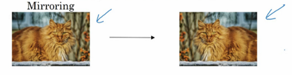
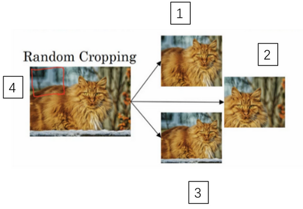
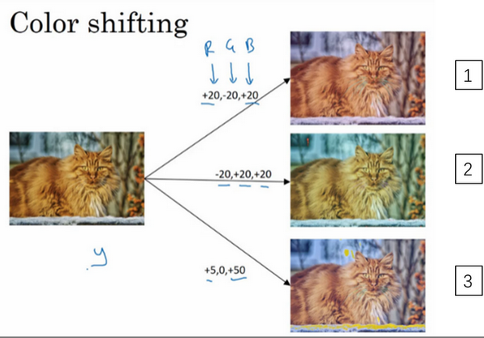

### 第二周：深度卷积网络：实例探究

#### 为什么要进行实例探究？（Why look at case studies?）
一个典型的思路：在开始使用卷积神经网络处理一个应用场景时，是否有前人的经典网络结构可以借鉴，很多时候没有必要从头开始自己创建一个新的网络。也就是说，如果有人已经训练或者计算出擅长识别猫、狗、人的神经网络或者神经网络框架，而你的计算机视觉识别任务是构建一个自动驾驶汽车，你完全可以借鉴别人的神经网络框架来解决自己的问题。

另外学习本课程的另一个收获，如果要一直接触新的前沿技术，需要阅读论文。

本章的其余章节会介绍几个经典的神经网络结构。

#### 经典网络（Classic networks）

### LeNet-5

首先看看LeNet-5的网络结构，假设你有一张32×32×1的图片，LeNet-5可以识别图中的手写数字，比如像这样手写数字7。LeNet-5是针对灰度图片训练的，所以图片的大小只有32×32×1。

第一层使用6个5×5的过滤器，步幅为1。由于使用了6个过滤器，步幅为1，padding为0，输出结果为28×28×6，图像尺寸从32×32缩小到28×28。然后进行池化操作，当时使用的是平均池化，过滤器的宽度为2，步幅为2，图像的尺寸，高度和宽度都缩小了2倍，输出结果是一个14×14×6的图像。

接下来是卷积层，我们用一组16个5×5的过滤器，新的输出结果有16个通道，这个图像从14到14缩小到了10×10。然后又是池化层，高度和宽度再缩小一半，输出一个5×5×16的图像。将所有数字相乘，乘积是400。

下一层是全连接层，在全连接层中，有400个节点，每个节点有120个神经元，这里已经有了一个全连接层。但有时还会从这400个节点中抽取一部分节点构建另一个全连接层，就像这样，有2个全连接层。

最后一步就是利用这84个特征得到最后的输出，我们还可以在这里再加一个节点用来预测$\hat y$的值，$\hat y$有10个可能的值，对应识别0-9这10个数字。使用softmax函数输出十种分类结果。

随着网络越来越深，图像的高度和宽度在缩小，从最初的32×32缩小到28×28，再到14×14、10×10，最后只有5×5。与此同时，随着网络层次的加深，通道数量一直在增加，从1增加到6个，再到16个。

### AlexNet

输入图像规格:224×224×3（RGB图像）,实际上会经过预处理变为227×227×3。使用的96个大小规格为11×11的过滤器filter，或者称为卷积核，进行特征提取。得到了96个55×55大小的特征图，并且是RGB三通道的。

然后用一个3×3的过滤器构建最大池化层，f=3，步幅s为2，卷积层尺寸缩小为27×27×96。接着再执行一个5×5的卷积，padding之后，输出是27×27×276。然后再次进行最大池化，尺寸缩小到13×13。此后依次做三次same卷积，相同的padding，最后得到结果13×13×256。最后再进行一次最大池化，尺寸缩小到6×6×256。6×6×256等于9216，将其展开为9216个单元，然后是两个全连接层。最后使用softmax函数输出识别的结果，看它究竟是1000个可能的对象中的哪一个。

实际上，这种神经网络与LeNet有很多相似之处，不过AlexNet要大得多。正如前面讲到的LeNet或LeNet-5大约有6万个参数，而AlexNet包含约6000万个参数。当用于训练图像和数据集时，AlexNet能够处理非常相似的基本构造模块，这些模块往往包含着大量的隐藏单元或数据，这一点AlexNet表现出色。AlexNet比LeNet表现更为出色的另一个原因是它使用了ReLu激活函数。

### VGG

VGG 又称 VGG-16 网络，“16”指网络中包含 16 个卷积层和全连接层。VGG-16网络没有那么多超参数，这是一种只需要专注于构建卷积层的简单网络。

VGG-16的结构并不复杂，这点非常吸引人，而且这种网络结构很规整，都是几个卷积层后面跟着可以压缩图像大小的池化层，池化层缩小图像的高度和宽度。同时，卷积层的过滤器数量变化存在一定的规律，由64翻倍变成128，再到256和512。

VGG-16确实是个很大的网络，总共包含约1.38亿个参数。但它的优势在于，随着网络的加深，图像的高度和宽度都在以一定的规律不断缩小，每次池化后刚好缩小一半，而通道数量在不断增加，而且刚好也是在每组卷积操作后增加一倍。也就是说，图像缩小的比例和通道数增加的比例是有规律的。

#### 残差网络（Residual Networks (ResNets))
非常深的网络很难训练，存在着梯度消失和梯度爆炸的问题，但是通过跳跃连接（Skip connection），可以从某一层网络层获取激活，然后迅速反馈给另外一层。可以利用跳跃连接构建能够训练深度网络的ResNets，有时深度能够超过100层。

ResNets是由残差块（Residual block）构建的，首先我解释一下什么是残差块。

残差块是如何操作的呢？
在第二个ReLU非线性激活函数前加上$a^{[l]}$。通过（Short cut，或者称跳远连接，Skip connections）可以将$a^{[l]}$添加到第二个 ReLU 过程中，直接建立$a^{[l]}$与 $a^{[l+2]}$之间的隔层联系。公式如下：
- Linear：$z^{[l+1]}=W^{[l+1]}a^{[l]}+b^{[l+1]}$
- Relu：$a^{[l]}=g(z^{[l+1]})$
- Linear：$z^{[l+2]}=W^{[l+2]}a^{[l+1]}+b^{[l+2]}$
- Relu：$a^{[l+2]}=g(z^{[l+2]}+a^{[l]})$

构建一个残差网络就是将许多残差块堆积在一起，形成一个深度网络。每两层增加一个捷径，构成一个残差块。如下图所示。

如果使用标准优化算法训练一个普通网络，比如说梯度下降法，或者其它热门的优化算法。如果没有残差，没有这些捷径或者跳跃连接，会发现随着网络深度的加深，训练错误会先减少，然后增多。但有了 ResNets 就不一样了，即使网络再深，训练的表现却不错，比如说训练误差减少，就算是训练深达 100 层的网络也不例外。

#### 残差网络为什么有用？（Why ResNets work?）
假设有一个大型神经网络，其输入为 X，输出为$a^{[l]}$。给这个神经网络额外增加两层，输出为$a^{[l+2]}$。将这两层看作一个具有跳远连接的残差块。为了方便说明，假设整个网络中都选用 ReLU 作为激活函数，包括输入 X 的非零异常值，因此输出的所有激活值都大于等于 0。

则有：

$$a^{[l+2]}=g(z^{[l+2]}+a^{[l]})=g(W^{[l+2]}a^{[l+1]}+b^{[l+2]}+a^{[l]})$$

如果使用L2正则化或权重衰减,它会压缩$W^{[l+2]}$ 的值，为方便起见，如果$W^{[l+2]}=0$ ，$b^{[l+2]}=0$，可推导出：
$$a^{[l+2]}=g(a^{[l]})=RELU(a^{[l]})=a^{[l]}$$

所以给大型神经网络增加两层，不论是把残差块添加到神经网络的中间还是末端位置，都不会影响网络的表现，残差网络起作用的主要原因就是**这些残差块学习恒等函数**非常容易，你能确定网络性能不会受到影响，很多时候甚至可以提高效率，或者说至少不会降低网络的效率，因此创建类似残差网络可以提升网络性能。

#### 网络中的网络以及 1×1 卷积（Network in Network and 1×1 convolutions）
1x1 卷积（1x1 convolution，或称为 Network in Network）指过滤器的尺寸为 1。当通道数为 1 时，1x1 卷积意味着卷积操作等同于乘积操作。

如果是一张 6×6×32 的图片，那么使用 1×1 过滤器进行卷积效果更好。具体来说，1×1 卷积所实现的功能是遍历这 36 个单元格，计算左图中 32 个数字(通道)和过滤器中 32 个数字(通道)的元素积之和，然后应用 ReLU 非线性函数。

这个 1×1×32 过滤器中的 32 个数字可以这样理解，一个神经元的输入是 32 个数字（输入图片中左下角位置 32 个通道中的数字），即相同高度和宽度上某一切片上的 32 个数字，这 32 个数字具有不同通道，乘以 32 个权重（将过滤器中的 32 个数理解为权重），然后应用 ReLU 非线性函数，在这里输出相应的结果。

如果过滤器不止一个，而是多个（filters个），就好像有多个输入单元，输出结果是 6×6x#filters（过滤器数量）。

池化能压缩数据的高度$(n_{H})$及宽度$(n_{W})$，而 1×1 卷积能压缩数据的通道数$(n_{C})$。在如下图所示的例子中，用 32 个大小为 1×1×192 的滤波器进行卷积，就能使原先数据包含的 192 个通道压缩为 32 个。

#### 谷歌 Inception 网络简介（Inception network motivation）
在之前的构建卷积层时，你要决定过滤器的大小是1×1，3×3还是5×5，或者要不要添加池化层。而 Inception网络的作用即是代替人工来确定卷积层中的过滤器尺寸与类型，或者确定是否需要创建池化层。

下图为使用不同尺寸过滤器进行横向拼接后的结果。基本思想是Inception网络不需要人为决定使用哪个过滤器或者是否需要池化，而是由网络自行确定这些参数，你可以给网络添加这些参数的所有可能值，然后把这些输出连接起来，让网络自己学习它需要什么样的参数，采用哪些过滤器组合。

不难发现，描述的Inception层有一个问题，就是计算成本，这里以一个5×5过滤器在该模块中的计算成本为例进行说明。

图中有 32 个滤波器，每个滤波器的大小为 5x5x192。输出大小为 28x28x32，所以需要计算 28x28x32 个数字，对于每个数，都要执行 5x5x192 次乘法运算。加法运算次数与乘法运算次数近似相等。因此，可以看作这一层的计算量为 28x28x32x5x5x192 = 1.2亿。

为了解决计算量大的问题，可以引入 1x1 卷积来减少其计算量。

对于同一个例子，我们使用 1x1 卷积把输入数据从 192 个通道减少到 16 个通道，然后对这个较小层运行 5x5 卷积，得到最终输出。这个 1x1 的卷积层通常被称作 瓶颈层（Bottleneck layer） 。

改进后的计算量为 28x28x192x16 + 28x28x32x5x5x16 = 1.24 千万，减少了约 90%。

不想决定池化层是使用 1×1，3×3 还是 5×5 的过滤器，那么 inception 模块就是最好的选择。我们可以应用各种类型的过滤器，只需要把输出连接起来。之后我们讲到计算成本问题，我们学习了如何通过使用 1×1 卷积来构建瓶颈层，从而大大降低计算成本，

也就是说，要合理构建瓶颈层，就可以既显著缩小计算规模，又不会降低网络性能。

#### Inception 网络（Inception network）
本节介绍通过Inception网络基础模块的组合，构筑Inception网络。
下图为一个Inception网络基础模块。这个基础模块由四部分构成，一个1×1的卷积层;一个1×1的卷积层，再通过一个3×3的卷积层；一个1×1的卷积层，再通过一个5×5的卷积层；使用same类型的paddingd的池化层，再通过一个1×1的卷积层。最后得到的输出的维度为28×28×256。这就是一个Inception模块，而Inception网络所做的就是将这些模块都组合到一起。

多个Inception 模块的堆叠构成Inception Network，下面是GoogleNet的结构：

这些分支有什么用呢？在网络的最后几层，通常称为全连接层，在它之后是一个 softmax 层（编号 1）来做出预测，这些分支（编号 2）所做的就是通过隐藏层（编号 3）来做出预测，所以这其实是一个 softmax 输出（编号 2），这（编号 1）也是。这是另一条分支（编号 4），它也包含了一个隐藏层，通过一些全连接层，然后有一个 softmax 来预测，输出结果的标签。

注意绿色笔圈出的隐藏层，这些分支都是 Softmax 的输出层，可以用来参与特征的计算及结果预测，起到调整并防止发生过拟合的效果。

如果你理解了 Inception 模块，你就能理解 Inception 网络，无非是很多 个 Inception 模块一环接一环，最后组成了网络。

#### 迁移学习（Transfer Learning）

相比于从头训练权重，或者说从随机初始化权重开始，如果下载别人已经训练好网络结构的权重，通常能够进展的相当快，用这个作为预训练，然后转换到感兴趣的任务上，社区经常使用得数据集：比如 ImageNet，或者 MS COCO，或者 Pascal。

在我们自己的任务中，常常遇到的情况是，在做某类物体的识别分类时，面临着数据集不够的情况，这个时候通过应用迁移学习，应用社区研究者建立的模型和参数，用少量的数据仅训练最后的自定义的softmax网络，从而能够在小数据集上达到很好的效果。

不同的深度学习编程框架有不同的方式，允许你指定是否训练特定层的权重。在这个例子中，你只需要训练 Softmax 层的权重，把前面这些层的权重都冻结（而冻结的层由于不需要改变和训练，可以看作一个固定函数。可以将这个固定函数存入硬盘，以便后续使用，而不必每次再使用训练集进行训练了。）

1. 取输入图像 x，然后把它映射到这层（softmax的前一层，紫色线条标记的）的激活函数，计算特征或者激活值。
2. 将这个固定函数存入硬盘（softmax 层之前的所有层视为一个固定映射）。
3. 在此之上训练 softmax 分类器。

存储到硬盘或者说预计算方法的优点就是，你不需要每次遍历训练集再重新计算这个激活值了。

如果我们在自己的问题上也拥有大量的数据集，我们可以多训练后面的几层。总之随着数据集的增加，我们需要“（冻结） freeze”的层数越来越少。最后如果我们有十分庞大的数据集，那么我们可以训练网络模型的所有参数，将其他研究者训练的模型参数作为参数的初始化来替代随机初始化，来加速我们模型的训练。

#### 数据扩充（Data augmentation）
计算机视觉中常遇到的问题是数据不够。这节中介绍几种数据扩充的方法。
##### Mirroring 镜像

##### Random Cropping 随机裁剪

随机裁剪，给定一个数据集，然后开始随机裁剪，可能修剪这个（编号1），选择裁剪这个（编号2），这个（编号3），可以得到不同的图片放在数据集中，你的训练集中有不同的裁剪。随机裁剪并不是一个完美的数据扩充的方法，如果你随机裁剪的那一部分（红色方框标记部分，编号4），这部分看起来不像猫。

##### Color Shifting 彩色转换

在R、G和B三个通道上加上不同的失真值。
PCA颜色增强:指更有针对性地对图片的RGB通道进行主成分分析（Principles Components Analysis，PCA），对主要的通道颜色进行增加或减少，比如说，如果你的图片呈现紫色，即主要含有红色和蓝色，绿色很少，然后 PCA 颜色增强算法就会对红色和蓝色增减很多，绿色变化相对少一点，所以使总体的颜色保持一致。

#### 计算机视觉现状（The state of computer vision）

##### Data VS  Hand Engineering
大部分机器学习问题是介于少量数据和大量数据范围之间的。
- 当你有很多数据时，人们倾向于使用更简单的算法和更少的手工工程，因为我们不需要为这个问题精心设计特征。
- 相反当你没有那么多的数据时，那时你会看到人们从事更多的是手工工程，就是你有很多小技巧可用，从而获得更好的表现。

通常我们的学习算法有两种知识来源:
- 一个来源是被标记的数据，就像(x，y)应用在监督学习
- 第二个知识来源是手工工程，有很多方法去建立一个手工工程系统，它可以是源于精心设计的特征，手工精心设计的网络体系结构或者是系统的其他组件。所以当你没有太多标签数据时，你只需要更多地考虑手工工程。

计算机视觉领域没有足够的数据，是造成计算机视觉领域发展相当复杂网络架构的原因。因为在缺乏更多数据的情况下，获得良好表现的方式还是花更多时间进行架构设计。

**当你有少量的数据时，有一件事对你很有帮助，那就是迁移学习。**

另外，在模型研究或者竞赛方面，有一些方法能够有助于提升神经网络模型的性能：
- 集成（Ensembling）：独立地训练几个神经网络，并平均它们的输出。假设你的 7 个神经网络，它们有 7 个不同的预测，然后平均他们，这可能会让你在基准上提高 1%，2%或者更好。
- Multi-crop at test time：将数据扩增应用到测试集，对结果进行平均。
但是由于这些方法计算和内存成本较大，一般不适用于构建实际的生产项目。