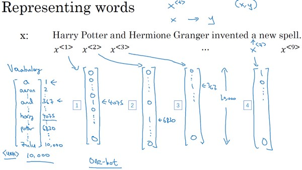
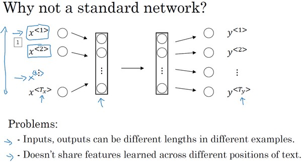

### 第一周：循环序列模型（Recurrent Neural Networks）

#### 为什么选择序列模型？（Why Sequence Models?）
自然语言、音频等数据都是前后相互关联的数据，比如理解一句话要通过一整句而不是其中的几个词，分析一段音频要通过连续的片段而不是其中的几帧。前面所学的DNN以及CNN处理的都是前后毫无关联的一个个单独数据，对于这些序列数据则需要采用RNN进行处理。下图中展示了RRN的一些具体应用。

#### 数学符号
序列模型的数学表示，如有如下语句：

Harry Potter and Herminoe Granger invented a new spell.

对于一个序列数据x，用符号$x^{⟨t⟩}$来表示这个数据中的第 t个元素，用 $y^{⟨t⟩}$来表示第t个标签，用$T_x$和 $T_y$来表示输入和输出的长度。

对于NLP问题，一个句子首先要进行数字化的表示，需要先建立一个词汇表（Vocabulary），或者叫字典（Dictionary）。将需要表示的所有词语变为一个列向量，可以根据字母顺序排列，然后根据单词在向量中的位置，用 one-hot 向量（one-hot vector）来表示该单词的标签。如下图所示：

#### 循环神经网络模型

为什么不能用传统神经网络来处理序列数据？
- 输入和输出数据在不同的例子中可以有不同的长度；因此输入层和输出层的神经元数量无法固定。
- 从输入文本的不同位置学到的同一特征无法共享。
  

为了解决这些问题，引入循环神经网络（Recurrent Neural Network，RNN）。一种循环神经网络的结构如下图所示：

当元素$x^{⟨t⟩}$输入隐藏层的同时，该隐藏层也会接收来自上一时间步的隐藏层的激活值$a^{⟨t−1⟩}$，其中$a^{⟨0⟩}$ 一般直接初始化为零向量。一个时间步输出一个对应的预测结果$\hat{y}^{⟨t⟩}$。

循环神经网络是从左向右扫描数据，同时每个时间步的参数也是共享的，用$W_{ax}$来表示管理着从$x^{⟨1⟩}$到隐藏层的连接的一系列参数，每个时间步使用的都是相同的参数$W_{ax}$。而激活值也就是水平联系是由参数$W_{aa}$决定的，同时每一个时间步都使用相同的参数$W_{aa}$，同样的输出结果由$W_{ya}$决定。

假如在预测$y^{⟨3⟩}$时，不仅要使用$x^{⟨3⟩}$的信息，还要使用来自$x^{⟨1⟩}$和$x^{⟨2⟩}$的信息。这个循环神经网络的一个缺点就是它只使用了这个序列中之前的信息来做出预测，尤其当预测$y^{⟨3⟩}$时，它没有用到$x^{⟨4⟩}$，$x^{⟨5⟩}$，$x^{⟨6⟩}$等后面的信息。

前向传播过程：

$a^{⟨0⟩} = \vec{0}$

$a^{⟨t⟩} = g_1(W_{aa}a^{⟨t-1⟩} + W_{ax}x^{⟨t⟩} + b_a)$

$\hat y^{⟨t⟩} = g_2(W_{ya}a^{⟨t⟩} + b_y)$

激活函数 $g_1$通常选择 tanh，有时也用 ReLU；$g_2$可选 sigmoid 或 softmax，取决于需要的输出类型。

#### 通过时间的反向传播（Backpropagation through time）

为了计算反向传播过程，需要先定义一个损失函数。单个位置上（或者说单个时间步上）某个单词的预测值的损失函数采用交叉熵损失函数，如下所示：

$$L^{⟨t⟩}(\hat y^{⟨t⟩}, y^{⟨t⟩}) = -y^{⟨t⟩}log\hat y^{⟨t⟩} - (1 - y^{⟨t⟩})log(1-\hat y^{⟨t⟩})$$

而整个序列的损失函数，是将每个单独时间步的损失函数都加起来,如下所示：

$$J = L(\hat y, y) = \sum^{T_x}_{t=1} L^{⟨t⟩}(\hat y^{⟨t⟩}, y^{⟨t⟩})$$

#### 不同类型的循环神经网络（Different types of RNNs）

上面所讲述的都是一种RNN结构，它的输入量$T_x$等于输出数量$T_y$。事实上，对于其他一些应用，$T_x$和 $T_y$并不一定相等。

不同的应用场景对应着不同的结构：如"多对一“，情感分类的例子，首先读取输入，一个电影评论的文本，然后判断他们是否喜欢电影还是不喜欢。再比如多对多的例子，它的输入长度和输出长度是完全一样的，像机器翻译这样的应用。再比如音乐生成的例子，输入可以是长度为1甚至为空集，输出为一段音乐，为一对多的例子。

#### 语言模型和序列生成（Language model and sequence generation）

**什么是语言模型？**

语言模型（Language Model）能够估计某个序列中各元素出现的可能性。例如，在一个语音识别系统中，语言模型能够计算两个读音相近的句子为正确结果的概率，识别出的结果为概率高的。

**那么如何建立一个语言模型呢**？

你首先需要一个训练集，包含一个很大的文本语料库（corpus）。语料库是自然语言处理的一个专有名词，意思就是很长的或者说数量众多的句子组成的文本。建立过程的第一步是标记化（Tokenize），即建立字典；然后将语料库中的每个词表示为对应的 one-hot 向量。另外，需要增加一个额外的标记 EOS（End of Sentence）来表示一个句子的结尾。标点符号可以忽略，也可以加入字典后用 one-hot 向量表示。

对于语料库中部分特殊的、不包含在字典中的词汇，例如人名、地名，可以不必针对这些具体的词，而是在词典中加入一个 UNK（Unique Token）标记来表示。

完成标识化的过程后，这意味着输入的句子都映射到了各个标志上，或者说字典中的各个词上。下一步我们要构建一个RNN来构建这些序列的概率模型。

在第一个时间步中，输入的 $a^{⟨0⟩}$和 $x^{⟨1⟩}$都是零向量，$y^{⟨1⟩}$是通过 softmax 预测出的字典中每个词作为第一个词出现的概率；在第二个时间步中，输入的$x^{⟨2⟩}$是训练样本的标签中的第一个单词 $y^{⟨1⟩}$（即“cats”）和上一层的激活项$a^{⟨1⟩}$，输出的$y^{⟨2⟩}$表示的是通过 softmax 预测出的、单词“cats”后面出现字典中的其他每个词的条件概率。以此类推，最后就可以得到整个句子出现的概率。

为了训练这个网络，我们要定义代价函数。于是，在某个时间步t，如果真正的词是$y^{⟨t⟩}$，而神经网络的softmax层预测结果值是$\hat y^{⟨t⟩}$。那么损失函数为：

$$L(\hat y^{⟨t⟩}, y^{⟨t⟩}) = -\sum_t y_i^{⟨t⟩} log \hat y^{⟨t⟩}$$

而总体损失函数,也就是把所有单个预测的损失函数都相加起来。如下所示：

$$J = \sum_t L^{⟨t⟩}(\hat y^{⟨t⟩}, y^{⟨t⟩})$$

#### 对新序列采样（Sampling novel sequences）

在训练好一个语言模型后，可以通过采样（Sample）新的序列来了解这个模型中都学习到了一些什么。

在第一个时间步输入$a^{⟨0⟩}$和$x^{⟨1⟩}$为零向量，输出预测出的字典中每个词作为第一个词出现的概率，根据 softmax 的分布进行随机采样（np.random.choice），将采样得到的$y^{⟨1⟩}$作为第二个时间步的输入$x^{⟨2⟩}$。以此类推，直到采样到EOS，最后模型会自动生成一些句子，从这些句子中可以发现模型通过语料库学习到的知识。

这里建立的是基于词汇构建的语言模型。根据需要也可以构建基于字符的语言模型，其优点是不必担心出现未知标识（UNK），其缺点是得到的序列过多过长，并且训练成本高昂。因此，基于词汇构建的语言模型更为常用。

#### 循环神经网络的梯度消失（Vanishing gradients with RNNs）

$$The\ cat, which\ already\ ate\ a\ bunch\ of\ food,\ was\ full.$$

$$The\ cats, which\ already\ ate\ a\ bunch\ of\ food,\ were\ full.$$

这个例子中的句子有长期的依赖，最前面的单词对句子后面的单词有影响。但是我们目前见到的基本的RNN模型，不擅长捕获这种长期依赖效应。究其原因，由于梯度消失，在反向传播时，后面层的输出误差很难影响到较靠前层的计算，网络很难调整靠前的计算。

在反向传播时，随着层数的增多，梯度不仅可能指数型下降，也有可能指数型上升，即梯度爆炸。不过梯度爆炸比较容易发现，因为参数会急剧膨胀到数值溢出（可能显示为 NaN）。这时可以采用梯度修剪（Gradient Clipping）来解决：观察梯度向量，如果它大于某个阈值，则缩放梯度向量以保证其不会太大。相比之下，梯度消失问题更难解决。GRU 和 LSTM 都可以作为缓解梯度消失问题的方案。

#### GRU单元（Gated Recurrent Unit（GRU））
GRU门控循环单元，它改变了RNN的隐藏层，使其可以更好地捕捉深层连接，并改善了梯度消失问题。

GRU 单元有一个新的变量称为 c，代表记忆细胞（Memory Cell），其作用是提供记忆的能力，记住例如前文主语是单数还是复数等信息。在时间t，记忆细胞的值$c^{⟨t⟩}$等于输出的激活值$a^{⟨t⟩}$；$\tilde c^{⟨t⟩}$ 代表下一个 c 的候选值。$Γ_u$ 代表更新门（Update Gate），用于决定什么时候更新记忆细胞的值。以上结构的具体公式为,这里是简化的GRU 单元：

$$\tilde c^{⟨t⟩} = tanh(W_c[c^{⟨t-1⟩}, x^{⟨t⟩}] + b_c)$$

$$Γ_u = \sigma(W_u[c^{⟨t-1⟩}, x^{⟨t⟩}] + b_u)$$

$$c^{⟨t⟩} = Γ_u \times \tilde c^{⟨t⟩} + (1 - Γ_u) \times c^{⟨t-1⟩}$$

$$a^{⟨t⟩} = c^{⟨t⟩}$$

当使用 sigmoid 作为激活函数 $\sigma$ 来得到$Γ_u$时，$Γ_u$ 的值在 0 到 1 的范围内，且大多数时间非常接近于 0 或 1。当 $Γ_u$=1时，$c^{⟨t⟩}$被更新为 $\tilde c^{⟨t⟩}$，否则保持为 $c^{⟨t-1⟩}$。因为$Γ_u$可以很接近 0 ，$c^{⟨t⟩}$几乎就等于$c^{⟨t-1⟩}$。在经过很长的序列后，c 的值依然被维持，从而实现“记忆”的功能。

以上实际上是简化过的 GRU 单元，但是蕴涵了 GRU 最重要的思想。完整的 GRU 单元添加了一个新的相关门（Relevance Gate） $Γ_r$，表示$\tilde c^{⟨t⟩}$和$c^{⟨t⟩}$的相关性。因此，表达式改为如下所示:

$$\tilde c^{⟨t⟩} = tanh(W_c[Γ_r * c^{⟨t-1⟩}, x^{⟨t⟩}] + b_c)$$

$$Γ_u = \sigma(W_u[c^{⟨t-1⟩}, x^{⟨t⟩}] + b_u)$$

$$Γ_r = \sigma(W_r[c^{⟨t-1⟩}, x^{⟨t⟩}] + b_r$$

$$c^{⟨t⟩} = Γ_u \times \tilde c^{⟨t⟩} + (1 - Γ_u) \times c^{⟨t-1⟩}$$

$$a^{⟨t⟩} = c^{⟨t⟩}$$

#### 长短期记忆（LSTM（long short term memory）unit）
LSTM（Long Short Term Memory，长短期记忆）网络比 GRU 更加灵活和强大，它额外引入了遗忘门（Forget Gate） $Γ_f$和输出门（Output Gate）$Γ_o$。其结构图和公式如下：

在上述公式和图示中看到，LSTM不同于GRU，a和c是独立开的两个值。

以上是简化版的 LSTM。在更为常用的版本中，几个门值不仅取决于  $a^{⟨t-1⟩}$和 $x^{⟨t⟩}$，有时也可以偷窥上一个记忆细胞输入的值  $c^{⟨t-1⟩}$，这被称为窥视孔连接（Peephole Connection)。对于三个门的公式更新如下：
$$\tilde c^{⟨t⟩} = tanh(W_c[a^{⟨t-1⟩}, x^{⟨t⟩}] + b_c)$$
$$Γ_u = \sigma(W_u[a^{⟨t-1⟩}, x^{⟨t⟩}, c^{⟨t-1⟩}] + b_u)$$
$$Γ_f = \sigma(W_f[a^{⟨t-1⟩}, x^{⟨t⟩}, c^{⟨t-1⟩}] + b_f)$$

$$Γ_o = \sigma(W_o[a^{⟨t-1⟩}, x^{⟨t⟩},c^{⟨t-1⟩}] + b_o)$$

$$c^{⟨t⟩} = Γ^{⟨t⟩}_u \times \tilde c^{⟨t⟩} + Γ^{⟨t⟩}_f \times c^{⟨t-1⟩}$$

$$a^{⟨t⟩} = Γ_o^{⟨t⟩} \times tanh(c^{⟨t⟩})$$

#### 双向循环神经网络（Bidirectional RNN）
单向的循环神经网络在某一时刻的预测结果只能使用之前输入的序列信息。双向循环神经网络（Bidirectional RNN，BRNN）可以在序列的任意位置使用之前和之后的数据。其工作原理是增加一个反向循环层，结构如下图所示：

$$\hat y^{<t>} = g(W_{y}[\overrightarrow a^{<t>}, \overleftarrow a^{<t>}] + b_{y})$$

这个改进的方法不仅能用于基本的 RNN，也可以用于 GRU 或 LSTM。缺点是需要完整的序列数据，才能预测任意位置的结果。例如构建语音识别系统，需要等待用户说完并获取整个语音表达，才能处理这段语音并进一步做语音识别。因此，实际应用会有更加复杂的模块。

#### 深层循环神经网络（Deep RNNs）

循环神经网络的每个时间步上也可以包含多个隐藏层，形成深度循环神经网络（Deep RNN)。结构如下图所示：

深层的基本神经网络结构相似，深层RNNs模型具有多层的循环结构，但不同的是，在传统的神经网络中，我们可能会拥有很多层，几十层上百层，但是对与RNN来说，三层的网络结构就已经很多了，因为RNN存在时间的维度，所以其结构已经足够的庞大。

