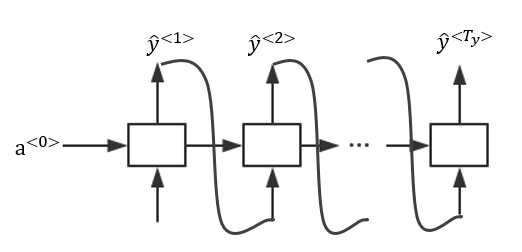
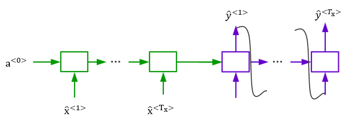
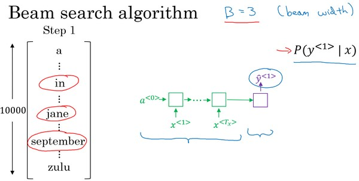
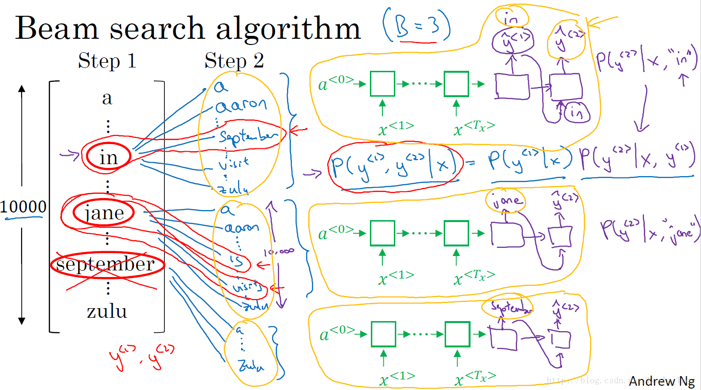
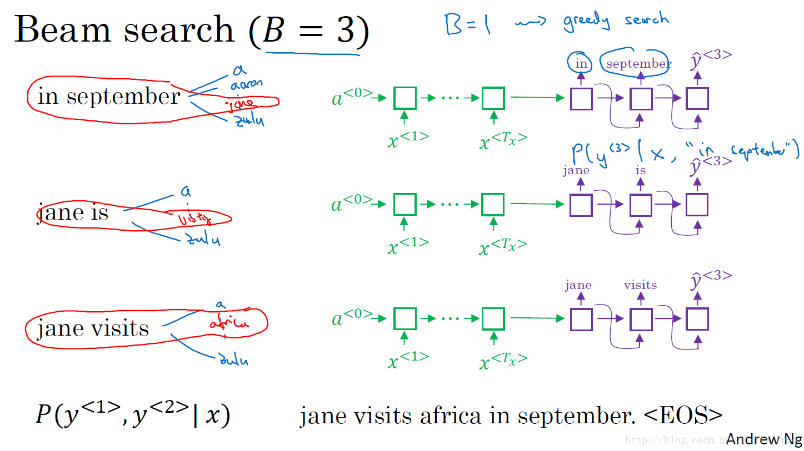
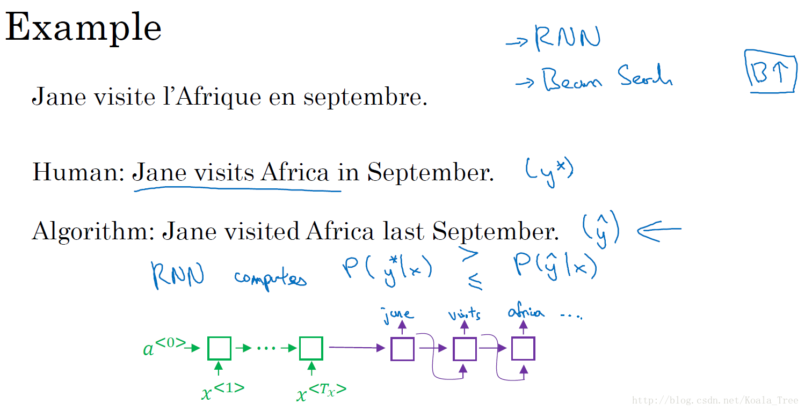
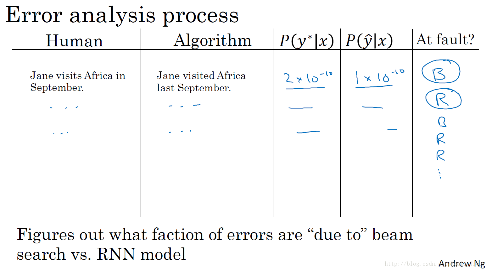
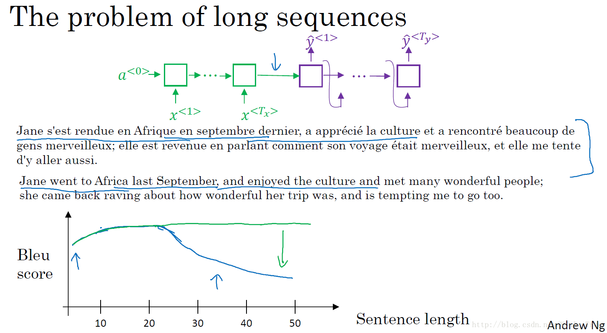
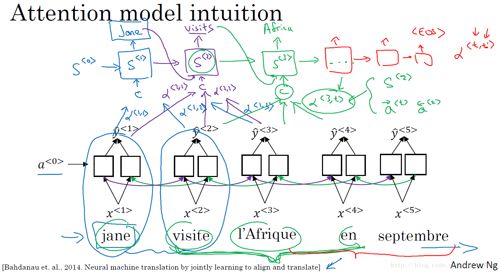

### 第三周：序列模型和注意力机制（Sequence models & Attention mechanism）

#### 序列结构的各种序列（Various sequence to sequence architectures）
Seq2Seq（Sequence-to-Sequence）模型能够应用于机器翻译、语音识别等各种序列到序列的转换问题。一个 Seq2Seq 模型包含编码器（Encoder）和解码器（Decoder）两部分，它们通常是两个不同的 RNN。如下图所示，左边的encoder对于输入序列的处理会输出一个向量来代表这个输入序列，然后将编码器的输出作为解码器（Decoder）的输入，由解码器负责输出正确的翻译结果。

**image to sequence模型**

如下图，将图片输入到卷积神经网络中，下面所展示的就是AlexNet结构，卷积网络输出图片的向量表示，这个预训练网络可以看作为图像的编码网络Encoder。然后将softmax单元去掉，换为RNN网络，将图片的向量表示输入到RNN中（Decoder），RNN要做的就是生成图像的描述。

#### 选择最可能的句子（Picking the most likely sentence）
seq2seq机器翻译模型与前面讲到的语言模型相似，可以看成为具有条件的语言模型。

下图所示，上图为语言模型，下图为机器翻译的具有条件的语言模型。

对于语言模型，总是以零向量开始，也就是其第一个时间步的输入为零向量；

在机器翻译中，包含了编码网络encoder（图中绿色网络）和解码网络decoder（图中紫色网络），其中解码网络decoder的结构与语言模型的结构是相似的。而encoder网络会计算出一系列向量来表示输入的句子，decoder网络就可以以这个句子向量开始，而不是以零向量开始，所以相比语言模型来说，机器翻译可以称作条件语言模型，其输出的句子概率是相对于输入的条件概率。

机器翻译模型所有要做的就是对于一个句子的输入，通过模型来找出合适的y值，使得条件概率最大化。而解决这种问题最通用的算法就是束搜索(Beam Search)。

**为什么不用贪心搜索(Greedy Search)呢？**

贪心算法是每次机器翻译都按照一个词一个词的进行翻译，找到在当前条件下，下一个最有可能的词。

而机器翻译要做的是，你真正需要的是一次性挑选出整个单词序列，从$y^{<1>}，y^{<2>}，\cdots，y^{<T_{y}>}$来使得整体的概率最大化。所以对于贪心搜索来说，这种方法对于机器翻译来说是不可行的。

#### 集束搜索（Beam Search）
集束搜索算法的目的是给定一个输入句子或者语音片段，你不会想要一个随机的文本翻译结果，你想要最接近原意的翻译结果。下面给出具体算法。

这里仍然以一个法语翻译为英语作为示例。

**Step1**：下图中，左边列出了10,000个词的词汇表。（下图右下方）绿色为encoder网络，输入的法语句子，要评估的是第一个翻译输出y的概率值是多少。集束搜索会通过设定集束宽（beam width）B参数，来决定考虑多少个输出值。假如通过设置B的大小如3，我们则取softmax层输出概率前3的3个单词，并保存起来。这里假设in jane September选了出来。

**Step2**：对于第一步选出的三个单词，每一个都对应10000个不同的选择来组成词语对。对于集束搜索的第二步,就是从3*10000个结果中选择概率最高的三个作为第二步的输出。

给出计算各个词语对的计算过程，以下图中第一行in的计算过程为例。解码器的第一个输出$y^{<1>}$为单词in，同时作为第二个结点的输入。则为了求条件概率最大化，可表示为

$P(y^{<1>},y^{<2>}|X)=P(y^{<1>}|X)P(y^{<2>}|X,y^{<1>})$

在给定输入下，第一和第二两个词对的概率等于第一步第一个单词的概率乘以给定第一个输入单词和输入语句下的第二步的条件概率。

**Step3**：Step 3~Step T，与Step2的过程是相似的，直到遇到句尾符号结束。

#### 改进集束搜索（Refinements to Beam Search）
长度归一化（Length normalization）就是对束搜索算法稍作调整的一种方式，帮助你得到更好的结果，下面介绍一下它。

束搜索就是最大化这个概率，

$$\arg \max_{y} \prod\limits_{t = 1}^{{T_y}} {P({y^{ < t > }}|x,{y^{ < 1 > }}, \ldots ,{y^{ < t - 1 > }})}
\\  = \arg \max_{y} P(y^{ < 1 > },\cdots,y^{ <T_{y} > }|x) \\
= \arg \max_{y} P(y^{ < 1 > }|x) P(y^{ < 2> }|x,y^{ < 1 >})\cdots P(y^{ < T_{y}> }|x,y^{ < 1 >},\cdots, y^{ <T_{y}-1>})$$

计算上面的乘积概率，每个概率值都是小于1的，通常远小于1。很多小于1的数乘起来，会得到很小很小的数字，会造成数值下溢。我们不会最大化上面这个公式的乘积，而是取log值，变成log求和最大值，得到一个数值上更加稳定的算法，公式如下：

$$\arg \max_{y} \sum\limits_{y = 1}^{{T_y}} \log {P({y^{ < t > }}|x,{y^{ < 1 > }}, \ldots ,{y^{ < t - 1 > }})}$$

参照原来的目标函数,这个目标函数有一个缺点，它可能不自然地倾向于简短的翻译结果，它更偏向短的输出，因为短句子的概率是由更少数量的小于1的数字乘积得到的，所以这个乘积不会那么小。

对于取对数，也有同样的问题，概率的log值通常小于等于1，实际上在log的这个范围内，结果是负数，所以加起来的项越多，得到的结果越负。所以对于目标函数做一些改变，不再最大化这个目标函数了，我们可以把它归一化，通过除以翻译结果的单词数量。相比直接除以输出单词长度的值，可以使用更加柔和的方式：在$T_{y}$上加上一个指数α，如α=0.7，通过调整其大小获得更加好的效果。

$$\dfrac {1}{T_{y}^{\alpha}}\arg \max_{y} \sum\limits_{y = 1}^{{T_y}} \log {P({y^{ < t > }}|x,{y^{ < 1 > }}, \ldots ,{y^{ < t - 1 > }})}$$

通过上面的目标，选取得分最大的句子，即为我们的模型最后得到的输出结果。

**集束宽度选择：**

B越大，你考虑的选择越多，你找到的句子可能越好，但是B越大，你的算法的计算代价越大，因为你要把很多的可能选择保存起来。需要对应用的领域和场景选择适当的B值。

#### 集束搜索的误差分析（Error analysis in beam search）
集束搜索是一种启发式搜索算法，其输出结果不总为最优。。通过误差分析法，定位是束搜索算法出现了问题，还是RNN模型出了问题。

同样以法语句子的英文翻译为例子，我们人类对法语句子的翻译如下图中间的句子，而我们的模型输出的翻译如下图中下面的句子。通过我们的模型，我们分别计算人类翻译的概率$P(y^{*}|x)$以及模型翻译的概率$P(\hat y|x)$，比较两个概率的大小，通过比较我们就能知道是因为Beam Search 算法的问题还是RNN模型的问题。如下图所示：

- $P(y^{*}|x) > P(\hat y|x)$的情况：Beam search算法选择了$\hat y$，但是$y^{*}$却得到了更高的概率，所以Beam search 算法出错了；
- $P(y^{*}|x) <= P(\hat y|x)$的情况：翻译结果$y^{*}$相比$\hat y$要更好，但是RNN模型却预测$P(y^{*}|x) <= P(\hat y|x)$，所以这里是RNN模型出现了错误。

在开发集上，对各个句子进行检测，得到每个句子对应的出错情况，那么根据整个开发集的上算法错误和模型错误的比例，就可以针对性地对二者之一进行改进和修正了。

#### 注意力模型直观理解（Attention Model Intuition）
注意力模型或者说注意力这种思想（The attention algorithm, the attention idea）已经是深度学习中最重要的思想之一。总的来说，注意力模型是借鉴了人类的注意力机制，核心目标也是从众多信息中选择出对当前任务目标更关键的信息。

**长句子存在的问题**：

利用我们前面的编码和解码的RNN模型，对于长句子，RNN网络中的，下图中的绿色的编码器要做的就是读整个句子，然后记忆整个句子。紫色的解码器要做的就是进行翻译。而神经网络记忆非常长句子是非常困难的，所以随着句子变长，Bleu评分会降低。

而人工翻译，首先会做的可能是先翻译出句子的部分，再看下一部分，并翻译这一部分。看一部分，翻译一部分，一直这样下去。

引入注意力模型后，模型翻译得就像人类一样，一次翻译句子的一部分。

对于法语翻译英语的例子中，针对每个单词的输出，一般来说与某个输出相关的或者有较大影响的单词应该是集中在附近的几个单词或者说是某些部分。所以注意力模型会在每个输入的信息块上计算注意力权重，不同的权重对每一步的输出结果有不同的注意力影响。

举例：也就是在计算翻译的第一个词Jane时候，应该花多少注意力在离他距离较近的各个词上面。

#### 注意力模型（Attention Model）
本节仍然通过举例的方式来进行说明。

注意力模型的一个示例网络结构如下图所示。其中，底层是一个双向循环神经网络（BRNN），该网络中每个时间步的激活都包含前向传播和反向传播产生的激活：
$$a^{\langle t’ \rangle} = ({\overrightarrow a}^{\langle t’ \rangle}, {\overleftarrow a}^{\langle t’ \rangle})$$

顶层是一个“多对多”结构的循环神经网络，第 t 个时间步的输入包含该网络中前一个时间步的激活 $s^{\langle t-1 \rangle}$、输出$y^{\langle t-1 \rangle}$，以及底层的 BRNN 中多个时间步的激活$c$，其中 $c$ 有:

$$c^{\langle t \rangle} = \sum_{t’}\alpha^{\langle t,t’ \rangle}a^{\langle t’ \rangle}$$

其中，参数$\alpha^{\langle t,t’ \rangle}$，即代表着$y^{\langle t \rangle}$对$a^{\langle t' \rangle}$的“注意力”，总有：

$$\sum_{t’}\alpha^{\langle t,t’ \rangle} = 1$$

我们使用 Softmax 来确保上式成立，因此有：

$$\alpha^{\langle t,t’ \rangle} = \frac{exp(e^{\langle t,t’ \rangle})}{\sum^{T_x}_{t'=1}exp(e^{\langle t,t’ \rangle})}$$

而对于$e^{\langle t,t’ \rangle}$,我们通过神经网络学习得到。输入为 $s^{\langle t-1 \rangle}$，$a^{\langle t’ \rangle}$,如下图所示：

注意力模型的一个缺点是时间复杂度为 $O(n^3)$。

#### 语音识别
在语音识别任务中，输入是一段以时间为横轴的音频片段，输出是文本。

音频数据的常见预处理步骤是运行音频片段来生成一个声谱图，并将其作为特征。以前的语音识别系统通过语言学家人工设计的音素（Phonemes）来构建，音素指的是一种语言中能区别两个词的最小语音单位。现在的端到端系统中，用深度学习就可以实现输入音频，直接输出文本。

对于训练基于深度学习的语音识别系统，大规模的数据集是必要的。学术研究中通常使用 3000 小时长度的音频数据，而商业应用则需要超过一万小时的数据。

语音识别系统可以用注意力模型来构建，一个简单的图例如下：

用 CTC（Connectionist Temporal Classification）损失函数来做语音识别的效果也不错。由于输入是音频数据，使用 RNN 所建立的系统含有很多个时间步，且输出数量往往小于输入。因此，不是每一个时间步都有对应的输出。CTC 允许 RNN 生成下图红字所示的输出，并将两个空白符（blank）中重复的字符折叠起来，再将空白符去掉，得到最终的输出文本。

