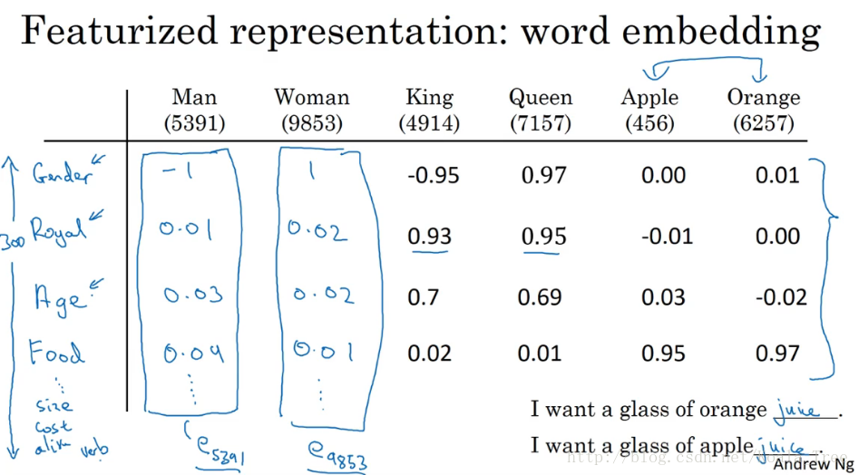
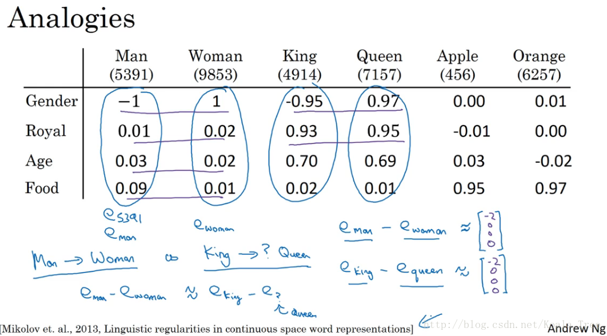
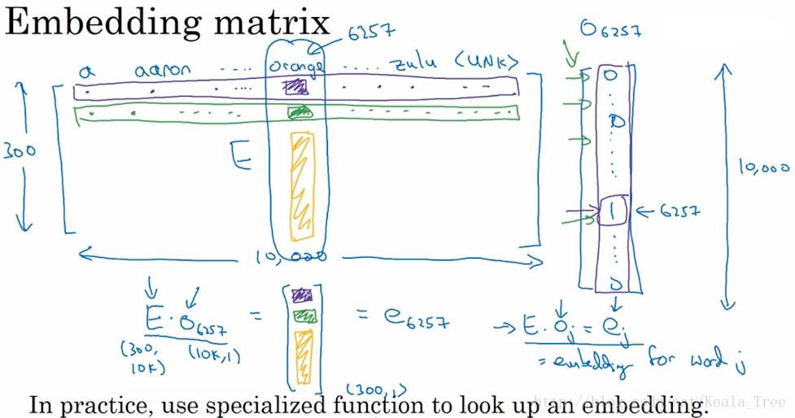
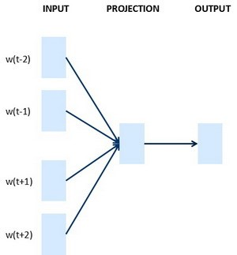
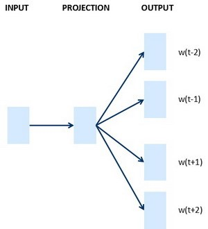
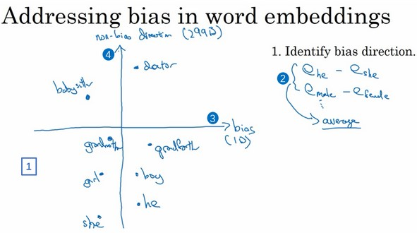
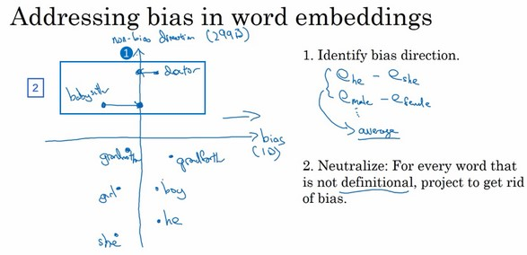
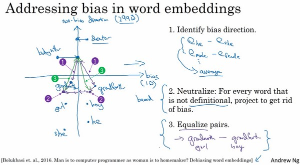

### 第二周：自然语言处理与词嵌入

#### 词汇表征（Word Representation）
one-hot 向量将每个单词表示为完全独立的个体，不同词向量都是正交的，因此单词间的相似度无法体现。缺点就是它把每个词孤立起来，这样使得算法对相关词的泛化能力不强。每个词向量之间的距离都一样，乘积均为0，所以无法获取词与词之间的相似性和关联性。因为对于算法来说，无法知道，apple和orange的关系很接近，就像man和woman，king和queen一样。

换用特征化表示方法能够解决这一问题。我们可以通过用语义特征作为维度来表示一个词，因此语义相近的词，其词向量也相近。

对于这种表示方法，比如我们想知道这些词与Gender（性别）的关系。假定男性的性别为-1，女性的性别为+1，那么man的性别值可能就是-1，而woman就是-1。最终根据经验king就是-0.95，queen是+0.97，apple和orange没有性别可言。这样对于不同的单词算法泛化性能会更好。

词嵌入（Word Embedding）是 NLP 中语言模型与表征学习技术的统称，概念上而言，它是指把一个维数为所有词的数量的高维空间（one-hot 形式表示的词）“嵌入”到一个维数低得多的连续向量空间中，每个单词或词组被映射为实数域上的向量。对大量词汇进行词嵌入后获得的词向量，可用于完成命名实体识别（Named Entity Recognition）等任务。

将高维的词嵌入“嵌入”到一个二维空间里，就可以进行可视化。常用的一种可视化算法是 t-SNE 算法。在通过复杂而非线性的方法映射到二维空间后，每个词会根据语义和相关程度聚在一起。

#### 使用词嵌入（Using Word Embeddings）
用词嵌入做迁移学习可以降低学习成本，提高效率。其步骤如下：

- 从大量的文本集中学习词嵌入，或者下载网上开源的、预训练好的词嵌入模型；
- 将这些词嵌入模型迁移到新的、只有少量标注训练集的任务中；
- 可以选择是否微调词嵌入。当标记数据集不是很大时可以省下这一步。

**词嵌入和人脸编码之间有奇妙的关系**

上一节中的人脸识别，我们训练了一个Siamese网络结构，这个网络会学习不同人脸的一个128维表示，然后通过比较编码结果来判断两个图片是否是同一个人脸，这个词嵌入的意思和这个差不多。在人脸识别领域大家喜欢用编码这个词来指代这些向量。

脸识别领域和这里的词嵌入有一个不同就是，在人脸识别中我们训练一个网络，任给一个人脸照片，甚至是没有见过的照片，神经网络都会计算出相应的一个编码结果；而学习词嵌入则是有一个固定的词汇表，学习一个固定的编码，每一个词汇表的单词的固定嵌入。

#### 词嵌入的特性（Properties of Word Embeddings）
**词嵌入可用于类比推理**

尽管类比推理可能不是NLP中最重要的，不过它能帮助人们理解词嵌入做了什么，以及词嵌入能够做什么。

假如我提出一个问题，man如果对应woman，那么king应该对应什么？你们应该都能猜到king应该对应queen。能否有一种算法来自动推导出这种关系，下面就是实现的方法。

算法所做的就是计算嵌入向量$e_{man} - e_{woman}$，然后找出一个向量也就是找出一个词，使得$e_{man} - e_{woman} \approx e_{king} - e_?$

一个最常用的相似度计算函数是余弦相似度（cosine similarity）。公式为：
$$sim(u, v) = \frac{u^T v}{|| u ||_2 || v ||_2}$$

#### 嵌入矩阵（Embedding Matrix）
当你应用算法来学习词嵌入时，实际上是学习一个嵌入矩阵。通过嵌入矩阵与对应词的one-hot向量相乘，则可得到该词汇的embedding。

不同的词嵌入方法能够用不同的方式学习到一个嵌入矩阵（Embedding Matrix） E。将字典中位置为 i 的词的 one-hot 向量表示为 $o_i$，词嵌入后生成的词向量用 $e_i$表示，则有：

$E \cdot o_i = e_i$

但在实际情况下一般不这么做。因为 one-hot 向量维度很高，且几乎所有元素都是 0，而不是用通常的矩阵乘法来做，这样做的效率太低。因此，实践中直接用专门的函数查找矩阵 E 的特定列。

#### 学习词嵌入（Learning Word Embeddings）
神经概率语言模型（Neural Probabilistic Language Model）构建了一个能够通过上下文来预测未知词的神经网络，在训练这个语言模型的同时学习词嵌入。

训练过程中，将语料库中的某些词作为目标词，以目标词的部分上下文作为输入，Softmax 输出的预测结果为目标词。嵌入矩阵 E 和 w、b 为需要通过训练得到的参数。这样，在得到嵌入矩阵后，就可以得到词嵌入后生成的词向量。

#### Word2Vec
Word2Vec 是一种简单高效的词嵌入学习算法，包括 2 种模型：
- 如果是用一个词语作为输入，来预测它周围的上下文，那这个模型叫做『Skip-gram 模型』
- 而如果是拿一个词语的上下文作为输入，来预测这个词语本身，则是 『Continuous Bag of Words(CBOW) 模型』

下图左边为CBOW模型，右边为Skip-Gram模型。**CBOW对小型数据库比较合适，而Skip-Gram在大型语料中表现更好。**

    

模型流程：
- 使用一个具有大量词汇的词汇表，如Vocab size = 10000k；
- 构建基本的监督学习问题，也就是构建上下文（C）和目标词（T）的映射关系：C——T；
- $o_{c}$（one-hot）——E（词嵌入矩阵）——$e_{c} = E*o_{c}$（词嵌入）——Softmax层——$\hat y$；
- $Softmax$  $p(t|c) = \dfrac{e^{\Theta_{t}^{T}e_{c}}}{\sum \limits^{10000}_{j=1}e^{\Theta_{j}^{T}e_{c}}}$
- 损失函数：$L(\hat y, y) = -\sum \limits ^{10000}_{i=1}y_{i}\log \hat y_{i}$，这是在目标词y表示为one-hot向量时，常用的softmax损失函数
- 通过反向传播梯度下降的训练过程，可以得到模型的参数E和softmax的参数。

现在输入一个 x 的 one-hot encoder: [1,0,0,…,0]，对应图上的输入X，则在输入层到隐含层的权重里，只有对应 1 这个位置的权重被激活，这些权重的个数，跟隐含层节点数是一致的，从而这些权重组成一个向量 vx 来表示x，而因为每个词语的one-hot encoder 里面 1 的位置是不同的，所以，这个向量 vx 就可以用来唯一表示 x。

设某个词为 c，该词的一定词距内选取一些配对的目标上下文 t，则该网络仅有的一个 Softmax 单元输出条件概率：

$$p(t|c) = \frac{exp(\theta_t^T e_c)}{\sum^m_{j=1}exp(\theta_j^T e_c)}$$

在此 Softmax 分类中，每次计算条件概率时，需要对词典中所有词做求和操作，因此计算量很大。解决方案之一是使用一个分级的 Softmax 分类器（Hierarchical Softmax Classifier），形如二叉树。在实践中，一般采用霍夫曼树（Huffman Tree）而非平衡二叉树，常用词在顶部。

**如何采样上下文**：

在构建上下文目标词对时，如何选择上下文与模型有不同的影响。

- 对语料库均匀且随机地采样：使得如the、of、a等这样的一些词会出现的相当频繁，导致上下文和目标词对经常出现这类词汇，但我们想要的目标词却很少出现。
- 采用不同的启发来平衡常见和不常见的词进行采样。这种方法是实际使用的方法

#### 负采样（Negative Sampling）
为了解决 softmax 计算较慢的问题，Word2Vec 的作者后续提出了负采样（Negative Sampling）模型。简化的整体思路就是，将原来的对所有词做softmax运算，改为了K+1个二分类问题。下面给出具体流程。

构造一个新的监督学习问题，如上图。给定一对单词，比如orange和juice，我们要去预测这是否是一对上下文词-目标词（context-target）。

生成这些数据的方式是我们选择一个上下文词Orange，再在一个窗口内选一个目标词如juice，这就是表的第一行，它给了一个正样本，并给定标签为y=1。然后我们要做的是给定K次，用相同的上下文词，再从字典中选取随机的词，king、book、the、of等，并标记y=0，这些就会成为负样本。基于上述构建的训练集合，形成了一个监督学习问题。其中学习算法输入x，输入这对词，要去预测目标的标签，即预测输出y。

原网络中的 softmax 变成多个 sigmoid 单元输出上下文−目标词对 $(c, t)$为正样本 $(y=1)$ 的概率：

$$P(y=1 | c, t) = \sigma(\theta_t^Te_c)$$

其中，$θ_t$、$e_c$ 分别代表目标词和上下文词的词向量。通过这种方法将之前的一个复杂的多分类问题变成了多个简单的二分类问题，而降低计算成本。

之前训练中每次要更新 n 维的多分类 softmax 单元（n 为词典中词的数量）。现在每次只需要更新 k+1 维的二分类 sigmoid 单元，计算量大大降低。

**K个负样本如何选取**

- 通过单词出现的频率进行采样：导致一些类似 a、the、of 等词的频率较高；
- 均匀随机地抽取负样本：没有很好的代表性；

关于计算选择某个词作为负样本的概率，作者推荐采用以下公式（而非经验频率或均匀分布）：

$$p(w_i) = \frac{f(w_i)^{\frac{3}{4}}}{\sum^m_{j=0}f(w_j)^{\frac{3}{4}}}$$

这种方法处于上面两种极端采样方法之间，即不用频率分布，也不用均匀分布，其中，$f(w_i)$代表语料库中单词 $w_i$ 出现的频率。上述公式更加平滑，能够增加低频词的选取可能。

#### GloVe词向量

GloVe（global vectors for word representation）这个算法并不如Word2Vec或是Skip-Gram模型用的多，但是也有人热衷于它，因为它更简便，更容易理解。

Glove定义了$X_{ij}$是单词i在单词j上下文中出现的次数。一般地，如果不限定上下文词的先后顺序，则有对称关系 $X_{ij}=X_{ji}$；如果有限定先后，则 $X_{ij} \neq X_{ji}$ 。

**下面给出GloVe 模型的损失函数为：**

$$J = \sum^N_{i=1}\sum^N_{j=1}(\theta^t_ie_j - log(X_{ij}))^2$$

损失函数的优化目标是解决参数θ和e的问题，然后准备用梯度下降来最小化上面的公式，这样他们的输出能够对这两个单词同时出现的频率进行良好的预测。

为了避免出现“两个单词不会同时出现、无相关性”的情况，即 $X_{ij}=0$时 $log(X_{ij})$ 为负无穷大，从而引入一个权重因子 $f(X_{ij})$：

$$J = \sum^N_{i=1}\sum^N_{j=1}f(X_{ij})(\theta^t_ie_j - log(X_{ij}))^2$$

$X_{ij}=0$ 时， $f(X_{ij})=0$。这种做法直接忽略了无任何相关性的上下文词和目标词，只考虑 $X_{ij}>0$ 的情况。

一般地，引入偏移量，则最终损失函数表达式为：
$$J = \sum^N_{i=1}\sum^N_{j=1}f(X_{ij})(\theta^t_ie_j + b_i + b_j - log(X_{ij}))^2$$

其中，$\theta_i$、$e_j$是单词 i 和单词 j 的词向量；$b_i$、$b_j$ 为偏移量。

值得注意的是，参数 $\theta_i$ 和 $e_j$ 都是需要学习的参数，在这个目标算法中二者是对称的关系，所以我们可以一致地初始化 $\theta_i$ 和 $e_j$，然后用梯度下降来最小化输出，在处理完所有词后，直接取二者的平均值作为词嵌入向量，最终的  $e_w$ 可表示为：

$$e_{w}^{(final)}= \frac{e_{w} +\theta_{w}}{2}$$

从上面的目标中，可以看出我们想要学习一些向量，他们的输出能够对上下文和目标两个词同时出现的频率进行很好的预测，从而得到我们想要的词嵌入向量。

#### 情感分类（Sentiment Classification）
情感分类是指分析一段文本对某个对象的情感是正面的还是负面的，实际应用包括舆情分析、民意调查、产品意见调查等等。训练情感分类模型时，面临的挑战之一可能是标记好的训练数据不够多。然而有了词嵌入得到的词向量，只需要中等数量的标记好的训练数据，就能构建出一个表现出色的情感分类器。

这是一个情感分类问题的一个例子，输入 x 是一段文本，而输出 y 是你要预测的相应情感。我们要做的就是：训练一个将左边的餐厅评价转换为右边评价所属星级的情感分类器，也就是实现 x 到 y 的映射。有了用词嵌入方法获得的嵌入矩阵 E，一种简单的实现方法如下：

如上图所示，用词嵌入方法获得嵌入矩阵 E 后，计算出句中每个单词的词向量并取平均值，输入给一个 softmax 单元，输出预测结果 $\hat y$。

这种方法的优点是适用于任何长度的文本；缺点是没有考虑词的顺序，对于包含了多个正面评价词的负面评价，很容易预测到错误结果。比如句子："Completely lacking in good taste, good service, and good ambiance."，虽然 good这个词出现了很多次，有 3 个 good，如果如上图方法一般**忽略词序**，仅仅把所有单词的词嵌入加起来或者平均下来，你最后的特征向量会有很多 good 的表示，你的分类器很可能认为这是一个好的评论，然而事实上这是一个差评，只有一星的评价。

为了解决这一问题，情感分类的另一种模型是 RNN。

如上图所示，用词嵌入方法获得嵌入矩阵 E 后，然后输入到 many-to-one 的 RNN 模型中，最后通过最后的 softmax 分类器中，输出预测结果$\hat y$。由于词向量是从一个大型的语料库中获得的，这种方法保证了词的顺序的同时能够对一些词作出泛化。

#### 词嵌入除偏（Debiasing Word Embeddings）
语料库中可能存在性别歧视、种族歧视、性取向歧视等非预期形式偏见（Bias），这种偏见会直接反映到通过词嵌入获得的词向量。例如，使用未除偏的词嵌入结果进行类比推理时，"Man" 对 "Computer Programmer" 可能得到 "Woman" 对 "Housemaker" 等带有性别偏见的结果。

具体内容可以阅读课程中给出的论文。这里仅给出主要思想。

**第一步**：辨别出我们想要减少或想要消除的特定偏见的趋势。如下图，对于已经完成一个词嵌入的学习的各个词，具有性别属性的各个词语的分布如下。横坐标这个趋势就是偏见趋势，然后与这个趋势的正交方向为无偏见趋势。在这种情况下，偏见趋势可以将它看做1D子空间，这个无偏见趋势就会是299D的子空间（这里假设词向量矩阵为300维）

**第二步**：中和步骤。像doctor和babysitter那种本身定义中不含有性别含义的，我们希望它们在性别方面是中立的。对于这类词，我们可以将它们在无偏见趋势轴上进行投影。如下图所示。

**第三步**：均衡词对儿。这一步要解决的问题就是，对于babysitter这类词中，我们想要确保的是其到grandmother和grandfather的距离相等，主要做的就是将grandmother和grandfather移至与中间轴线等距的一对点上。这一步就是对所有的词来完成同样的操作如grandmother-grandfather，boy-girl，he-she等

那么如何来区分哪些词是和性别相关的？哪些本身含义中不含有性别属性呢？论文作者做的是训练一个分类器来尝试解决哪些词是有明确定义的，哪些词是性别确定的，哪些词不是。