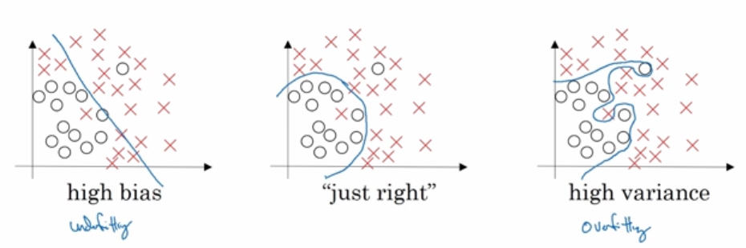
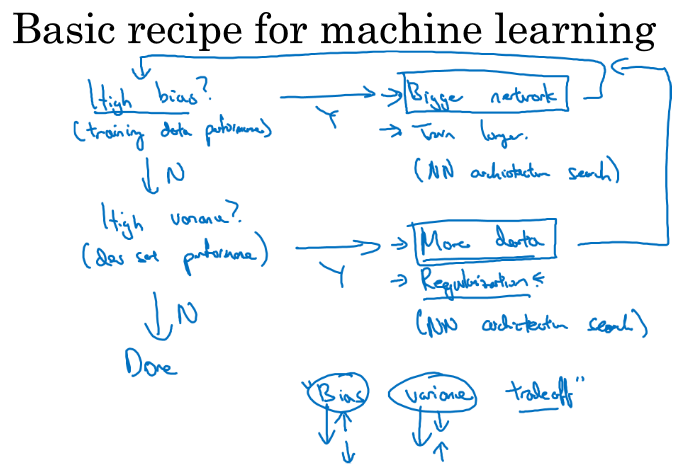
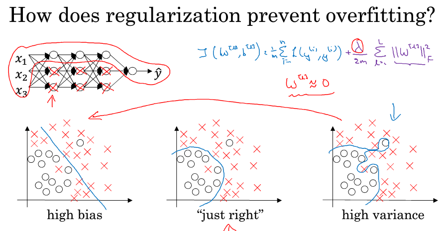
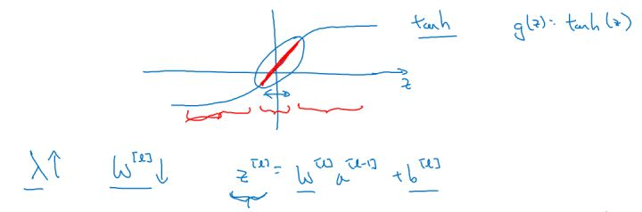
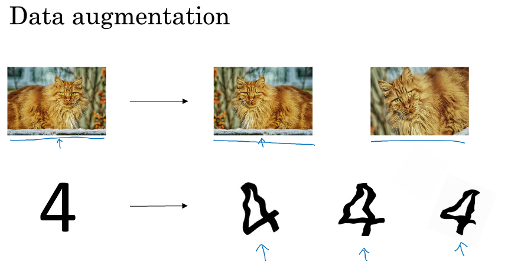
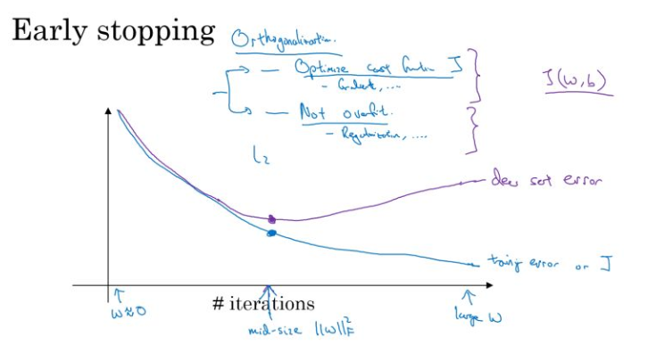
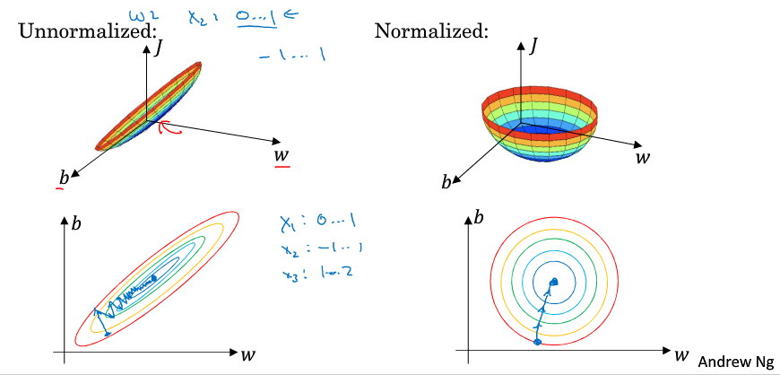
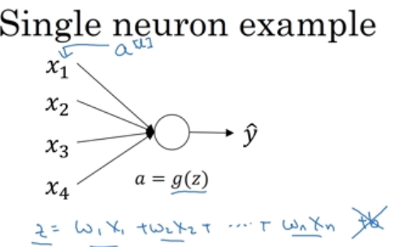
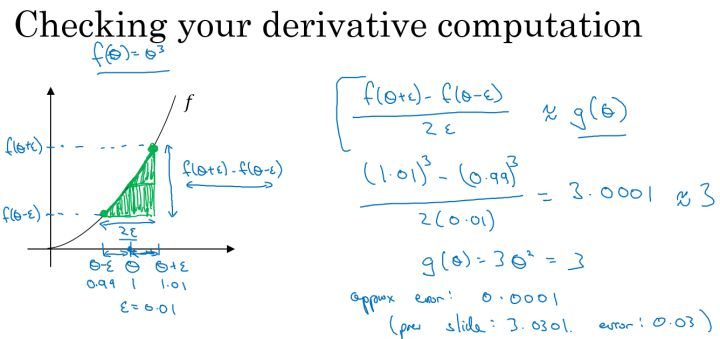

### 第一周：深度学习的实用层面

#### 训练集\验证集\测试集
在构建深度学习模型时，有许多参数和超参数是很难在第一时间给出合理取值的，都需要经过不断的迭代验证，取使得模型表现最好的参数值。那么如何快速的对模型进行迭代验证呢？就是对数据集合进行划分，划分为训练集\验证集\测试集。
首先给出他们的定义：
- 训练集（train set）：用训练集对算法或模型进行训练过程；
- 验证集（development set，简写为 dev set）：利用验证集或者又称为简单交叉验证集（hold-out cross validation set）进行交叉验证，选择出最好的模型；
- 测试集（test set）：最后利用验证集中选中的最好模型，在测试集中对模型进行评估，获取模型运行的无偏估计。

**小数据时代**：

在小数据量的时代，如：100、1000、10000的数据量大小，可以将data做以下划分：

无验证集的情况：70% (train)/ 30%(test)；
有验证集的情况：60% (train)/ 20%(dev) / 20%(test)；
通常在小数据量时代，以上比例的划分是非常合理的。

**大数据时代**：

但是在如今的大数据时代，对于一个问题，我们拥有的data的数量可能是百万级别的，所以验证集和测试集所占的比重会趋向于变得更小。

验证集的目的是为了验证不同的算法哪种更加有效，所以验证集只要足够大能够验证大约2-10种算法哪种更好就足够了，不需要使用20%的数据作为验证集。如百万数据中抽取1万的数据作为验证集就可以了。

测试集的主要目的是评估模型的效果，如在单个分类器中，往往在百万级别的数据中，我们选择其中1000条数据足以评估单个模型的效果。

对于大数据量，Andrew给出了如下的建议：
100万数据量：98% / 1% / 1%；
超百万数据量：99.5% / 0.25% / 0.25%（或者99.5% / 0.4% / 0.1%）


**其他建议**：
Andrew建议要确保验证集和测试集来自于同一个分布，这样可以使得机器学习算法变得更快；
如果不需要用无偏估计来评估模型的性能，则可以不需要测试集；实际上这种情况，是把测试集的功能在验证集上进行了实现，在验证集中进行交叉验证，评估各模型的效果，选择出最好的模型。

#### 偏差和方差
通过下图形象化的理解方差和偏差：

- 欠拟合时，对训练集的拟合程度不够，属于高偏差的情况；

- 高方差：此时出现过拟合，对训练集的过度拟合，对于验证集会出现高偏差；如果模型设置的太复杂，虽然在train集上 bias 的值非常小，模型甚至可以将所有的数据点正确分类，但是当将训练好的模型应用在dev 集上的时候，却出现了较高的错误率。这是因为模型设置的太复杂则没有排除一些train集数据中的噪声，使得模型出现overfitting的情况，在dev 集上出现高variance的现象。

所以对于bias和variance的tradeoff，对于模型来说是一个十分重要的问题。

上述图形对于二维可进行图形化，但对于高维情况，可通过对比训练集误差和验证集误差来进行判断：

| Type |condition1 | condition2 | condition3|condition4|
| - | :-: | :-:| :-:| :-:| -: | 
| Train Set Error | 1%| 15% | 15% | 0.5% | 
| Dev Set Error  | 11% | 16% | 30% | 1% | 
| Conclusion | high variance | high bias |high bias&high variance | low bias&low variance| 

以上为在人眼判别误差在0%的情况下，该最优误差通常也称为“贝叶斯误差”，如果“贝叶斯误差”大约为15%，那么图中第二种情况就是一种比较好的情况。

#### 机器学习的基本方法
接着上节中介绍的，当判断出模型存在的是高偏差问题、高方差问题还是两者都高后，如何进一步去优化模型性能，本节中给出了一些基本思路和方法。

在课程中Andrew画了如下这张图，整体思路是：先在训练集中判断是否有高偏差，通过尝试各种方法去降低偏差，直到到达可接受的程度；然后跳到下一步在验证集中去判断是否存在高偏差，然后通过尝试各种方法去降低偏差,直到达到一个低偏差和低方差的结果。


首先判断是否是一个高偏差问题？
    Yes：
    - 增加网络结构，如增加隐藏层数目；
    - 训练更长时间；
    - 使用其他的
    - 寻找合适的网络架构，使用更大的NN结构；
    NO：跳到取判断是否存在高方差问题

判断是否是一个高方差问题？
    Yes：
    - 获取更多的数据；
    - 正则化（ regularization）；
    - 寻找合适的网络结构；
    NO：训练完成

在大数据时代，深度学习对监督式学习大有裨益，使得我们不用像以前一样太过关注如何平衡偏差和方差的权衡问题，通过训练更大的神经网络或者得到更多的数据等方法可以使得在不增加另一方的情况下减少一方的值。

#### 正则化方法
当发现你的模型存在过拟合问题时，最先尝试的解决办法是引入正则项，这节中介绍了为什么正则项可以降低模型的复杂度,从而避免过拟合问题的发生的原理。

神经网络的正则化的引入，和之前的章节类似，也是首先介绍Logistic Regression的正则化，然后类比的给出神经网络的正则化。

**Logistic Regression:**
L1正则化：$J( \omega, b)=\frac{1}{m}\sum\limits_{i=1}^{m}L(\hat y^{(i)},y^{(i)})+\frac{\lambda}{2m}\left \| \omega \right \|_1$
其中$\left \| \omega \right \|_1 =\sum\limits_{j=1}^{n_x} \left| \omega_j \right|$
对于L1正则化，很多$\omega$会变为0，称为稀疏矩阵。

L2正则化：$J( \omega, b)=\frac{1}{m}\sum\limits_{i=1}^{m}L(\hat y^{(i)},y^{(i)})+\frac{\lambda}{2m}\left \| \omega \right \|_2^{2}$
其中$\left \| \omega \right \|_2 =\sum\limits_{j=1}^{n_x} \omega_j^2=\omega^T\omega$
对于L2正则化，会使得权重$\omega$衰减较小。

**neutral network:**
神经网络加入正则化项的代价函数后的公式为：
$J(w^{[1]},b^{[1]},\cdots,w^{[L]},b^{[L]})=\dfrac{1}{m}\sum\limits_{i=1}^{m}l(\hat y^{(i)},y^{(i)})+\dfrac{\lambda}{2m}\sum\limits_{l=1}^{L}||w^{[l]}||_{F}^{2}$

其中 $||w^{[l]}||_{F}^{2}=\sum\limits_{i=1}^{n^{[l-1]}}\sum\limits_{j=1}^{n^{[l]}}(w_{ij}^{[l]})^{2}$ ，因为 $\omega$ 的大小为 $(n^{[l-1]},n^{[l]}) $，该矩阵范数被称为Frobenius范数，简称F-范数，是一种矩阵范数，记为||·||F。矩阵A的Frobenius范数定义为矩阵A各项元素的绝对值平方的总和。

**计算一下梯度下降,为什么称L2正则为系数衰减**
在加入正则化项后，梯度变为：

$dW^{[l]} = (from\_backprop)+\dfrac{\lambda}{m}W^{[l]}$

迭代公式，带入上述的$dW^{[l]}$后变为：
$W^{[l]} = W^{[l]}-\alpha dW^{[l]}$
$W^{[l]} = W^{[l]}-\alpha [(from\_backprop)+\dfrac{\lambda}{m}W^{[l]}$
$= W^{[l]}-\alpha\dfrac{\lambda}{m}W^{[l]} -\alpha(from\_backprop)$
$=(1-\dfrac{\alpha\lambda}{m})W^{[l]}-\alpha(form\_backprop)$

其中， $(1-\dfrac{\alpha\lambda}{m})$ 为一个 <1 的项，会给原来的$ W^{[l]}$一个衰减的参数，所以L2范数正则化也被称为“权重衰减（Weight decay）”。

#### 为什么正则化可以减小过拟合？
Andrew首先通过图解的方式，直观的讲解了为什么正则化可以避免过拟合。
假设有如下含有正则项的Cost Function，为了使得损失函数越小，当正则化系数$\lambda$越大时，$\omega]^[l]$越趋近于0。反映到图上就相当于很多神经元被消除掉，故神经网络的模型越趋向于简单。当然上面这种解释是一种直观上的理解，但是实际上隐藏层的神经元依然存在，但是他们的影响变小了，便不会导致过拟合。
$J(w^{[1]},b^{[1]},\cdots,w^{[L]},b^{[L]})=\dfrac{1}{m}\sum\limits_{i=1}^{m}l(\hat y^{(i)},y^{(i)})+\dfrac{\lambda}{2m}\sum\limits_{l=1}^{L}||w^{[l]}||_{F}^{2}$



然后Andrew又从公式层面进行了讲解：
这里假设激活函数为$g(z)=tanh(z)$，从之前的讲解知道，当取值在0点附近时，函数近似为线性函数。
同样假设当正则化系数$\lambda$取一个较大的值时，$\omega^{[l]}$取值变小，所以$z^{[l]}=\omega^{[l]}a^{[l]}+b^{[l]}$的取值也会变小。由下图可知，在 z 较小的区域里， $\tanh(z)$ 函数近似线性，所以每层的函数就近似线性函数，整个网络就成为一个简单的近似线性的网络，而不是一个复杂的非线性的网络，从而不会发生过拟合。



**tips**
在调试梯度下降算法时，设计一个损失函数和迭代次数的函数，随着迭代次数的增加，会看到损失函数单调递减。当然这个损失函数是加上正则项后的损失函数。

#### dropout正则化
先图形化的了解一下dropout正则化：
假设有左边的神经网络架构，在训练过程中随机地忽略一些神经元，设置一个随机消失的概率，随机选择一定比例（比如50%）的节点抛弃。这些神经元被随机地“抛弃”了。也就是说它们在正向传播过程中对于下游神经元的贡献效果暂时消失了，反向传播时该神经元也不会有任何权重的更新。通过精简后的模型进行训练，达到提升了模型的泛化能力，不容易对训练数据过拟合。


**如何实施dropout？**
介绍了最常用的一种方法，称为"inverted dropout"。这里以某一层（示例中用的是Layer3）的dropout为例进行了讲解。
```
keep_prob = 0.8  #表示保留某个隐藏神经元的概率,也就是消除任意一个隐藏单元的概率为0.2
d3 =np.random.rand(a3.shape(0),a3.shape(1))<keep_out
#这里d3是一个矩阵，d3中对应等于1的概率为0.8，对应等于0的概率为0.2
a3 =np.multipy(a3,d3) #作用是过滤d3中等于0的元素
a3/=keep_prob  #作用是为了下一步的z4的值期望不变，因为20%的值变为0，故需要 W4*a3 的部分除以一个keep_prob，用来修正和弥补缺失的20%的影响。
```

**说明**
Dropout技术只在模型训练的阶段使用，在评估模型性能的时候不需使用，不用于test set。
#### 理解dropout正则化
我们知道在神经网络中，任何一个神经元都对应了多个输入，每个输入代表了一种特征，同时对应着权重值。如果应用了dropout后，每个输入都会随机的消除，这样就保障了对于单个神经元不会再特别依赖于某一个输入特征，也就是说不会给某一个输入设置太大的权重。这么做的效果就是，模型对神经元特定的权重不那么敏感。

所以通过传播过程，dropout将产生和L2范数正则化达到相同的缩减权重的效果。

另外在dropout正则化实施过程中，可以根据不同层间神经元的个数，观察权重矩阵W，设置不同的keep_prob值，一般情况下对于维度较大的权重矩阵的可以设小一点的keep_prob值，而对于神经元较少的层，keep_prob可以为1，即不进行消除。通常keep_prob的最优值，需要通过参数调优的方式来进行确定。

引入dropout后的缺点， 因为随机的对神经元进行了消除，这样Cost function不能再被明确的定义，所以我们无法绘制出每次迭代 J(W,b)的函数图。

Andrew给出了调试技巧：
关闭dropout功能，即设置 keep_prob = 1.0；
运行代码，确保 J(W，b) 函数单调递减；
再打开 dropout ；

dropout在computer vision领域内有很多成功的应用案例,因为在computer vision领域内数据量非常大，同时又缺少足够的数据，所以容易出现过拟合的问题。所以在这个领域内几乎成为了一种通用的做法，但在其他领域内用的相对少。记住，只在模型出现过拟合时，再考虑使用这种方法。

#### 其他正则化方法
**数据扩大**
第一种方法是扩大数据训练集的方法，通过图片的一些变换，得到更多的训练集和验证集，从而避免过拟合，优点就是数据获取成本低增加了训练集；缺点就是肯定没有新获取的图片好，因为提供的信息量毕竟有重复。


**early stopping**
Early stopping：在交叉验证集的误差上升之前的某点停止迭代(如下图中的紫色点位置)，避免过拟合。缺点就是需要同时考虑第一模型的训练，第二模型的过拟合问题，不符合模型训练中的orthogonalization(正交化理论)。

orthogonalization(正交化理论)包括两部分，每部分单独考虑：
- 最优化损失函数的过程：比如算法选择，梯度下降等来优化J(w,b)；
- 防止过拟合的过程： 正则化，更多的数据等；



#### 归一化输入
对数据集特征 $x_{1},x_{2}$ 归一化的过程：


计算每个特征所有样本数据的均值： $\mu = \dfrac{1}{m}\sum\limits_{i=1}^{m}x^{(i)} $；
减去均值得到对称的分布，使得均值为0： $x : =x-\mu $；
归一化方差，因为均值为0： $\sigma^{2} = \dfrac{1}{m}\sum\limits_{i=1}^{m}x^{(i)^{2}} , x = x/\sigma^{2}$ 。


进行归一化的最大作用，可以**加速模型训练的速度**。

在不使用归一化的代价函数中，如左图，我们需要设置一个较小的学习率，那么很可能我们需要很多次迭代才能到达代价函数全局最优解；如果使用了归一化，代价函数如右图，那么无论从哪个位置开始迭代，我们都能以相对很少的迭代次数找到全局最优解。

#### 梯度消失与梯度爆炸
通过下面示例给出了为什么会出现梯度消失和梯度爆炸的现象：


假定这里有线性激活函数，$g(z) = z$，$b^{[l]}=0$ ，所以对于目标输出有：

$\hat y = W^{[L]}W^{[L-1]}\cdots W^{[2]}W^{[1]}X$

当$W^{[l]}$ 的值大于1的情况：
如： $W^{[l]}=\left[ \begin{array}{l}1.5 & 0 \\\ 0 & 1.5\end{array} \right]$ ，那么最终， $\hat y = W^{[L]}\left[ \begin{array}{l}1.5 & 0 \\\ 0 & 1.5\end{array} \right]^{L-1}X$ ，激活函数的值将以指数级递增；

$W^{[l]} $的值小于1的情况：
如： $W^{[l]}=\left[ \begin{array}{l}0.5 & 0 \\\ 0 & 0.5\end{array} \right] $，那么最终， $\hat y = W^{[L]}\left[ \begin{array}{l}0.5 & 0 \\\ 0 & 0.5\end{array} \right]^{L-1}X $，激活函数的值将以指数级递减。

上面的情况对于导数也是同样的道理，所以在计算梯度时，根据情况的不同，梯度函数会以指数级递增或者递减，导致训练导数难度上升，梯度下降算法的步长会变得非常非常小，需要训练的时间将会非常长。

在梯度函数上出现的以指数级递增或者递减的情况就分别称为梯度爆炸或者梯度消失。

#### 神经网络的权重初始化
应对上一节中的梯度爆炸或者梯度消失问题，本节中介绍了权重初始化方法来进行缓解。
首先从单一神经元来进行介绍，然后可以推而广之应用到整个网络。
假设有如下的单一神经元，输出
$z=\omega_1x_1+\omega_2x_2+...+\omega_nx_n$
为了避免出现梯度爆炸或者梯度消失，我们期望z不能过大也不太过小，而这里随着n的增加，我们期望$\omega_i$越小,这时最合理的方式就是设置$\omega_i = \frac{1}{n}$,这里n为输入的特征数。


对权重矩阵进行初始化的代码实现：
```
WL = np.random.randn(WL.shape[0],WL.shape[1])* np.sqrt(1/n[L-1])
#python中np.randow.randn服从高斯分布，均值为0，标准方差1
```
这么做是因为，如果激活函数的输入 x 近似设置成均值为0，标准方差1的情况，输出 z 也会调整到相似的范围内。根据上节中的证明，z不能比1小很多也不能比1大很多，所以这时候虽然没有解决梯度消失和爆炸的问题，但其在一定程度上确实减缓了梯度消失和爆炸的速度。

**其他的激活函数的情形**
激活函数使用Relu： $Var(w_{i})=\dfrac{2}{n}$
激活函数使用tanh： $Var(w_{i})=\dfrac{1}{n}$
其中n是输入的神经元个数，也就是 $n^{[l-1]} $。


#### 梯度的数值逼近
本节给出梯度数值逼近的公式：
这里以一个$f(\theta)=\theta ^3$函数为例，由图可以看出，双边误差逼近的误差是0.0001，先比单边逼近的误差0.03，其精度要高了很多。


涉及的公式：

双边导数：
$f'(\theta) = \lim\limits_{\varepsilon \to 0}=\dfrac{f(\theta+\varepsilon)-(\theta-\varepsilon)}{2\varepsilon}$

误差： $O(\varepsilon^{2})$,

单边导数：
$f'(\theta) = \lim\limits_{\varepsilon \to 0}=\dfrac{f(\theta+\varepsilon)-(\theta)}{\varepsilon}$

误差：$ O(\varepsilon)$

因为$\varepsilon$很小，故$O(\varepsilon^{2})$比$ O(\varepsilon)$要小

#### 梯度检验
梯度检验用于检查和验证back propagation是否正确。下面介绍具体的方法：
因为我们的神经网络中含有大量的参数： $W^{[1]},b^{[1]},\cdots,W^{[L]},b^{[L]}$ ，为了做梯度检验，需要将这些参数全部连接起来，reshape成一个大的向量 $\theta$ 。
这样cost func就变为了：

$J(W^{[1]},b^{[1]},...,W^{[l]},b^{[l]}) = J(\theta)$

同时对 $dW^{[1]},db^{[1]},\cdots,dW^{[L]},db^{[L]} $执行同样的操作，我们知道$dW^{[i]}$和$W^{[i]}$的维度是相同的。

**进行梯度检验：**
对于任意一个$\theta_i$，通过双边导数的形式求近似导数：
$d\theta_{appr}^{i}=\frac{J(\theta_1,\theta_2,...,\theta_i+\varepsilon,..)-J(\theta_1,\theta_2,...,\theta_i-\varepsilon,..)}{2\varepsilon}$

这里要判断的是$d\theta_{appr} \approx d\theta $
判断公式：
$
\dfrac {||d\theta_{approx}-d\theta||_{2}}{||d\theta_{approx}||_{2}+||d\theta||_{2}}$

其中，“$ ||\cdot ||_{2}$ ”表示欧几里得范数，它是误差平方之和，然后求平方根，得到的欧氏距离。

#### 梯度检验的实施技巧
- 不要在训练过程中使用梯度检验，只在debug的时候使用，使用完毕关闭梯度检验的功能；因为会增加计算的复杂度，耗时。
- 如果算法的梯度检验出现了错误，要检查每一项，找出错误，也就是说要找出哪个$d\theta_{approx}[i]$与$d\theta$的值相差比较大；
- 不要忘记了正则化项；
- 梯度检验不能与dropout同时使用。因为每次迭代的过程中，dropout会随机消除隐层单元的不同神经元，这时是难以计算dropout在梯度下降上的代价函数J；


