### 第三周：超参数调试、正则化及优化

#### 调试处理
在神经网络的模型测试中，会涉及到很多的超参数的调优。本节中介绍了如何选择最优参数的技巧和方法。
在神经网络中会涉及到很多的超参数，如下图所示，Andrew也从他的实践中给出了几个参数的重要性。
红色的learning rate最重要；
其次是是黄色的参数：隐藏单元个数、Mini-Batch的大小、以及Momentum算法中的参数beta
最后是紫色的参数：神经网络的层数和学习率衰减系数
还有在Adam算法中的$\beta_1,\beta_2,\varepsilon$一般取固定值$0.9,0.999,10^{(-8)}$
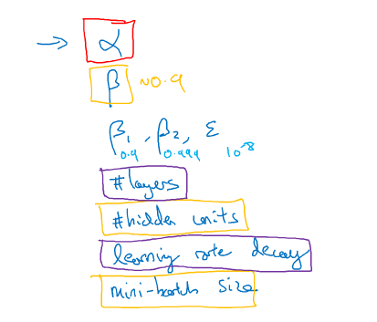

**Tips1**
使用随机值，而不用Grid Search的方法；
在传统的机器学习算法中，数据量较小而且超参数较少的情况下，使用Grid Search的方法还可行；但在神经网络中，在我们不知道哪个参数更重的时候，随机取值是一个更好的方式，可以提升搜寻的效率；随机可以尝试取值差异更大情况下的结果。
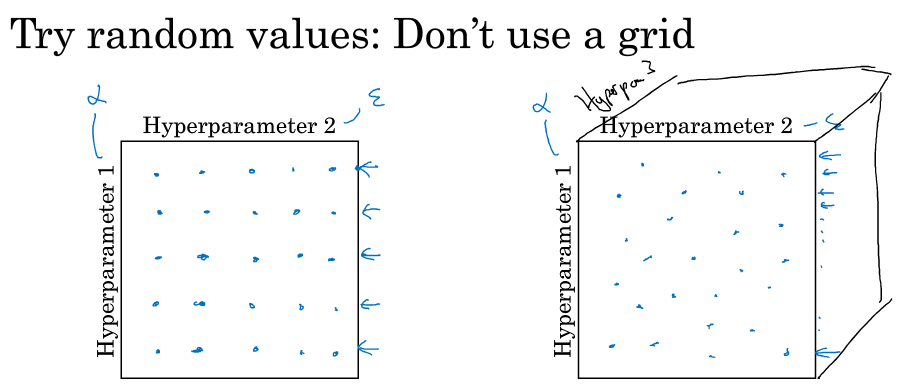
**Tips2**
从粗糙到精细，先在整体上确定一个局部，再在这个局部范围内进行精细化的随机搜寻最优取值。


#### 为超参数选择合适的范围
上节中提到的随机搜寻，也不是所有的超参数都可以在有效取值范围内进行搜寻，而是给定一个合适合理的范围进行搜寻，这节中给出了示例。
**随机搜寻的例子**
有些超参数的范围适宜进行随机搜寻，如下图中的某层中的隐藏单元个数以及神经网络的层数。
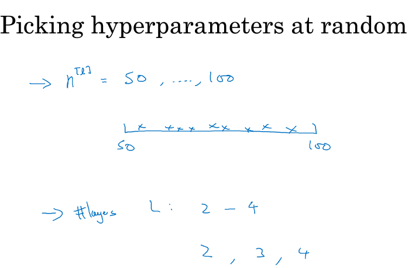

**选取合适的尺度和范围进行搜寻**
下图中是以学习率$\alpha$为例，在 $0.001,\ldots,1 $范围内进行选择。如果在$0.001,\ldots,1$的范围内进行进行均匀随机取值，则有90%的概率 选择范围在$0.1\sim 1$之间，而只有10%的概率才能选择到$0.001\sim0.1$之间，显然是不合理的。
所以要对学习率$\alpha$从线性尺度变换为log尺度，再进行搜寻；从而达到分别在$ 0.0001\sim0.001 , 0.001\sim0.01, 0.01\sim0.1 , 0.1\sim1$ 范围内搜寻。
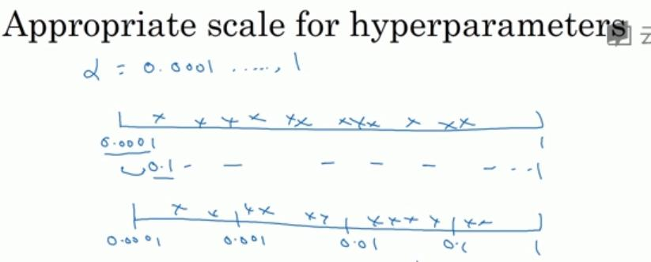

代码实现
```
r = -4 * np.random.rand()     # r in [-4,0]
learning_rate = 10 ** r      # 10^{r}
```

在使用指数加权平均的时候，超参数$ \beta$ 也需要用上面这种方向进行选择。
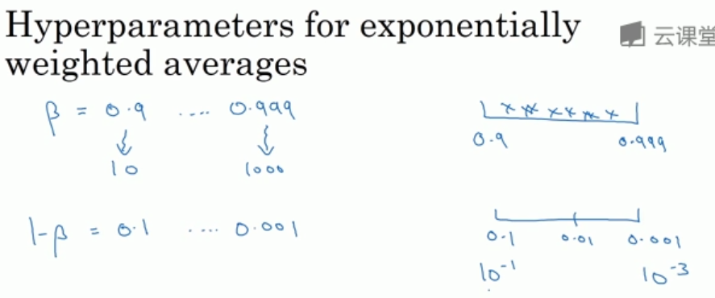

#### 超参数调优的实践：Pandas（熊猫法）  Vs Caviar（鱼子酱法）
一组参数有时可用应用在不同的领域内，NLP、Computer Vision、Speech等。
可以根据计算资源的不同选择如下两种方法：
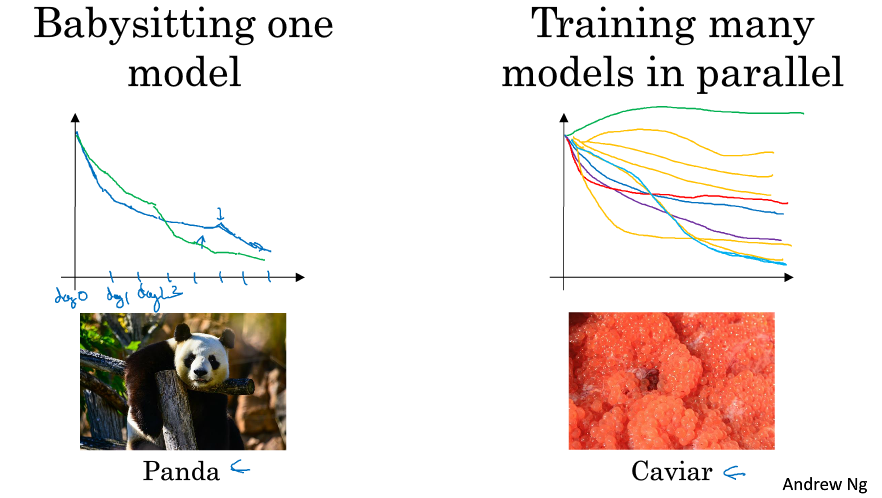
- 在计算资源不足的情况下选择第一种，第一种称为熊猫法，因为熊猫通常一次有一个baby，每次调试一组参数，每隔一段时间调试一次，观察曲线的变化，不断的进行优化；

- 在计算资源充足的情况下选择第二种，第二种称为鱼子酱法，因为鱼通常每一次产卵无数，相当于每次并行调试多个模型，选取其中参数表现最好的模型。

#### 归一化网络的激活函数
**Batch Normalization的定义**
之前提到过，在逻辑回归中，对于输入X的归一化可以提升对于参数w和b的训练速度；引申到神经网络中，如下图的神经网络架构，这里要训练的参数为$\omega^{(l)}$和$b^{(l)}$为了提升参数的训练速率，也对于每层$\omega^{(l)}$和$b^{(l)}$的输入进行归一化，也就是经过激活函数前的$z^{(l)}$进行归一化的处理。
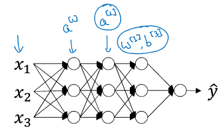
**Implementing Batch Norm**
以神经网络中某一隐藏层的中间值为例，这里去掉了所在的层数l： $z^{(1)},z^{(2)},\ldots,z^{(m)} $：

$\mu = \dfrac{1}{m}\sum\limits_{i}z^{(i)} $

$\sigma^{2}=\dfrac{1}{m}\sum\limits_{i}(z^{(i)}-\mu)^{2}$

$z^{(i)}_{\rm norm} = \dfrac{z^{(i)}-\mu}{\sqrt{\sigma^{2}+\varepsilon}}$

这里加上 $\varepsilon$ 是为了保证数值的稳定，防止方差为0 。

到这里所有 z 的分量都是平均值为0和方差为1的分布，但是我们不希望隐藏层的单元总是如此，也许不同的分布会更有意义，所以我们再进行计算：

$\widetilde z^{(i)} = \gamma z^{(i)}_{\rm norm}+\beta$

这里 $\gamma $和 $\beta $是可以更新学习的参数，如神经网络的权重 w 一样，两个参数的值来确定 $\widetilde z^{(i)} $所属的分布。

#### 将Batch Norm拟合进神经网络
假设有如下的神经网络架构，每个神经元可以看作为两个部分，前一层的输入$z^{[l]}$以及经过激活函数的输出$a^{[l]}$。Batch Norm是在两者之间加入，如图中红色线位置。可以得到如下的流程图：
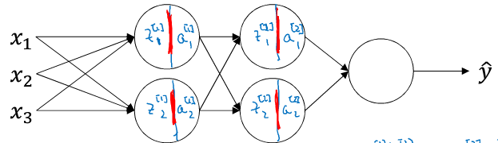

$X\xrightarrow{\omega^{[1]},b^{[1]}} z^{[1]} \xrightarrow{\beta^{[1]},\gamma^{[1]},Batch} \widetilde z^{[1]} \rightarrow a^{[1]}=g^{[1]}(\widetilde z^{[1]})\xrightarrow{\omega^{[2]},b^{[2]}} z^{[2]} \xrightarrow{\beta^{[2]},\gamma^{[2]},Batch} \widetilde z^{[2]} \rightarrow a^{[2]}=g^{[2]}(\widetilde z^{[2]}) $

上面的流程中，要求的参数变为：
$\omega^{[1]},b^{[1]},\omega^{[2]},b^{[2]},\cdots,\omega^{[l]},b^{[l]}$
$\beta^{[1]},\gamma^{[1]},\beta^{[2]},\gamma^{[2]},\cdots,\beta^{[l]},\gamma^{[l]}$
然后类似的可以对各个参数应用梯度下降算法，或者momentum、RMSprop等算法。
其中上述的参数$b^{[l]}$可以去掉，因为在进行Batch Norm过程中，因为 $ z^{[l]}=w^{[l]}a^{[l-1]}+b^{[l]}$ ，而Batch Norm 要做的就是将$ z^{[l]} $归一化，结果成为均值为0，标准差为1的分布，再由 $\beta $和 $\gamma $进行重新的分布缩放，那就是意味着，无论 $b^{[l]}$ 值为多少，在这个过程中都会被减去，不会再起作用。所以如果在神经网络中应用Batch Norm 的话，就直接将偏置参数$ b^{[l]}$ 去掉，或者将其置零。

**Working with mini-batches**
这个算法的过程与上面类似，唯一不同的是，这里是对每一个batch进行操作，将全部的输入变为了一个batch size的大小$X^{\{t\}}$，具体的示例见下面的实现。

**Implemanting  gradient descent**
for t = 1 ... num （这里num 为Mini Batch 的数量）：
在每一个$X^{\{t\}}$上进行前向传播（forward prop）的计算：
在每个隐藏层都用 Batch Norm 将$ z^{[l]}$ 替换为 $\widetilde z^{[l]}$
使用反向传播（Back prop）计算各个参数的梯度： $dw^{[l]},d\gamma^{[l]},d\beta^{[l]}$
更新参数：
$w^{[l]}:=w^{[l]}-\alpha dw^{[l]}$
$\gamma^{[l]}:=\gamma^{[l]}-\alpha d\gamma^{[l]}$
$\beta^{[l]}:=\beta^{[l]}-\alpha d\beta^{[l]}$
同样与Mini-batch 梯度下降法相同，Batch Norm同样适用于momentum、RMSprop、Adam的梯度下降法来进行参数更新。

#### Batch Norm为什么有效？
**原因一**
Batch Norm对于隐藏层激活函数进行归一化的原理与之前讲到的对于输入层X进行归一化的原理是类似的，都是将不同尺度的输入统一到一个维度上，从而加速训练的过程。

**原因二**
learning on shifting input distribution 
介绍了一种输入数据分布改变的现象，称为"Covariate shift"。当数据分布改变时，就需要重新训练模型。神经网络学习过程本质就是为了学习数据分布，一旦训练数据与测试数据的分布不同，那么网络的泛化能力也大大降低；另外一方面，一旦每批训练数据的分布各不相同(batch 梯度下降)，那么网络就要在每次迭代都去学习适应不同的分布，这样将会大大降低网络的训练速度，这也正是为什么我们需要对数据都要做一个归一化预处理的原因。
对于如下图的神经网络，如果只看第三层隐藏神经元，将前面盖上，第三层是以第二层隐层的输出值 $a^{[2]} $作为输入特征的，通过前向传播得到最终的 $\hat y$ ，但是因为我们的网络还有前面两层，由于训练过程，参数 $w^{[1]},w^{[2]}$ 是不断变化的，那么也就是说对于后面的网络， $a^{[2]}$ 的值也是处于不断变化之中，所以就有了Covariate shift的问题。

如果对 $z^{[2]}$ 使用了Batch Norm，那么即使其值不断的变化，但是其均值和方差却会保持。那么Batch Norm的作用便是其限制了前层的参数更新导致对后面网络数值分布程度的影响，使得输入后层的数值变得更加稳定。另一个角度就是可以看作，Batch Norm 削弱了前层参数与后层参数之间的联系，使得网络的每层都可以自己进行学习，相对其他层有一定的独立性，这会有助于加速整个网络的学习。
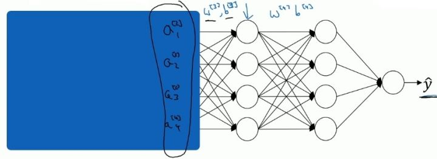

**Batch Norm as regulization**
Batch Norm中会有一定的正则化的效果，但这个并不是它的主要作用。
这是因为在使用Mini-batch梯度下降的时候，每次计算均值和偏差都是在一个Mini-batch上进行计算，而不是在整个数据样集上。这样就在均值和偏差上带来一些比较小的噪声。那么用均值和偏差计算得到的 $\widetilde z^{[l]} $也将会加入一定的噪声。

这里和Dropout相似，其在每个隐藏层的激活值上加入了一些噪声，（这里因为Dropout以一定的概率给神经元乘上0或者1）。所以和Dropout相似，Batch Norm 也有轻微的正则化效果。

这里引入一个小的细节就是，如果使用Batch Norm ，那么使用大的Mini-batch如256，相比使用小的Mini-batch如64，会引入跟少的噪声，那么就会减少正则化的效果。

#### 测试时的Batch Norm
在训练模型的过程中，Batch Norm是对每一个Batch应用归一化，分布计算出均值和方差的；而对于测试时，是对每一个测试样本进行预测，这时无法计算均值和方差。那么在测试时候如何应用Batch Norm呢？

如下图，是在训练过程中，对于每一个Mini-Batch分别记录他们的均值和方差，然后利用指数加权平均的方法得到预测时需要的均值和方差，用他们来对测试样本进行预测。
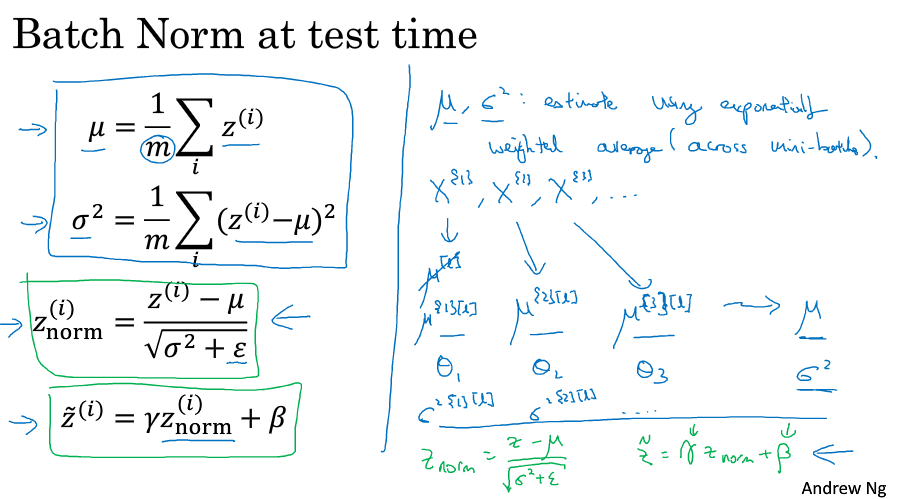


#### 多分类问题-softmax regression
本节中介绍了一种多分类的方法，称为softmax regression，实现思想是将多分类任务的输出转换为各个类别可能的概率，从而将最大的概率值所对应的类别作为输入样本的输出类别。如果在神经网络中，如果有几类要判别就对应于在于输出层有几个神经元，每个神经元对应了一个类别的输出概率，这个输出层称为softmax layer。softmax regression的一个示意图，如下图所示：黄色的层为输出层，对应的三个分类


**实现方法**
对于第L层，即输出层得到输入
$z^{[L]}=\omega^{[L]}*a^{[L-1]}+b^{[L]}$
$t= e^{z^{[L]}}$
然后经过激活函数，
$ a^{[L]} = \frac{e^{z^{[L]}}}{\sum_i t_i}$
具体的示例如下图所示,$e^z$ 的值为20、2.7、0.05，再分别除以累加和得到最终的概率值，0.88、0.12、0。
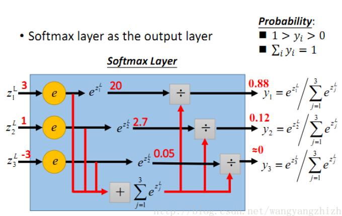


#### 训练一个softmax分类器
softmax的叫法是相对于hard来说的，softmax的输出层会给出属于各个分类的概率，而hard分类方式会直接给出最大值的分类1，其余分类为0。所以相对于“hardmax”而言，输出更加“soft”而没有那么“hard”。
Sotfmax回归将logistic回归从二分类问题推广到了多分类问题上。

**Loss Function**
在使用Sotfmax层时，对应的目标值 y 以及训练结束前某次的输出的概率值 $\hat y$ 分别为：

$y=\left[ \begin{array}{l} 0\\1\\0\\0 \end{array} \right] , \ \hat y=\left[ \begin{array}{l} 0.3\\0.2\\0.1\\0.4 \end{array} \right]$

Sotfmax使用的 Loss function 为：

$L(\hat y,y)=-\sum\limits_{j=1}^{4}y_{j}\log \hat y_{j}$

在训练过程中，我们的目标是最小化Loss function，由目标值我们可以知道，$ y_{1}=y_{3}=y_{4}=0$，$y_{2}=1$ ，所以代入 $L(\hat y,y) $中，有：

$L(\hat y,y)=-\sum\limits_{j=1}^{4}y_{j}\log \hat y_{j}=-y_{2}\log \hat y_{2}=-\log \hat y_{2}$

所以为了最小化Loss function，我们的目标就变成了使得 $\hat y_{2} $的概率尽可能的大。

也就是说，这里的损失函数的作用就是找到你训练集中的真实的类别，然后使得该类别相应的概率尽可能地高，这其实是最大似然估计的一种形式。

对应的Cost function如下：

$J(w^{[1]},b^{[1]},\ldots)=\dfrac{1}{m}\sum\limits_{i=1}^{m}L(\hat y^{(i)},y^{(i)})$

Softmax 的梯度下降

在Softmax层的梯度计算公式为：

$\dfrac{\partial J}{\partial z^{[L]}}=dz^{[L]} = \hat y -y$
**求导的具体过程如下**
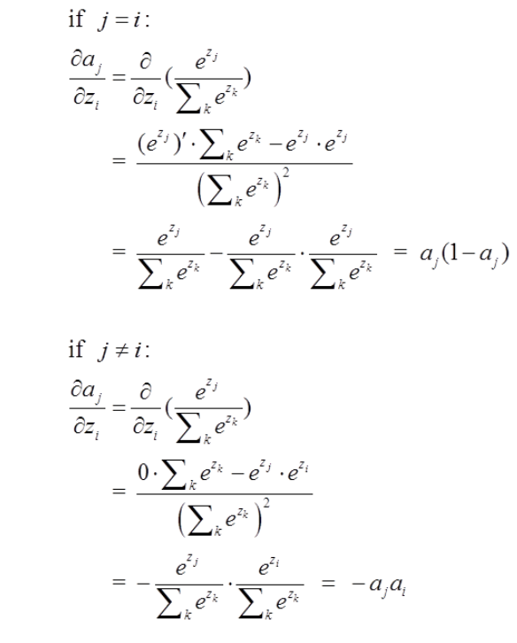
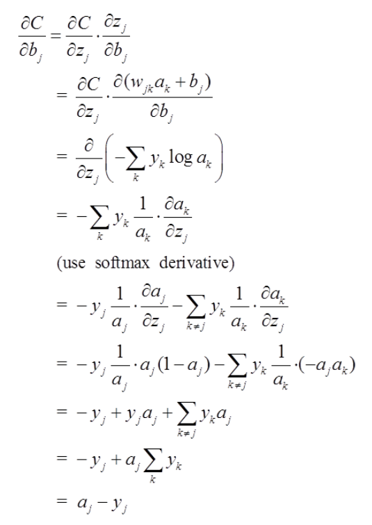