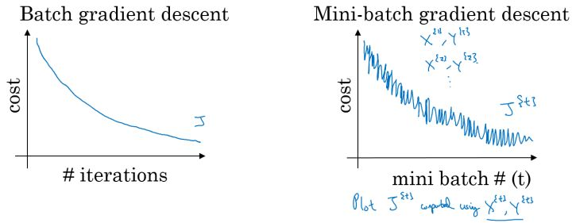
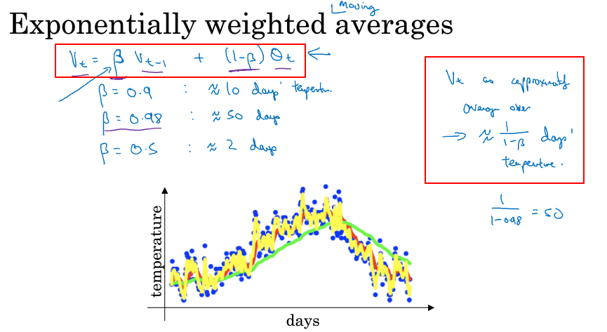
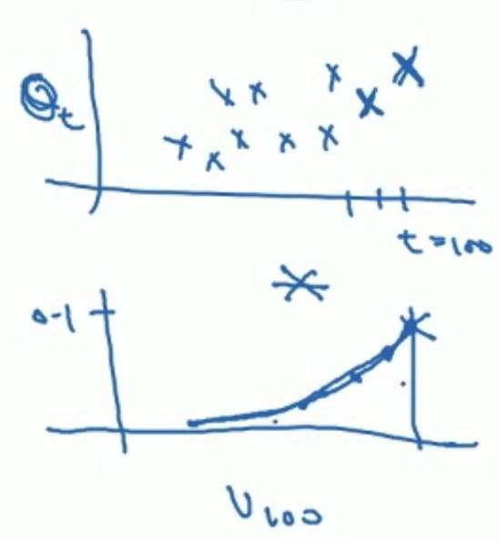
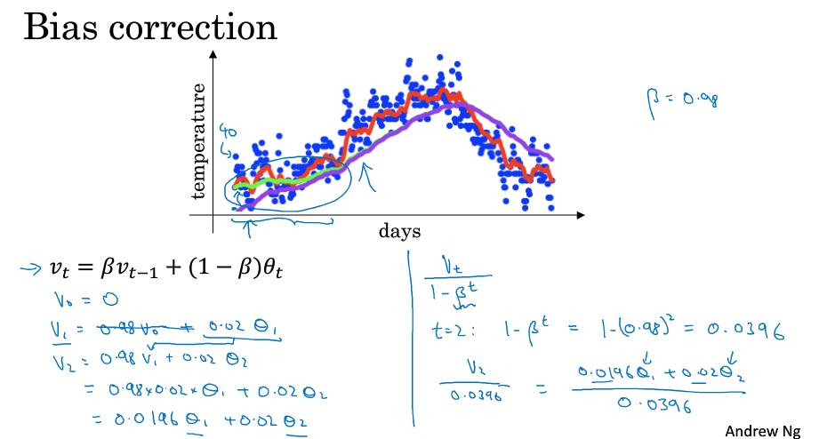
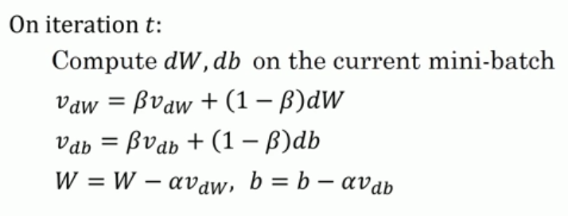
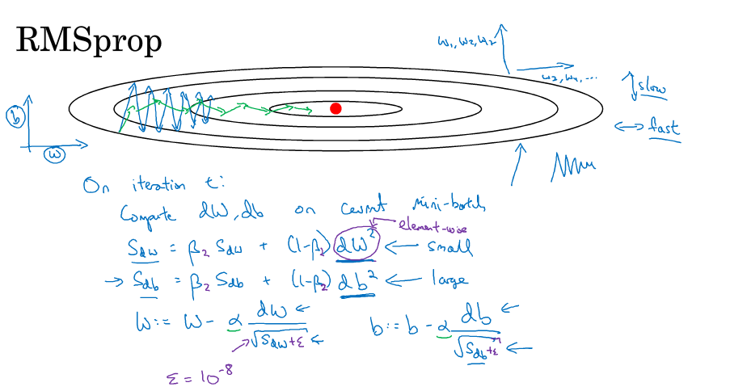
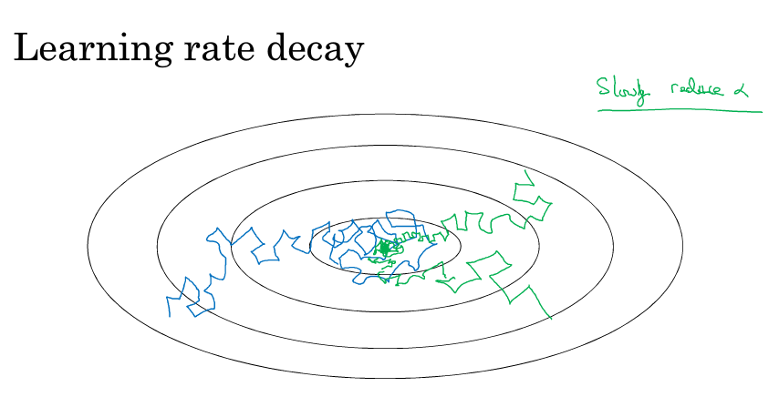

### 第二周：优化算法
本周的课程是学习多种优化算法，深度学习是一个依靠经验同时需要多次迭代训练的过程，在训练大数据量的情况下会很耗时，这样不利于idea的验证和模型的调优，所以在训练过程中引入快速的优化算法可以大大提升训练的效率。

#### Mini-Batch梯度下降法
之前课程学习，我们知道可以通过向量化实现的方式，对全部训练集进行一次性前向传播和后向传播的计算，效率会得到提升。而当这个全部训练集规模很大时，如有500万或5000万的训练数据，处理速度就会比较慢。这里可以考虑分而治之的思路，对全部训练集进行分组，形成若干个数据子集，每次用其子集进行梯度下降，则我们的算法速度会执行的更快。而处理的这些一小部分训练子集即称为Mini-batch。

**Notation**
引入了一个新的符号：
$X^{ \{ 1 \}}$这个代表分组后的第一组数据子集，如果假设每个数据子集有512个样本，则
$X^{ \{ 1 \}}=\{ x^{(1)},x^{(2)},...,x^{(512)}   \}$
同理，可以得到$Y^{ \{ 1 \}}$

**Mini-Batch Gradient Descent**
首先介绍一个基本概念：
- EPOCHS：当一个完整的数据集通过了神经网络一次并且返回了一次，这个过程称为一个epoch。一般在训练过程中要使用多于一个 epoch
对于普通的梯度下降法，一个epoch只能进行一次梯度下降；而对于Mini-batch梯度下降法，一个epoch可以进行Mini-batch的个数次梯度下降。

整体实现思路如下：
第一步，根据总的样本数，以及单个分组的样本数，确定一共有多少个Mini-Batch，确定number of batches 
第二步，对每个Mini-Batch循环，利用向量化方法计算每个Mini-Batch梯度下降算法。
伪代码如下：
for i =1,...,number of batches:
    前向传播 $X^{ \{ i \}}$，针对于其中一个Batch
    计算损失函数$J^{ \{ i \}}$，计算这个Batch的损失函数
    反向传播，计算梯度
    更新权重系数:
    $\omega^{[l]}=\omega^{[l]}-\alpha d\omega^{[l]}$
    $b^{[l]}=b^{[l]}-\alpha db^{[l]}$

#### 理解Mini-Batch梯度下降法
普通的batch梯度下降法和Mini-batch梯度下降法代价函数的变化趋势，如下图所示：

左边的图是一次训练所有样本的情况，随着迭代次数的增加，损失函数会逐渐下降；
而右图为Mini-Batch情况，因为每次训练的Mini-Batch的训练子集样本都不同，导致了损失函数不是单调下降的情况，因为有些数据子集中会引入噪声。

**Mini-Batch Size的大小选择**
- Mini-Batch Size = m  称为 Batch Gradient Descent
这种情况下，就是之前讲到的一次训练全部m个样本，可以保证随着迭代次数的增加，损失函数会逐渐下降，取到全局最优解；
缺点：单次迭代时间过长;

- Mini-Batch Size = 1  称为 Stochastic Gradient Descent
这种情况下，每次训练一个样本，相当于用了for循环，虽然可以保证损失函数总体的趋势向最小值的方向下降，但是无法到达全局最小值点，会呈现波动的情形。
缺点：失去向量化的加速过程;

- 1<Mini-Batch Size <m 称为 Mini-Batch Gradient Descent
这种情况下，可以达到最快的学习效率；而且也可以应用向量化的加速；可以比Stochastic Gradient Descent更持续性的靠近最小值的方向。

Mini-Batch Size选择的指导原则：

如果训练样本的大小比较小时，如 $m\leqslant 2000$ 时，直接选择batch梯度下降法；
如果训练样本的大小比较大时，典型的大小为： $2^{6},2^{7},\cdots,2^{10}$；
Mini-batch的大小要符合CPU/GPU内存。

#### 指数加权平均
指数加权移动平均(Exponential Weighted Moving Average),先给出定义：
算术平均（权重相等）—>加权平均（权重不等）—>移动平均（大约是只取最近的 N 次数据进行计算）。

$v_t = \beta v_{t-1}+(1- \beta)\theta_t$,公式中$ \theta_t$ 为 t 时刻的实际温度；系数 β 表示加权下降的快慢；$v_t $ ，表示到第t天的平均温度。

理解：$v_t $可以理解为平均多少天的温度 $\frac{1}{1-\beta}$,如$\beta=0.9$,则约等于10天。根据 β取值不同，图中的曲线也在变化，当 β变小时，如图中黄色曲线 β=0.5，约等于2天平均，曲线波动越剧烈；而当 β变大时，图中绿色曲线β=0.98，约等于50天平均，曲线变化平缓，而且向右偏移，对数据扰动不明显，稍滞后。

#### 理解指数加权平均
例子，当 $\beta =0.9$ 时，有如下的公式：

$v_{100} = 0.9v_{99}+0.1\theta_{100}$
$v_{99} = 0.9v_{98}+0.1\theta_{99}$
$v_{98} = 0.9v_{97}+0.1\theta_{98}$
$\quad\quad\quad\quad...$
把下面的公式，一步一步的带入上面公式，进行展开，有：

$v_{100}=0.1\theta_{100}+0.1\times0.9\theta_{99}+0.1\times(0.9)^{2}\theta_{98}+0.1\times(0.9)^{3}\theta_{97}+\cdots$
上式中所有 $\theta$ 前面的系数相加起来为1或者接近于1，称之为偏差修正。
一般认为当指数项衰减到 $\frac{1}{e}$就可以忽略不计。
总体来说存在， $(1-\varepsilon)^{1/\varepsilon}=\dfrac{1}{e} $，在我们的例子中， $1-\varepsilon=\beta=0.9$ ，即 $0.9^{10}\approx 0.35\approx\dfrac{1}{e}$ 。相当于大约10天后，系数的峰值（这里是0.1）下降到原来的 $\dfrac{1}{e}$ ，只关注了过去10天的天气。

对于上面公式可以看成为两部分乘积再求和的运算结果，如下图，上图为温度随时间的分布图，记载着各个时间的温度；下图为指数衰减函数，从0.1开始向下衰减，上式为上下图中对应的数据进行加权求和。如0.1对应温度$\theta_{100}$，0.1*0.9对应温度$\theta_{99}$，以此类推。本质就是以指数式递减加权的移动平均。各数值的加权会随时间而指数式递减，越近期的数据加权越重，但较旧的数据也给予一定的加权

**指数加权平均实现**

伪代码实现如下：
初始化：$v_{\theta} = 0$
Repeat { 
    得到当前的$\theta_t $值，对$v_{\theta}$进行更新；
    $v_{\theta} = \beta v_{\theta}+(1- \beta)\theta_t$
}

这种方法的优点：
代码仅仅占用一行而已，不断覆盖掉原有的V值即可，只占单行的存储和内存。虽然不是最精确的计算平均值的方法，但是相比于原有的计算平均值需要保存所有数据求和后取平均的方法效率更高和资源占用率大大减小。所以在机器学习中大部分采用指数加权平均的方法计算平均值。

#### 偏差修正 bias correction
偏差修正法可以使得平均值的计算更加准确，尤其是对早期的修正。

如上图当β=0.98时，实际上我们得到的不是绿色曲线，而是紫色曲线，起点比真实的温度要低很多，因为使用指数加权平均的方法在前期会有很大的偏差。
因为初始化：$v_{\theta} = 0$，更新一下是$v_{\theta} = 0.98*0+0.02*\theta_1$，所以前期会有很大的偏差。这是$v_{\theta} = 0$造成的。

解决方法是:将所有时刻的$v_{\theta}$除以 ${1-\beta^t}$ 后作为修正后的 $v_{\theta}$。当 t 很小时，这种做法可以在起始阶段的估计更加准确；当 t 很大时，偏差修正几乎没有作用，所以对原来的式子几乎没有影响.

#### 动量梯度下降（Momentum）
传统梯度下降算法，假如通过下图中的蓝色曲线的波动形式逼近全局最优解，这个过程中可以看到在纵轴上下波动幅度较大，横轴上以较慢的速度向最优解的红点方向移动；这种上下波动减慢了梯度下降的速度，而且也无法使用较大的学习率，否则就会想图中的紫色曲线那样偏离函数范围，不会收敛。所以为了避免波动过大，会选择一个较小的学习率，而这又会使得训练时间的增加。

从另一个角度看待问题，就是希望在纵轴上学习慢一点（避免上下大幅度波动），而在横轴上学习快一点，快速逼近最优解。效果就像图中的红色曲线那样。

引出Momentum梯度下降法：
对于梯度下降的权重系数$\omega$和b的导数上求指数加权平均：

这里$\beta$也作为超参数，常用的值是0.9。

在我们进行动量梯度下降算法的时候，由于使用了指数加权平均的方法。原来在纵轴方向上的上下波动，经过平均以后，正负抵消，接近于0，纵轴上的波动变得非常的小；但在横轴方向上，所有的微分都指向横轴方向，因此其平均值仍然很大。所以会形成红色曲线那样的效果。

动量梯度下降算法解释：

在对应上面的计算公式中，将Cost function想象为一个碗状，想象从顶部往下滚球，其中：

微分项 dw,db 想象为球提供的加速度；
动量项 $v_{dw},v_{db}$相当于速度；
小球在向下滚动的过程中，因为加速度的存在使得速度会变快，但是由于 $\beta$ 的存在，其值小于1，可以认为是摩擦力，所以球不会无限加速下去。

#### RMSprop(root mean square prop)
本节中介绍了一种称为根均方根传播的算法，也可以加快梯度下降的过程。

为了解释算法，这里假设b为纵轴方向，w为横轴方向（实际上参数是高维的），目标为降低在b方向上的波动，而提升在w方向上的学习速度。
在第t次迭代：
        计算$dw$ $db$ 在当前的数据batch集合中，
        $S_{dw} = \beta S_{dw}+(1-\beta){dw}^2$
        $S_{db} = \beta S_{db}+(1-\beta){db}^2$
        $w =w -\alpha \frac{dw}{\sqrt{S_{dw}}}$
        $b =b -\alpha \frac{db}{\sqrt{S_{db}}}$

通过上图中蓝色曲线可以看出，在纵向波动大，也就是db要比dw变化大；反应到上面公式就是$S_{db}$ 要比$S_{dw}$变化大，而$S_{db}$ 和$S_{dw}$又都开根号出现在分母中，所以得出的结果就是b的幅度变化小，而在w方向上变化大。这也就得到了我们起初想要的效果，反应到图上就是绿色的曲线。这样就可以通过设定一个较大的学习率，而不必担心会在纵向出现偏离。    

在如图所示的实现中，RMSprop将微分项进行平方，然后使用平方根进行梯度更新，同时为了确保算法不会除以0，平方根分母中在实际使用会加入一个很小的值如 $\varepsilon=10^{-8}$

#### Adam优化算法(Adaptive Moment Estimation)
本节中介绍的Adam算法以及上一节中的RMSprop算法，经受了考验，在深度学习领域各种场景下都有很好的表现。Adam可以看作为momentum算法和RMSprop算法相结合的一种优化算法。

**Adam优化算法详解**
初始化 $v_{dw}=0,s_{dw}=0,v_{db}=0,s_{db} =0$
在第t次迭代时，计算$dw,db$在当前的Batch样本集合下：
首先是计算momentum：
$v_{dw} = \beta_1v_{dw}+(1-\beta_1)dw $
$v_{db} = \beta_1v_{db}+(1-\beta_1)db $

然后计算RMSprop：
$s_{dw} = \beta_2s_{dw}+(1-\beta_2){dw}^2 $
$s_{db} = \beta_2s_{db}+(1-\beta_2){db}^2 $

然后偏差修正：
$v_{dw}= \frac{v_{dw}}{1-{\beta_1}^t}$
$v_{db}= \frac{v_{db}}{1-{\beta_1}^t}$
$s_{dw}= \frac{s_{dw}}{1-{\beta_2}^t}$
$s_{db}= \frac{s_{db}}{1-{\beta_2}^t}$

最好执行参数更新：
$w = w - \alpha \frac{v_{dw}}{\sqrt{s_{dw}+\varepsilon}}$
$b = b - \alpha \frac{v_{db}}{\sqrt{s_{db}+\varepsilon}}$

超参数的选择:

$\alpha$ ：需要进行调参；
$\beta_{1}$ ：常用缺省值为0.9， dw 的加权平均；
$\beta_{2} $：推荐使用0.999， $dw^{2} $的加权平均值；
$\varepsilon$ ：推荐使用 10^{-8} 。

#### 学习率衰减
学习率衰减的必要性：
如果在一次完整的训练过程中，学习率恒定，在起初的训练过程中仍然会以一个较快的速率进行收敛，但到达最小值点附近后，由于不同batch中存在一定的噪声，使得不会在最小值点精确收敛，而一直会在一个最小值点较大的范围内波动，如下图中蓝色线所示。

但是如果我们使用学习率衰减，逐渐减小学习速率 $\alpha$ ，在算法开始的时候，学习速率还是相对较大的值，能够相对快速的向最小值点的方向下降。但随着迭代次数的增加，$ \alpha $会逐步减小，下降的步伐也会逐渐变小，最终会在最小值附近的一块更小的区域里波动，如图中绿色线所示。

**几种实现学习率衰减的方法和公式：**
常用： $\alpha = \dfrac{1}{1+decay\_rate*epoch\_num}\alpha_{0}$
指数衰减： $\alpha = 0.95^{epoch\_num}\alpha_{0}$
其他： $\alpha = \dfrac{k}{epoch\_num}\cdot\alpha_{0}$
离散下降（不同阶段使用不同的学习速率）

#### 局部最优问题
这一节没有听的太懂，但总体思想是：
在高纬度的情况下：
几乎不可能陷入局部最小值点；
处于鞍点的平缓区会减缓学习过程，可以利用如Adam等算法进行改善。
