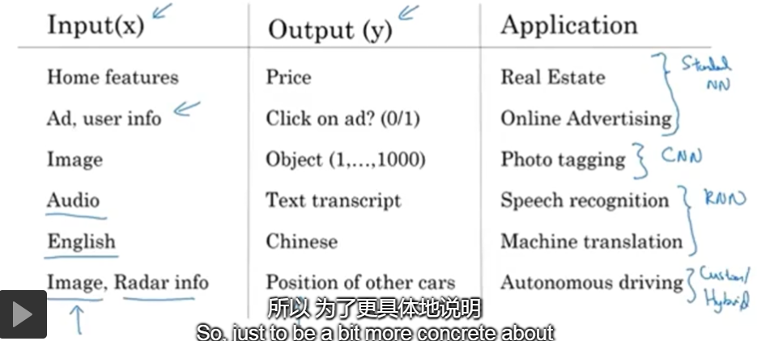
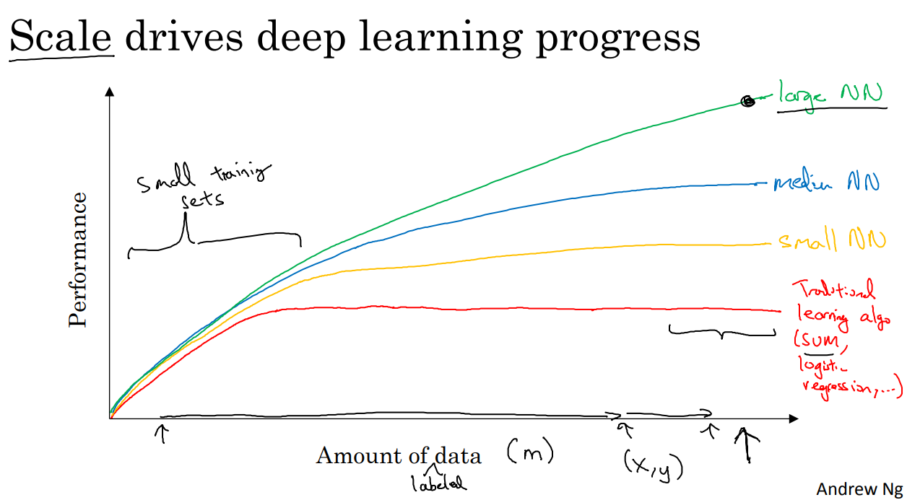

### 第一周：深度学习概述

深度学习目前在工业界，主要还是应用在有监督学习场景下，也就是输入有相应的输出。下图中列出了几个典型的应用，对于不同应用场景选择不同的深度学习算法：
- 如移动广告，可以用标准的神经网络解决；
- 图片标记，一般用CNN解决；
- 一维序列数据，如语音识别、语言翻译，使用RNN解决，循环神经网络；
- 对于无人驾驶，输入量很多，既包含图片有包含雷达信息等，通过混合型神经网络

深度学习理论诞生几十年了，为何在最近几年才引起了各行各业的重视？背后的原因是什么呢？
下图横坐标为数据的规模，曲线为各类算法相对于数据规模的函数。可以看出**深度神经网络（DNN’s）可以更好地利用大规模的数据**，随着数据规模的增大，增加神经网络的规模，会带来效果表现的提升，而较小的网络及传统机器学习算法（如SVM、LR等）面对海量数据性能会达到瓶颈。
为了有一个高性能的模型，要满足两个条件：
- 数据规模足够的大（这里的数据指的是label data，有输入X和输出Y；我的理解就是有效数据，清洗后的数据，高质量数据才会有高质量输出）
- 神经网络也足够的大

此外，还有好多算法方面的革新使DNN’s的训练变得非常快。比如将Sigmoid激活函数转换成ReLU(Rectified Linear Units)激活函数。激活函数的算法创新，可显著提升梯度下降等优化过程的处理效率。这些算法的优化和计算效率的提升使得研究者们的“创意-编码-验证”**循环迭代速度越来越快**。只有面对海量数据处理效率足够快，同时有想法又可以快速进行验证，多种因素共同促进的深度学习的快速发展。

.png)