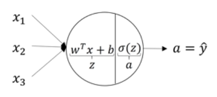
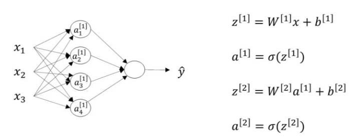
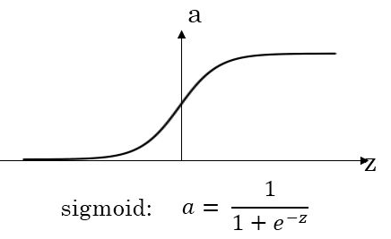
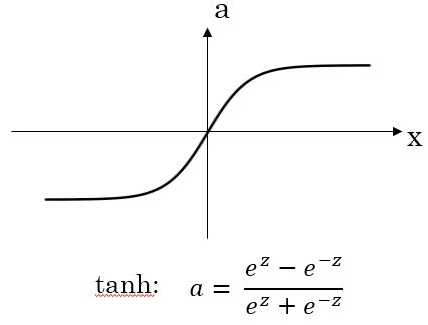
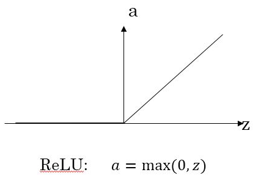
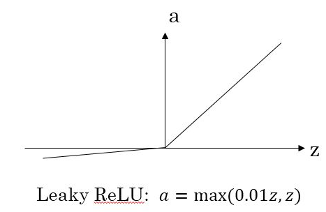
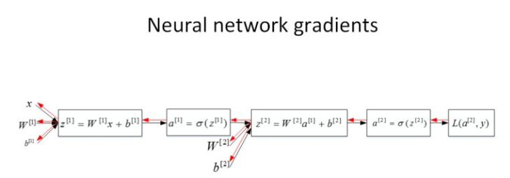
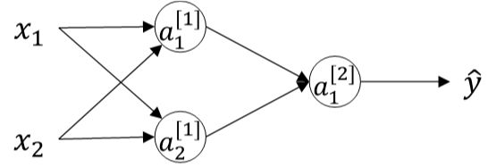

### 第三周：浅层神经网络

#### 神经网络的表示
简单理解，如果把逻辑回归看作是一个简单的单层神经元的话，神经网络可以看作是多个LR的组合；每层的每个节点都需要经历两个步骤的操作，第一对于上一层输入值进行汇总；第二经过激励函数sigmoid。也就是完成如下两步：
$z=\omega^Tx+b$
$a = \delta(z)$
如下图所示：


#### 双层神经网络表示-(单隐层神经网络)
通过一个双层神经网络的示意图，介绍一下神经网络中的符号表示以及一些基本概念：
下图称为双层神经网络，输入层不计算在内。各层依次称为输入层，中间层称为隐藏层和最后一层为输出层。输入层和输出层，对应着训练样本的输入和输出；中间的结果因为是不知道的，所以称为隐藏层。
符号表示如下图所示：
中括号加上标代表来自第几层的输出，下标代表第几个神经元，注意下标从1开始；
$a^{[0]}$表示输入层，$a_{1}^{[1]}$代表第一层的第一个神经元，$a^{[2]}$代表输出层。

另外还有对应的参数$\bm{W}$和$\bm{b}$，隐藏层对应的权重$\bm{W^{[1]}}$和常数项 $\bm{b^{[1]}}$，输出层对应的权重$\bm{W^{[2]}}$和常数项 $\bm{b^{[2]}}$。关于参数$\bm{W}$和$\bm{b}$的维度，可以总结如下，第i层的权重 $\bm{W^{[i]}}$维度的行等于i层神经元的个数，列等于i-1层神经元的个数；第i层常数项  $\bm{b^{[i]}}$维度的行等于i层神经元的个数，列始终为1。故下图中，$\bm{W^{[1]}}$的shape为(4,3),$\bm{W^{[2]}}$的维度为(1,4)。


#### 双层神经网络表示-单个样本点向量化表示


为了更清楚的对上图中的向量化表示进行解读，下面对符号表示进行拆解：
$z^{[1]}= \left[ \begin{array}{cccc}
z_{1}^{[1]} \\
z_{2}^{[1]} \\
z_{3}^{[1]} \\
z_{4}^{[1]}
\end{array} 
\right ] = \left[ \begin{array}{cccc}
w_{1}^{[1]T}x+b_{1}^{[1]} \\
w_{2}^{[1]T}x+b_{2}^{[1]}\\
w_{3}^{[1]T}x+b_{3}^{[1]} \\
w_{4}^{[1]T}x+b_{4}^{[1]}
\end{array} 
\right ] = \bm{W^{[1]}}x+\bm{b^{[1]}}$

这里$z_{i}^{[1]}$代表着该样本在隐藏层第i个神经元上的输入，这里没有经过激活函数sigmoid。


#### 双层神经网络表示-训练集向量化表示
这里直接给出向量化表示的公式,与单个样本点的区别在于，单个样本点的输出为向量，而这里全部为矩阵：

$\bm{Z^{[1]}}=\bm{W^{[1]}}\bm{X}+\bm{b^{[1]}}$

$\bm{A^{[1]}}=\sigma(\bm{Z^{[1]}})$

$\bm{Z^{[2]}}=\bm{W^{[2]}}\bm{A^{[1]}}+\bm{b^{[2]}}$

$\bm{A^{[2]}}=\sigma(\bm{Z^{[2]}})$

对其中的$\bm{Z^{[1]}}$进行拆解：
$\bm{Z^{[1]}}= \left[ \begin{array}{c}
|  & | &... & | \\
z^{[1](1)}  & z^{[1](2)} &... & z^{[1](m)} \\
|  & | &... & | 
\end{array} 
\right ] $

通过这里对$\bm{Z^{[1]}}$的拆解和上节中$z^{[1]}$的拆解，可以看出区别。这里的每一个$z^{[1](i)}$对应着上节中的$z^{[1]}$，代表着每个样本在隐藏层各个神经元上的输入。
其中右上角小括号中的数字代表样本序号，可以这样来理解，矩阵的行表示神经元个数，矩阵的列表示样本数目m。故$\bm{Z^{[1]}}$的维度为(4,m)，在隐藏层有4个神经元，m个训练样本。

#### 激活函数
这节课介绍了几种常用的激活函数，介绍了不同激活函数的优缺点以及使用场景。但在实际构建神经网络时，无法提前判定使用哪种激活函数效果会更好，需要在构建过程中通过交差验证等方法自己去选择和验证。下面介绍几个常用的激活函数 $g(x)$ 。

- $g(z) = \sigma(z)$


- $g(z) = tanh(z)$


- ReLU函数


- Leaky ReLU函数


如何选择合适的激活函数呢？首先我们来比较sigmoid函数和tanh函数。对于隐藏层的激活函数，一般来说，tanh函数要比sigmoid函数表现更好一些。因为tanh函数的取值范围在[-1,+1]之间，隐藏层的输出被限定在[-1,+1]之间，可以看成是在0值附近分布，均值为0。这样从隐藏层到输出层，数据起到了归一化（均值为0）的效果。因此，隐藏层的激活函数，tanh比sigmoid更好一些。而对于输出层的激活函数，因为二分类问题的输出取值为{0,+1}，所以一般会选择sigmoid作为激活函数。

观察sigmoid函数和tanh函数，我们发现有这样一个问题，就是当|z|很大的时候，激活函数的斜率（梯度）很小。因此，在这个区域内，梯度下降算法会运行得比较慢。在实际应用中，应尽量避免使z落在这个区域，使|z|尽可能限定在零值附近，从而提高梯度下降算法运算速度。

为了弥补sigmoid函数和tanh函数的这个缺陷，就出现了ReLU激活函数。ReLU激活函数在z大于零时梯度始终为1；在z小于零时梯度始终为0；z等于零时的梯度可以当成1也可以当成0，实际应用中并不影响。对于隐藏层，选择ReLU作为激活函数能够保证z大于零时梯度始终为1，从而提高神经网络梯度下降算法运算速度。但当z小于零时，存在梯度为0的缺点，实际应用中，这个缺点影响不是很大。为了弥补这个缺点，出现了Leaky ReLU激活函数，能够保证z小于零是梯度不为0。

最后总结一下，如果是分类问题，输出层的激活函数一般会选择sigmoid函数。但是隐藏层的激活函数通常不会选择sigmoid函数，tanh函数的表现会比sigmoid函数好一些。实际应用中，通常会会选择使用ReLU或者Leaky ReLU函数，保证梯度下降速度不会太小。其实，具体选择哪个函数作为激活函数没有一个固定的准确的答案，应该要根据具体实际问题进行验证（validation）。

#### 为什么需要非线性的激活函数?
在本节中，证明了如果所有激活函数都是线性函数时，最终的输出只不过输入的线性组合；也就是说中间隐藏层存在的意义就没有了，这样的话神经网络就没有任何作用了。具体证明过程很简单，这里就不再赘述。

在整个神经网络中，如果要使用线性的激活函数，一般应用在回归问题上，在输出层使用线性函数或者ReLU函数（非负的输出），输出的结果是一个连续数值。

如果所有的隐藏层全部使用线性激活函数，只有输出层使用非线性激活函数，那么整个神经网络的结构就类似于一个简单的逻辑回归模型，而失去了神经网络模型本身的优势和价值。

#### 神经网络的梯度下降法-理解反向传播
从一个单隐藏层的神经网络进行举例：
这个神经网络架构涉及四个参数$W^{[1]}$， $b^{[1]}$， $W^{[2]}$， $b^{[2]}$，令输入层的特征向量个数 $n_x=n^{[0]}$，隐藏层神经元个数为 $n^{[1]}$，输出层神经元个数为$ n^{[2]}=1$，则 $W^{[1]}$的维度为$(n^{[1]}, n^{[0]})$，$b^{[1]}$的维度为$( n^{[1]},1)$， $W^{[2]}$的维度为$( n^{[2]}, n^{[1]})$， $b^{[2]}$的维度为$( n^{[2]},1)$。

有了上面的符号表示，可以得到前向传播的向量化表示，如下：

$Z^{[1]}=W^{[1]}X+b^{[1]}$

$A^{[1]}=g(Z^{[1]})$

$Z^{[2]}=W^{[2]}A^{[1]}+b^{[2]}$

$A^{[2]}=g(Z^{[2]})$

其中， $g(\cdot)$ 表示激活函数。

下面给出神经网络反向传播过程的演示，过程与逻辑回归推导反向传播时候类似，通过链式法则的方式进行求导计算，这里仍然是以二分类问题进行示例，故输出层为一个sigmoid函数，以一个样本为例：



$dz^{[2]}=\frac{\partial L}{\partial a^{[2]}} \frac{\partial a^{[2]}}{\partial z^{[2]}}=a^{[2]}-y$ 

$dW^{[2]}=dz^{[2]}\cdot \frac{\partial z^{[2]}}{\partial W^{[2]}}=dz^{[2]}a^{[1]T}$


$db^{[2]}=dz^{[2]}\cdot \frac{\partial z^{[2]}}{\partial b^{[2]}}=dz^{[2]}\cdot 1=dz^{[2]}$

$dz^{[1]}=dz^{[2]}\cdot \frac{\partial z^{[2]}}{\partial a^{[1]}}\cdot \frac{\partial a^{[1]}}{\partial z^{[1]}}=W^{[2]T}dz^{[2]}\ast g'(z^{[1]})$

$dW^{[1]}=dz^{[1]}\cdot \frac{\partial z^{[1]}}{\partial W^{[1]}}=dz^{[1]}x^T$

$db^{[1]}=dz^{[1]}\cdot \frac{\partial z^{[1]}}{\partial b^{[1]}}=dz^{[1]}\cdot 1=dz^{[1]}$

上述计算过程并不繁琐，应用的就是求导的链式法则；为了使得大家更理解上面过程，类似的给出以上各矩阵的维度，在计算后向传播时，要保障矩阵的维度是互相匹配的。
$dz^{[2]} ,z^{[2]}$维度都为$( n^{[2]},1)$
$w^{[2]}$维度都为$( n^{[2]},n^{[1]})$
$dz^{[1]} ,z^{[1]}$维度都为$( n^{[1]},1)$
$w^{[1]}$维度都为$( n^{[1]},n^{[0]})$

#### 参数随机初始化
神经网络模型中的参数权重W是不能全部初始化为零的，接下来我们分析一下原因。

举个简单的例子，一个浅层神经网络包含两个输入，隐藏层包含两个神经元。如果权重 $W^{[1]}$和 $W^{[2]}$都初始化为零，即：

$W^{[1]}= \left[ \begin{matrix} 0 & 0 \\ 0 & 0 \end{matrix} \right]$

$W^{[2]}= \left[ \begin{matrix} 0 & 0 \end{matrix} \right]$


这样使得隐藏层第一个神经元的输出等于第二个神经元的输出，即 $a_1^{[1]}=a_2^{[1]}$ 。经过推导得到$ dz_1^{[1]}=dz_2^{[1]} $，以及$ dW_1^{[1]}=dW_2^{[1]} $。因此，这样的结果是隐藏层两个神经元对应的权重行向量$ W_1^{[1]}$和 $W_2^{[1]}$每次迭代更新都会得到完全相同的结果， $W_1^{[1]}$始终等于 $W_2^{[1]}$，完全对称。这样隐藏层设置多个神经元就没有任何意义了。值得一提的是，参数b可以全部初始化为零，并不会影响神经网络训练效果。



我们把这种权重W全部初始化为零带来的问题称为symmetry breaking problem。解决方法也很简单，就是将W进行随机初始化（b可初始化为零）。python里可以使用如下语句进行W和b的初始化：
```
W_1 = np.random.randn(2,2)*0.01
b_1 = np.zero(2,1)
W_2 = np.random.randn(1,2)*0.01
b_2 = 0
```

这里我们将 $W_1^{[1]}$和 $W_2^{[1]}$乘以0.01的目的是尽量使得权重W初始化比较小的值。之所以让W比较小，是因为如果使用sigmoid函数或者tanh函数作为激活函数的话，W比较小，得到的|z|也比较小（靠近零点），而零点区域的梯度比较大，这样能大大提高梯度下降算法的更新速度，尽快找到全局最优解。如果W较大，得到的|z|也比较大，附近曲线平缓，梯度较小，训练过程会慢很多。

当然，如果激活函数是ReLU或者Leaky ReLU函数，则不需要考虑这个问题。但是，如果输出层是sigmoid函数，则对应的权重W最好初始化到比较小的值。