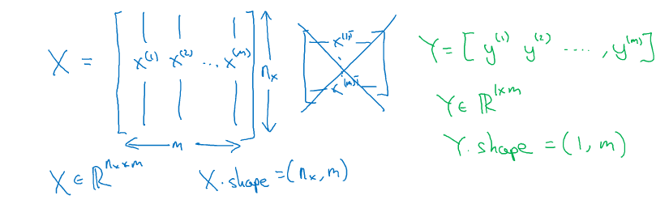
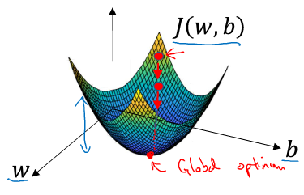
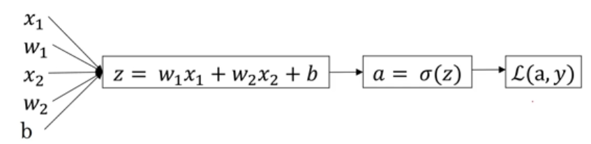

### 第二周：神经网络基础
#### 一些常用的标识
首先声明了课程中常用到的一些符号标识：
训练集合表示为${(x^{(1)},y^{(1)}),(x^{(2)},y^{(2)}),...,(x^{(m)},y^{(m)})}$,其中m为训练集的个数；
对于任何一个$x \in R^{n_x}$，表示样本$x$包含 $n_{x}$个特征;
还有一点需要声明的是，对于神经网络中的特征矩阵表示与传统算法中用到的不同：
$X$的每一列为一个样本点，$X.shape=(n_x,m)$



#### 逻辑回归的数学表示
逻辑回归用于解决二分类问题，要解决的是$y$属于0或者1的概率，数学表示就是：
$ \hat{y} = P(y=1|x)   $  这里  $ \hat{y}$ 的取值范围是$0< \hat{y} \leq1$，引入Sigmoid函数，使得线性方程$\omega^Tx+b$满足上述约束条件。逻辑回归的求解归结为求模型中的参数$\omega$和$b$。
   

#### 逻辑回归的Cost Function    
定义逻辑回归的损失函数：这样定义好处是利用梯度下降算法求解时，是一个凸函数，有全局的最优解。
求解的目的是损失函数越小越好，即$\hat{y}$与$y$更接近。
为什么选择如下形式的损失函数的数学推导，在后面会有详细解读。

损失函数是所有训练样本的均值,通过最小化损失函数来求参数$\omega$和$b$。
$J(\omega,b)=\frac{1}{m} \sum\limits_{i=1}^{m} L(\hat{y}^{(i)},y^{(i)})=-\frac{1}{m} \sum\limits_{i=1}^{m}[y^{(i)}log(\hat{y}^{(i)})+(1-y^{(i)})log(1-\hat{y}^{(i)})]$               

#### 梯度下降算法求解
通俗解释梯度下降法：选择一个起始点作为初始值，然后沿着梯度下降最快的方向下降一定步长（学习率），重复迭代上述过程，直到达到全局最优解。如下图所示：


用梯度下降法（Gradient Descent）算法来最小化Cost function，以计算出合适参数$\omega$和$b$。数学形式如下：
$\omega := \omega-\alpha \frac{\partial J(\omega,b)}{\partial \omega}$

$b := b-\alpha \frac{\partial J(\omega,b)}{\partial b}$

上式中$\alpha$为学习率，即每次迭代的步长，它的取值影响着迭代的次数和程序执行的效率。

#### 逻辑回归中的梯度下降法-一个训练样本
本章通过逻辑回归的例子，看一下前向传递和反向传播的流程。
回顾一下之前介绍的逻辑回归：
$z=\omega^Tx+b$
$\hat{y} = a = \delta(z)$
$L(a,y) = -(ylog(a)+(1-y)log(1-a))$

通过以下简单的逻辑回归例子进行讲解:


反向求导过程实际上应用的链式法则，首先求损失函数对各个节点的导数，下面是一个样本点时的一次迭代计算过程：
$da=\frac{\partial L(\omega,a)}{\partial a}=-\frac{y}{a}+\frac{1-y}{1-a}$

$dz=\frac{\partial L}{\partial a} \frac{\partial a}{\partial z} = (-\frac{y}{a}+\frac{1-y}{1-a})*[a(1-a)]=a-y$

这一步中$f(x) = \delta(x)=\frac{1}{1+e^{-x}}$的导数为$f(x)(1-f(x))$

同理，可以求得参数$\omega$和$b$，如下：
$d\omega_{1}=\frac{\partial L}{\partial a} \frac{\partial a}{\partial z}\frac{\partial z}{\partial \omega_{1}}=x_{1}dz$

$d\omega_{2}=\frac{\partial L}{\partial a} \frac{\partial a}{\partial z}\frac{\partial z}{\partial \omega_{2}}=x_{2}dz$

$db=\frac{\partial L}{\partial a} \frac{\partial a}{\partial z}\frac{\partial z}{\partial b}=dz$

通过链式法则，求得上述参数的梯度后，然后对参数进行迭代更新：
$\omega_{1} := \omega_{1}-\alpha d\omega_{1}$

$\omega_{2} := \omega_{2}-\alpha d\omega_{2}$

$b := b-\alpha db$

#### 逻辑回归中的梯度下降法-整个训练集
m个训练样本的损失函数如下：
$J(\omega,b)=\frac{1}{m} \sum\limits_{i=1}^{m} L(\hat{y}^{(i)},y^{(i)})=-\frac{1}{m} \sum\limits_{i=1}^{m}[y^{(i)}log(\hat{y}^{(i)})+(1-y^{(i)})log(1-\hat{y}^{(i)})]$  

对于整个训练集的梯度下降法，如果用上述的单个样本点的计算方法，要用到两个for loop循环，一个循环m个训练样本，一个循环n个样本特征；这种方法的计算效率低且耗时，引出了向量法来解决这个问题。尤其在深度学习场景下，向量法的优势会更加突出。

#### 向量化（Vectorization）
向量化的作用就是去掉for loop循环，显著提升计算效率，数据量越大，提升效果越明显。
下面给出逻辑回归的向量化表示：
如$z=\omega^Tx+b$，
在python中可以使用numpy库进行计算，$z=np.dot(\omega,x)+b$
下面是单次迭代梯度下降算法流程,可见没有出现一次for Loop循环：
```
def sigmoid(inX): 
    return 1.0/(1+np.exp(-inX))#定义一个sigmoid方法，其本质就是1/(1+e^-x)

Z = np.dot(w.T,X) + b
A = sigmoid(Z)
dZ = A-Y
dw = 1/m*np.dot(X,dZ.T)
db = 1/m*np.sum(dZ)

w = w - alpha*dw
b = b - alpha*db
```
上步中Z = np.dot(w.T,X) + b，利用了python中numpy的'Broadcasting'方法，将常数b扩展成了一个(1*m)维的向量。

#### Python中对于矩阵向量的处理技巧
为了避免在编程中出现一些意想不到的bug，课件中提出了Python处理numpy vector的处理技巧,也希望大家养成良好的编程习惯，逃过一些在编码过程中就可以避免的坑。
```
import numpy as np
a = np.random.randn(5) 
a.shape
输出：
array([ 1.56373473, -0.10796547,  0.09631878,  0.80429434, -1.23193508])
(5,)
这条语句生成的a的维度为(5,)，既不是行向量也不是列向量，称为秩（rank）为1的array，如果对a进行转置，则会得到a本身，这在计算中会给我们带来一些问题。

a = np.random.randn(5,1) 
输出：
array([[ 0.24842621],
       [ 0.03144453],
       [-1.31668142],
       [-1.97078084],
       [ 0.96608444]])
这条语句生成的a的维度为(5,1)，为列向量，和上面的区别在于有双重的中括号。

a = np.random.randn(1,5) 
输出：
array([[ 0.89606342, -0.85031761,  0.10197684,  1.91269364,  0.67750783]])
同理，这条语句生成的a的维度为(1,15)，为行向量。

assert(a.shape == (5,1))
在不确定向量或者矩阵维度时候，可以使用assert语句对维度进行判断

另外可以使用reshape函数对矩阵设定所需的维度
a.reshape(5,1)
```

#### LR代价函数的数学解释
这节通过数学推导的方式给出了代价函数的由来，对上面的内容进行了一个系统的总结：
上文中提到$ \hat{y} $可以看作是预测输出为正类的概率 
$\hat{y} = P(y=1|x) $  ，
由于是二分类情况，故预测输出为负类的概率可以表示为：
$1-\hat{y} = P(y=0|x) $ 
下面通过一个方程将二者写到一个方程中：
$P(y|x)= \hat{y}^{y} (1-\hat{y})^{1-y} $                            
可见，若y=1,则$P(y|x)=\hat{y}$；若y=0，则$P(y|x)=1-\hat{y}$，与之前独立时候的方程等价。

下面再进一步对上述整合的方程简化，对上式进行log处理（这里是因为log函数是单调函数，不会改变原函数的单调性）：
$logP(y|x)= ylog\hat{y}+ (1-y)log(1-\hat{y}) $ 
概率 P(y|x) 越大越好，即判断正确的概率越大越好。这里对上式加上负号，则转化成了单个样本的Loss function，我们期望其值越小越好：
$L(a,y) = -(ylog(\hat{y})+(1-y)log(1-\hat{y}))$

###### 扩大到m个训练样本的情况
假设样本之间是独立同分布的，我们总是希望训练样本判断正确的概率越大越好，也就是它们之间的乘积越大越好，则有：
$max \prod \limits_{i=1}^{m}  = P(y^{(i)}|x^{(i)})$

同样引入log函数，加负号，则可以得到Cost function：
$J(\omega,b)=\frac{1}{m} \sum\limits_{i=1}^{m} L(\hat{y}^{(i)},y^{(i)})=-\frac{1}{m} \sum\limits_{i=1}^{m}[y^{(i)}log(\hat{y}^{(i)})+(1-y^{(i)})log(1-\hat{y}^{(i)})]$ 


