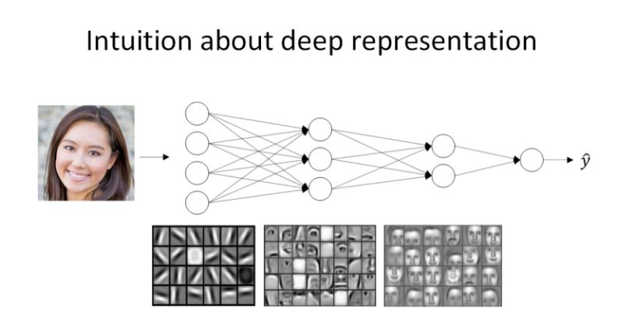
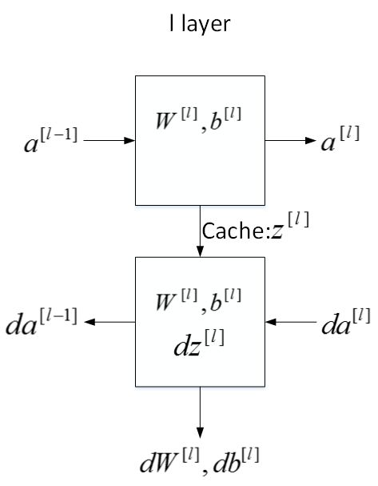
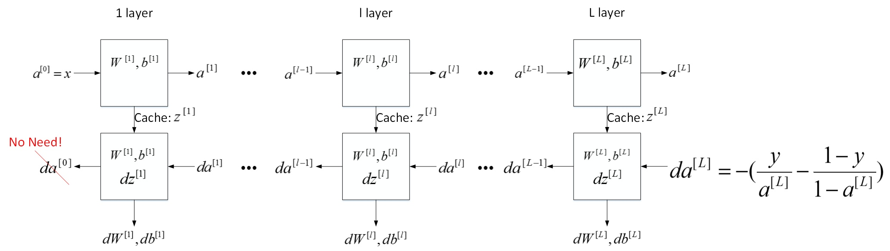

### 第四周：深层神经网络

#### 深层神经网络的符号表示
本节通过一个4层的神经网络，给出了神经网络的一些通用标记写法。
- 总层数：是隐藏层个数和输出层(一个)的总和，总层数用L表示，下图中L=4。输入层是第0层，输出层是第L层。
- 各层包含的单元数： $n^{[l]} $表示第$ l  $层包含的单元个数；下图中$n^{[0]}=n_x=3$ ，表示三个输入特征 $x_1,x_2,x_3 $。 $n^{[1]}=5$ ， $n^{[2]}=5 $， $n^{[3]}=3 $， $n^{[4]}=n^{[L]}=1 $
- 激活函数：第$ l$ 层的激活函数输出用$ a^{[l]} $表示， $a^{[l]}=g^{[l]}(z^{[l]})$
- 参数$W$和$b$：$W^{[l]} $ 和$b^{[l]} $表示第$ l $层的权重和偏置，用于计算$ z^{[l]}$；

#### 深层网络中的前向传播
深层网络中的前向传播与上一周中讲到的浅层神经网络的算法是类似的，只是深层网络中传播的层数更多，可以通过一个外围的关于Layers的For Loop循环来进行层间的传递计算。下面给出具体的计算公式：
对于第 $l $层，其正向传播过程的$ Z^{[l]} $和 $A^{[l]}$ 可以表示为：

$Z^{[l]}=W^{[l]}A^{[l-1]}+b^{[l]}$

$A^{[l]}=g^{[l]}(Z^{[l]})$

其中 $l=1,\cdots,L$ 
需要注意的是$A^{[0]}=X$，给上述的循环赋予的一个初始值。

#### 核对矩阵的维数
了解前向传播和后向传播的矩阵维数，可以避免编码过程中出现bug；在矩阵乘法的运算过程中，要确保前后的矩阵维度统一；下面给出核对矩阵维数的通用公式：

直接给出m个训练样本的情况，于m个训练样本，输入矩阵X的维度是$(n^{[0]},m )$。需要注意的是 $W^{[l]}$ 和 $b^{[l]} $的维度与单个样本是一致的：

$W^{[l]}:\ (n^{[l]},n^{[l-1]})$

$b^{[l]}:\ (n^{[l]},1)$

由导数的运算法则可知，$ dW^{[l]}$ 和 $db^{[l]}$ 的维度分别与$ W^{[l]} $和 $b^{[l]} $的相同。

这里与单个样本不同的是$Z^{[l]} $和 $A^{[l]} $，因为 $A^{[l]}=g^{[l]}( Z^{[l]}) $,故他们两个维度是一致的。

 $Z^{[l]}=W^{[l]}A^{[l-1]}+b^{[l]} $，$Z^{[l]} $是m个训练样本横向堆叠而成的，如$\bm{Z^{[1]}}$可扩展成如下公式：
 $\bm{Z^{[1]}}= \left[ \begin{array}{c}
|  & | &... & | \\
z^{[1](1)}  & z^{[1](2)} &... & z^{[1](m)} \\
|  & | &... & | 
\end{array} 
\right ] $

可以得到他们的维度：

$Z^{[l]}:\ (n^{[l]},m)$

$A^{[l]}:\ (n^{[l]},m)$

$b^{[l]}$ 会被当成$(n^{[l]},m)$矩阵进行运算，这是因为python的广播性质，且 $b^{[l]}$ 每一列向量都是一样的。$ dW^{[l]}$ 和 $db^{[l]}$ 的维度分别与$ W^{[l]} $和 $b^{[l]} $的相同。

同样$dZ^{[l]}$ 和 $dA^{[l]}$ 的维度分别与 $Z^{[l]} $和 $A^{[l]} $的相同。

#### 为什么深度学习有效果？
我们都知道神经网络能处理很多问题，而且效果显著。其强大能力主要源自神经网络足够“深”，也就是说网络层数越多，神经网络就更加复杂和深入，学习也更加准确。接下来，我们从几个例子入手，看一下为什么深度网络能够如此强大。

先来看人脸识别的例子，如下图所示。经过训练，神经网络第一层所做的事就是从原始图片中提取出人脸的轮廓与边缘，即边缘检测。这样每个神经元得到的是一些边缘信息。神经网络第二层所做的事情就是将前一层的边缘进行组合，组合成人脸一些局部特征，比如眼睛、鼻子、嘴巴等。再往后面，就将这些局部特征组合起来，融合成人脸的模样。可以看出，随着层数由浅到深，神经网络提取的特征也是从边缘到局部特征到整体，由简单到复杂。可见，如果隐藏层足够多，那么能够提取的特征就越丰富、越复杂，模型的准确率就会越高。

语音识别模型也是这个道理。浅层的神经元能够检测一些简单的音调，然后较深的神经元能够检测出基本的音素，更深的神经元就能够检测出单词信息。如果网络够深，还能对短语、句子进行检测。记住一点，神经网络从左到右，神经元提取的特征从简单到复杂。特征复杂度与神经网络层数成正相关。特征越来越复杂，功能也越来越强大。

尽管深度学习有着非常显著的优势，Andrew还是建议对实际问题进行建模时，尽量先选择层数少的神经网络模型，将深度层数作为一个参数进行调试，选择表现好的层数。只有对于越复杂的问题，再考虑层数多的深度神经网络。

#### 搭建深层神经网络块
下面用流程块图来解释神经网络正向传播和反向传播过程。如下图所示，对于第l层来说，正向传播过程中：

输入： $a^{[l-1]}$

输出： $a^{[l]}$

参数： $W^{[l]},b^{[l]}$

缓存变量：$ z^{[l]}$

反向传播过程中：

输入：$ da^{[l]}$

输出： $da^{[l-1]},dW^{[l]},db^{[l]}$

参数：$ W^{[l]},b^{[l]}$

下图给了一次完整的神经网络的迭代过程，通过图解可清晰了解一次完整的参数传递过程；完成一次后，再通过梯度下降法更新$\omega$和$b$的值。

#### 前向和反向传播
本节中推导神经网络正向传播过程和反向传播过程的具体表达式。

首先是正向传播过程，令层数为第 l 层，输入是$ a^{[l-1]}$ ，输出是$ a^{[l]} $，缓存变量是 $z^{[l]} $。其表达式如下：

m个训练样本，向量化形式为：

$\bm Z^{[l]}=\bm W^{[l]}\bm A^{[l-1]}+\bm b^{[l]}$

$\bm A^{[l]}=g^{[l]}(\bm Z^{[l]})$

然后是反向传播过程，输入是 $da^{[l]}$ ，输出是 $da^{[l-1]}$,$dw^{[l]}$,$db^{[l]} $。其表达式如下：

$d \bm Z^{[l]}=d \bm A^{[l]}\ast \bm g^{[l]'}(\bm Z^{[l]})$

$d \bm W^{[l]}=\frac1md \bm Z^{[l]}\cdot \bm A^{[l-1]T}$

$d\bm b^{[l]}=\frac1mnp.sum(d \bm Z^{[l]},axis=1,keepdim=True)$

$d\bm A^{[l-1]}=\bm W^{[l]T}\cdot d\bm Z^{[l]}$

$d\bm Z^{[l]}=\bm W^{[l+1]T}\cdot d\bm Z^{[l+1]}\ast \bm g^{[l]'}(\bm Z^{[l]})$

#### 参数和超参数

该部分介绍神经网络中的参数（parameters）和超参数（hyperparameters）的概念。超参数就是控制参数的参数。

神经网络中的参数就是我们熟悉的 $W^{[l]} $和$ b^{[l]}$ 。而超参数则是例如学习速率 $\alpha $，训练迭代次数N，神经网络层数L，各层神经元个数 $n^{[l]} $，激活函数 $g(z) $等。之所以叫做超参数的原因是它们决定了参数 $W^{[l]} $和$ b^{[l]} $的值。在后面的第二门课我们还将学习其它的超参数，这里先不讨论。

如何设置最优的超参数是一个比较困难的、需要经验知识的问题。通常的做法是选择超参数一定范围内的值，分别代入神经网络进行训练，测试cost function随着迭代次数增加的变化，根据结果选择cost function最小时对应的超参数值。这类似于validation的方法。