### 第一周：机器学习策略（一）

#### ML策略
对于一个模型分类器，如果想进一步提升它的准确度，有很多种方法可以尝试，如下图中罗列的各种ideas，但哪些方法是靠谱的可以有效帮助提升模型准确度呢？本周的课程，Andrew分享了他在搭建和部署大量深度学习产品时学到的经验和教训，总结出了相应的机器学习策略。
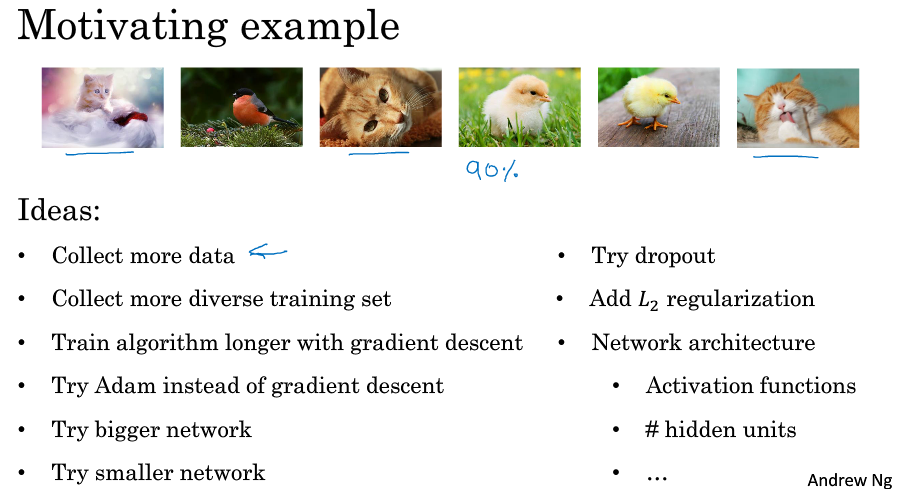

#### 正交化
所谓机器学习模型构造中的正交化，就是在模型训练的不同过程中，我们需要根据不同部分反映的问题，去做相应的调整，从而更加容易地判断出是在哪一个部分出现了问题，并做相应的解决措施。
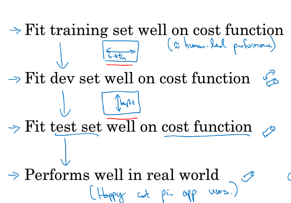

当在监督学习模型中，以下的4个假设需要真实且是相互正交的：

系统在训练集上表现的好
否则，使用更大的神经网络、更好的优化算法

系统在开发集上表现的好
否则，使用正则化、更大的训练集

系统在测试集上表现的好
否则，使用更大的开发集

在真实的系统环境中表现的好
否则，修改开发测试集、修改代价函数

#### 单一数字评估指标
为你的机器学习项目，设置一个单一数字评估指标，可以加速训练过程，它可以快速告诉你，新尝试的手段比之前的手段好还是差。通过两个实例进行了说明：
**实例一**
下面是分别训练的两个分类器的Precision、Recall以及F1 score。
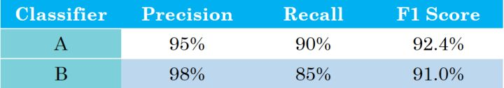
由上表可以看出，以Precision为指标，则分类器A的分类效果好；以Recall为指标，则分类器B的分类效果好。所以在有两个及以上判定指标的时候，我们很难决定出A好还是B好。

这里以Precision和Recall为基础，构成一个综合指标F1 Score，它是查准率P和查全率R的调和平均数，那么我们利用F1 Score便可以更容易的评判出分类器A的效果更好。

**实例二**
以下实例是不同算法在不同地区的错误率，很难扫一眼这些数值就快速判断算法A或算法B哪个更好。但通过计算平均值，转换为单一数字评估指标,你就可以快速判断出C算法的效果要好一些，因为他的平均误差率最低。
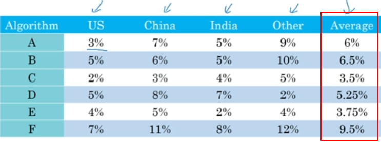

#### 满足和优化指标
假设你已经决定你很看重猫分类器的分类准确度，这可以是F_1分数或者用其他衡量准确度的指标。但除了准确度之外，我们还需要考虑运行时间，就是需要多长时间来分类一张图。分类器A需要80毫秒，B需要95毫秒，C需要1500毫秒。
你可能选择一个分类器，
优化指标：能够最大限度提高准确度，
满足指标：但必须满足运行时间要求，就是对图像进行分类所需的时间必须小于等于100毫秒；
综上，下面的分类器B是可以得到要求的最好的分类器。
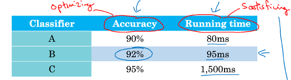

所以更一般地说，如果你要考虑N个指标，有时候选择其中一个指标做为优化指标是合理的。所以你想尽量优化那个指标，然后剩下N-1个指标都是满足指标，意味着只要它们达到一定阈值，例如运行时间快于100毫秒，但只要达到一定的阈值，你不在乎它超过那个门槛之后的表现，但它们必须达到这个门槛。

#### 训练/开发/测试集划分
本节中重点给出了设立开发/测试集的准则。

**三者之间的关系**
机器学习中的工作流程是：你尝试很多思路，用训练集训练不同的模型，然后使用开发集来评估不同的思路，然后选择一个，然后不断迭代去改善开发集的性能，直到最后你可以得到一个令你满意的模型，最后你再用测试集去评估。

**如何设立开发集和测试集？**
- 确保开发集和测试集来自同一分布；将所有数据重新洗牌打乱，随机选择放入开发集和测试集
- 要选择能够反映你未来会得到的数据的开发集和测试集，即模型数据和未来数据要具有相似性
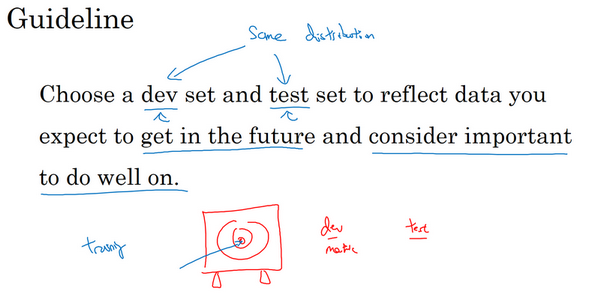

#### 开发/测试集的大小
在大数据时代，旧的经验规则，这个70/30比例划分不再适用了。现在流行的是把大量数据分到训练集，然后少量数据分到开发集和测试集，特别是当你有一个非常大的数据集时。如下图所示：
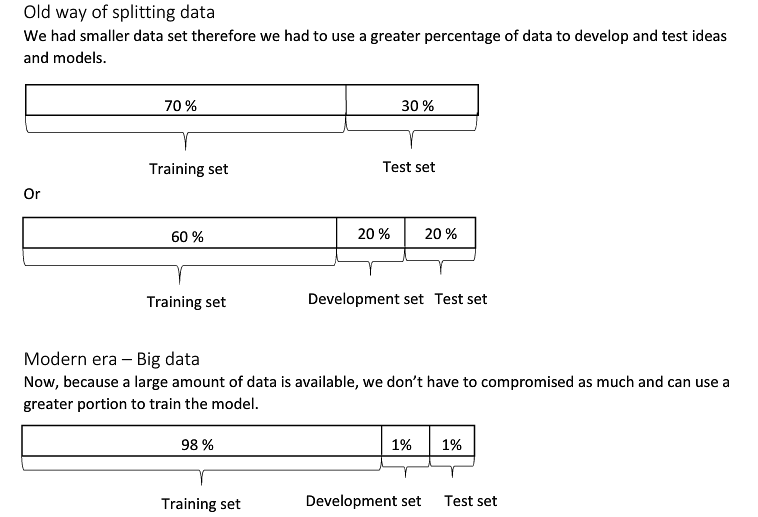

**Guidelines**
开发集要足够大，用来评估不同的ideas;
测试集用来评估最终模型的性能，能够对系统性能有置信度很高的评估即可，一般总体数据量的30%就足够了

#### 什么时候该改变开发/测试集和指标？
当你的评估指标无法正确衡量算法之间的优劣排序时，在这种情况下，原来的指标错误地预测算法A是更好的算法这就发出了信号，你应该改变评估指标了，或者要改变开发集或测试集。
举了一个例子如下图：
两个算法A和B，从错误率上来看算法A表现更好，有更低的错误率，但在上线应用时，发现算法A除了可以正确识别出猫的照片时，还会呈现一些色情图片；而B虽然错误率高一点，但不会出现色情图片；所以对于公司来说，显然算法B是更能接受。这时候，原来的评估指标就出现了问题，不再适用。在这种情况下， 就要考虑改变评估指标或者改变开发集合测试集了。
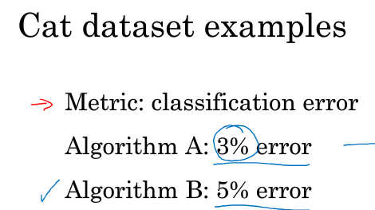

第二种情况：
如果在训练开发测试的过程中得到的模型效果比较好，但是在实际应用中自己所真正关心的问题效果却不好的时候，就需要改变开发、测试集或者评估指标。

#### 为什么是类似于人的表现
总结一下本节的主要内容：
第一，当机器学习的效果低于人类的表现时，有一些工具和手段可以起作用来提升机器学习的效果；
如提供更多的标记数据，通过偏差和方差分析等。但一旦超过人类表现，这些工具也就失效了。
第二，在一些人类擅长的领域，如图片识别、语音识别，当机器学习模型准确度还得到不了人类准确度时，机器学习的进展往往相当快；但超过人类表现后，也许没有太多的空间继续改善了。主要原因是人类水平在很多任务中离贝叶斯最优错误率已经不远了，理论上的最优错误率。

#### 可避免的偏差
通过知道人类水平的表现是怎样的，可以确切告诉你算法在训练集上的表现是好还是不好。通过下面的这个例子来更好的理解这句话：
下图是两种场景下的分类错误率，先来看左边场景A：
这里假设人类的误差为1%，而训练误差为8%，（这里差值7%称为avoidable bias），开发集误差为10%；对于这种情况，训练误差远低于人类误差，说明训练误差还有提升空间，这是一个高偏差的问题，模型下一步要着手减少偏差，即减少训练集误差和人类水平误差之间的差距，来提高模型性能。

而对于场景B，这里假设人类的误差为7.5%，而训练误差为8%，开发集误差为10%；对于这种情况，训练误差已经逼近人类误差，仅相差0.5%，而开发集误差和训练集误差为2%，这是一个方差问题，模型下一步要着手减少方差，即减少开发集误差和测试集误差之间的差距，来提高模型性能。
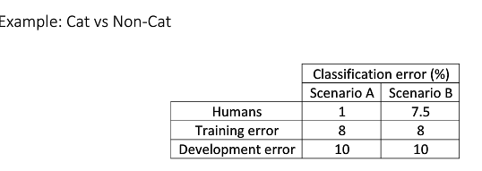

#### 理解人类水平表现
给出定义：“人类水平错误率”用来估计贝叶斯误差，这个是理论上最低的错误率。

人类水平错误率的定义可以不一样，要根据你的目标选择相应的错误率。

下图给出了三种场景下的错误分析结果：
对于场景A，训练集误差为5%，开发集误差为6%，对于人类水平误差选择哪个已经无所谓了，因为这时候明显训练集误差和人类水平误差的差值avoidable bias要明显大于训练集误差和开发集误差之间的差值，所以这是一个偏差问题。

对于场景B，这时候人类水平误差选择哪个同样无所谓，这时候训练集误差和开发集误差之间的差值要明显大于训练集误差和人类水平误差的差值avoidable bias，所以这是一个方差问题。可以通过如正则化、更多的训练集数据等方法来解决。

对于场景C，训练集误差为0.7%，开发集误差为0.8%，对于人类水平误差只能选择0.5%；这时候测量到的可避免偏差是0.2%，是测量到的方差问题0.1%的两倍，这表明也许偏差和方差都存在问题。但是，可避免偏差问题更严重。
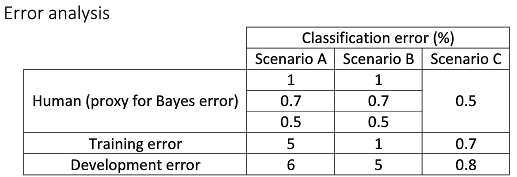

上面的例子表明：左边的两个例子中，当你远离人类水平时，将优化目标放在偏差或方差上可能更容易一点。这就说明了，为什么当你们接近人类水平时，更难分辨出问题是偏差还是方差。所以机器学习项目的进展在你已经做得很好的时候，很难更进一步。

#### 超过人类表现
当超过接近人类水平时，更难分辨出问题是偏差还是方差，传统的很多方法和手段就失效了。
在很多领域，机器学习的表现时超出人类的，尤其在那些非自然感知类的项目中，如移动广告、贷款审批、物流时间估计、推荐系统等，这些项目共同点都是，有大量历史的结构化的数据。

#### 改善模型性能
监督学习的两条基本假设：
- 模型在训练集上有很好的表现；说明可以做到低的可避免偏差，也就是训练误差和人类水平误差接近。
- 模型推广到开发和测试集也有很好的表现。说明方差不是很大。

针对于不同的问题，可以采取如下不同的方法进行解决：
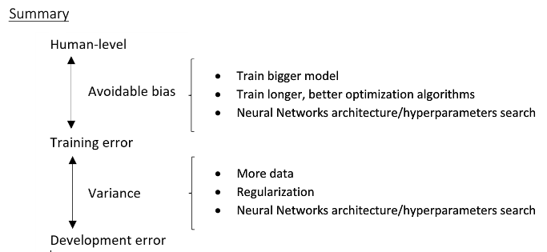

